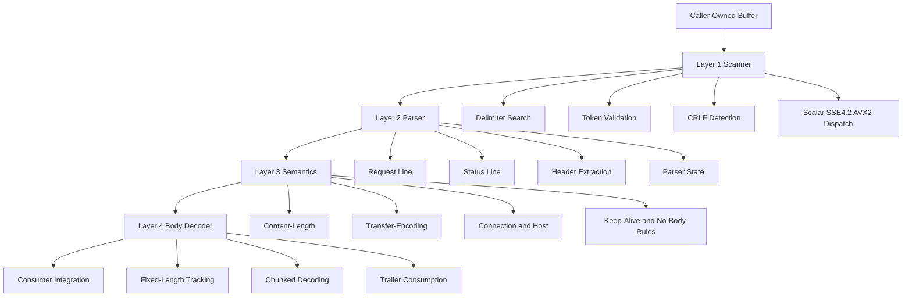
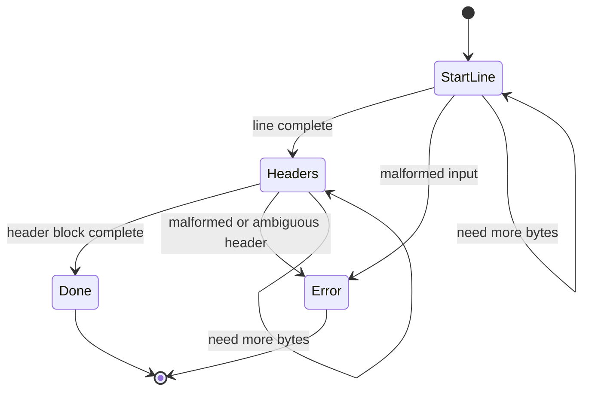
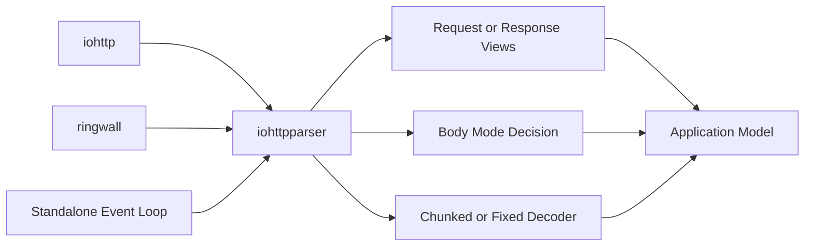

# iohttpparser Architecture

## Overview

`iohttpparser` is a strict HTTP/1.1 parser library for C23. It is designed as a reusable wire-level core for `iohttp`, `ringwall`, and other projects that need:
- zero-copy parsing
- no hidden allocation in the hot path
- explicit strict/lenient policy control
- transport-agnostic integration

**Design philosophy:** keep syntax parsing, security semantics, and body framing separate. Optimize for correctness first, then prove SIMD and incremental behavior against scalar truth.

---

## Core Architecture

---

## Layer Decomposition

| Layer | Responsibility | Current Status |
|---|---|---|
| Scanner | Delimiter search, token validation, runtime SIMD dispatch | Implemented with scalar, SSE4.2, AVX2 |
| Parser | Request/status line parsing, header extraction, consumed-byte reporting | Implemented with stateless and stateful API |
| Semantics | `Content-Length`, `Transfer-Encoding`, `Connection`, `Host`, keep-alive, ambiguity rejection | Implemented and covered by corpus tests |
| Body Decoder | Fixed-length accounting, chunked decoding, trailer handling | Implemented with unit, corpus, and fuzz coverage |

---

## Parsing Modes

The library now supports two parser entry styles:

1. Stateless parsing over an accumulated buffer.
2. Stateful parsing with explicit `ihtp_parser_state_t`.

Both styles keep the same zero-copy ownership model.

---

## Public API Shape

| API | Role |
|---|---|
| `ihtp_parse_request()` | Stateless request parse over an accumulated buffer |
| `ihtp_parse_response()` | Stateless response parse over an accumulated buffer |
| `ihtp_parse_headers()` | Stateless header-block parse |
| `ihtp_parser_state_init()` | Initialize explicit parser state |
| `ihtp_parser_state_reset()` | Reuse parser state for the next message |
| `ihtp_parse_request_stateful()` | Stateful request parsing |
| `ihtp_parse_response_stateful()` | Stateful response parsing |
| `ihtp_parse_headers_stateful()` | Stateful header-block parsing |
| `ihtp_decode_chunked()` | Incremental chunked body decode |
| `ihtp_decode_fixed()` | Fixed-length body accounting |

The stateful API does not change ownership rules:
- input bytes still belong to the caller
- parsed spans still point into caller memory
- parser state tracks progress only, not private buffers

---

## Integration Boundaries

### iohttp

`iohttp` should use `iohttpparser` as the HTTP/1.1 wire codec under a broader server/runtime layer.

### ringwall

`ringwall` should treat `iohttpparser` as a strict security boundary with fail-closed defaults and smaller operational limits.

### Generic Consumers

Standalone applications can use either the stateless or stateful parser entry points without adopting `io_uring`, TLS, routing, or any `iohttp`-specific abstractions.

---

## Non-Goals

The parser core deliberately excludes:
- URI normalization
- percent-decoding
- cookies
- multipart parsing
- compression decoding
- WebSocket frames
- routing
- transport ownership

These belong in higher layers or adjacent libraries.

---

## Current Priorities

1. Stabilize the public stateful parser API.
2. Expand differential testing against `picohttpparser` and `llhttp`.
3. Keep SIMD acceleration provably equivalent to scalar truth.
4. Strengthen consumer-facing integration contracts for `iohttp` and `ringwall`.
