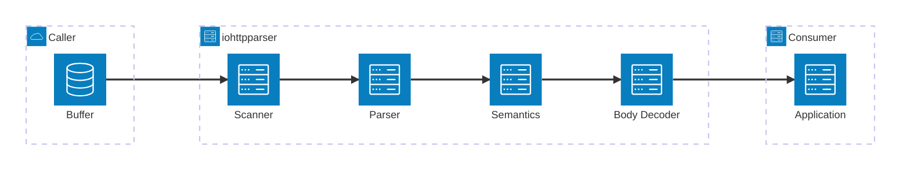
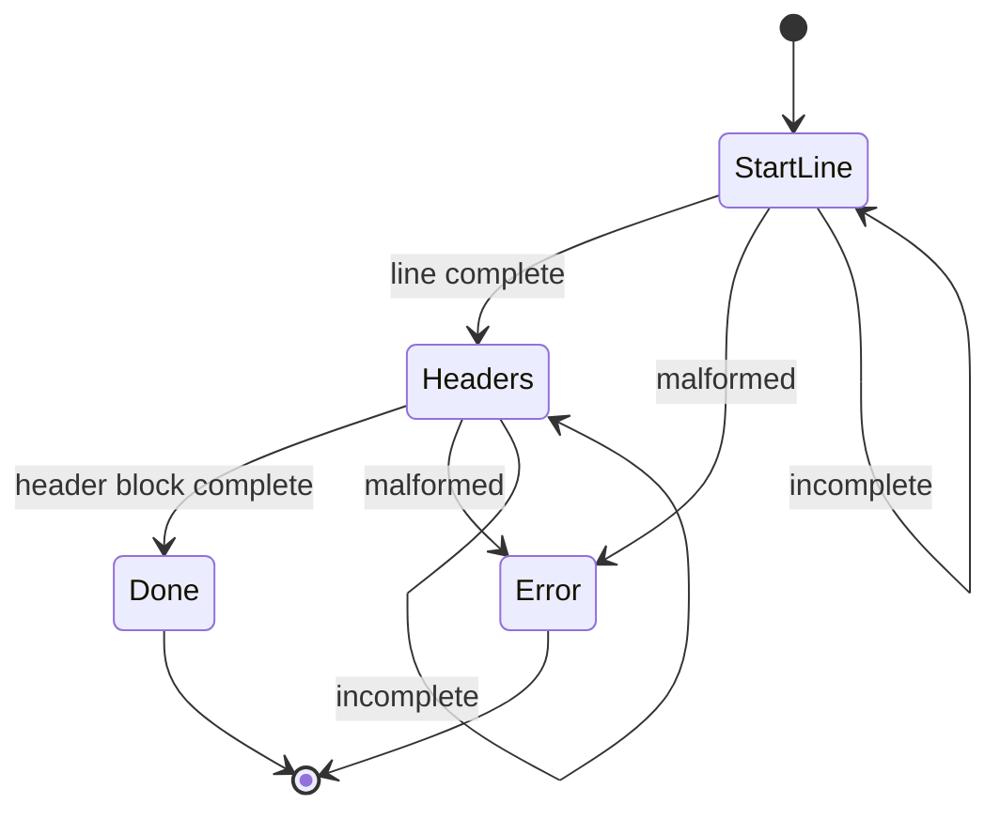

# Architecture

## Scope

`iohttpparser` is a C23 HTTP/1.1 wire parser.

Included scope:
- request line parsing
- status line parsing
- header field parsing
- parser state for incremental parsing
- framing semantics
- fixed-length body accounting
- chunked body decoding

Excluded scope:
- URI normalization
- percent-decoding
- cookies
- multipart parsing
- content-coding decode
- routing
- transport ownership
- WebSocket frame parsing

## Layer Model

| Layer | Responsibility | Output |
|---|---|---|
| Scanner | delimiter search, token checks, CRLF checks, SIMD dispatch | validated byte ranges |
| Parser | request line, status line, header extraction, parser state | zero-copy request, response, or header views |
| Semantics | framing rules, host rules, keep-alive, ambiguity rejection | body mode and connection decision |
| Body Decoder | fixed-length accounting, chunked decode, trailer handling | payload bytes and trailing bytes |

## Ownership Model

- The caller owns every input buffer.
- Parsed spans point into caller-owned memory.
- Parser state stores progress only.
- The body decoder stores framing state only.
- The library does not allocate hidden buffers in the hot path.

## Public Surface

| Area | API |
|---|---|
| Stateless parse | `ihtp_parse_request()`, `ihtp_parse_response()`, `ihtp_parse_headers()` |
| Stateful parse | `ihtp_parser_state_t`, `ihtp_parser_state_init()`, `ihtp_parser_state_reset()`, `ihtp_parse_*_stateful()` |
| Semantics | `ihtp_request_apply_semantics()`, `ihtp_response_apply_semantics()` |
| Body decode | `ihtp_decode_fixed()`, `ihtp_decode_chunked()` |
| Scanner | `ihtp_scan_*` helpers for internal and benchmark use |

## Parser Modes

The library exposes:
- stateless parsing over an accumulated buffer
- stateful parsing over the same accumulated buffer with explicit progress

The ownership model is identical in both modes.

## Integration Boundaries

| Consumer | Expected use |
|---|---|
| `iohttp` | general HTTP/1.1 server parsing with explicit framing handoff |
| `ioguard` | strict boundary parsing with fail-closed policy |
| standalone event loop | caller-managed buffer parsing without transport coupling |

The parser does not own:
- sockets
- TLS
- event loops
- message routing

## Invariants

- strict policy is the baseline
- SIMD paths must stay equivalent to scalar results
- syntax parsing and semantics are separate stages
- body decode starts only after semantics selects the body mode
