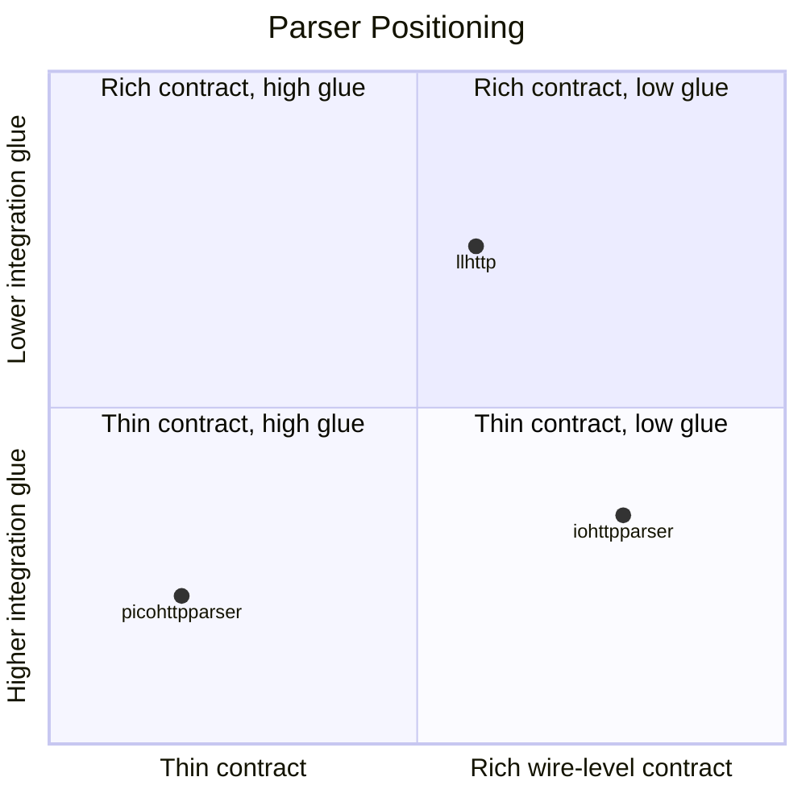

# Comparison

## Related Documents

| Document | Purpose |
|---|---|
| [08-testing-methodology.md](./08-testing-methodology.md) | test program, comparison rules, and artifact publication |
| [09-test-results.md](./09-test-results.md) | current PMI/PSI results for the compared parsers |
| [10-extended-contract-methodology.md](./10-extended-contract-methodology.md) | methodology for capabilities outside the common parser-core matrix |
| [11-extended-contract-results.md](./11-extended-contract-results.md) | result status for extended `iohttpparser` contract features |

## Scope

This document compares `iohttpparser`, `picohttpparser`, and `llhttp` by:
- API shape
- wire-level capabilities
- ownership model
- integration cost
- intended deployment scenarios

`iohttpparser` was developed for:
- `iohttp`
- `ioguard`

Its application scope is wider than those two consumers.

## Design Position

| Library | Primary position |
|---|---|
| `iohttpparser` | pull-based parser with explicit semantics and body-decoder stages |
| `picohttpparser` | minimal syntax parser with zero-copy output |
| `llhttp` | generated callback-driven state machine |

## API Model

| Area | iohttpparser | picohttpparser | llhttp |
|---|---|---|---|
| main API style | pull-based | pull-based | callback-driven |
| zero-copy output | yes | yes | callback slices |
| explicit parser state | yes | no public state | yes |
| typed request/response structs | yes | partial, pointer fields | callback events and internal parser state |
| separate semantics call | yes | no | mostly integrated |
| separate body decoder | yes | partial | mostly integrated |
| named consumer presets | yes | no | no |

## Functional Capability Matrix

| Capability | What it does | Why it matters | Typical use | iohttpparser | picohttpparser | llhttp |
|---|---|---|---|---|---|---|
| request line parse | parses method, target, version | required for all request handling | server request ingress | yes | yes | yes |
| status line parse | parses version, status code, reason | required for client/proxy response handling | upstream response ingress | yes | yes | yes |
| standalone header parse | parses header block without a full message wrapper | allows split-layer integration and tests | proxy/filter stages | yes | yes | partial |
| public parser state | exposes incremental parse progress | avoids rescanning accumulated buffers | event-loop and nonblocking I/O | yes | no | yes |
| stateless parse | parses an accumulated buffer without external parser state | simple embedding for complete buffers | tests, simple servers, batch parsing | yes | yes | no |
| zero-copy spans | returns pointers into caller buffer | avoids payload copies and hidden ownership | hot-path ingress | yes | yes | partial |
| framing semantics | resolves `Content-Length`, `Transfer-Encoding`, no-body rules, keep-alive | needed before body handoff | server, proxy, security boundary | yes | no | partial |
| ambiguity rejection | rejects `TE + CL`, conflicting `Content-Length`, malformed framing | prevents request smuggling and framing bugs | security-sensitive ingress | yes | no | partial |
| chunked body decode | decodes chunked body framing | needed for request and response body processing | server body ingestion, proxy forwarding | yes | yes | integrated |
| fixed-length accounting | tracks remaining body bytes | needed for partial reads and pipelining | event loops, upstream response handling | yes | no | integrated |
| trailer ownership flags | exposes whether trailer fields were declared and who consumes them | required for explicit trailer handoff | proxy/body filters | yes | no | partial |
| upgrade ownership flags | exposes `protocol_upgrade` | required for correct `101` handoff | upgrade gateway, tunnel switch | yes | no | partial |
| `Expect: 100-continue` flag | exposes `expects_continue` | lets the consumer decide interim response policy | HTTP servers, request filters | yes | no | partial |
| named strict presets | provides `IHTP_POLICY_IOHTTP` and `IHTP_POLICY_IOGUARD` | fixes consumer intent in code | multi-consumer embedding | yes | no | no |
| SIMD scanner backends | provides scalar, SSE4.2, AVX2 scanner paths | improves delimiter and token search cost | hot-path x86_64 deployments | yes | no separate layer | no separate layer |
| maintained differential corpus | compares against other parsers in-tree | detects unexplained divergence | regression testing | yes | reference target | reference target |
| consumer integration tests | models `iohttp` and `ioguard` use | validates contracts, not just syntax | release verification | yes | no | no |

## Capability Notes

### Semantics and ambiguity handling

`iohttpparser` includes:
- request and response framing decisions
- duplicate `Content-Length` classification
- `Transfer-Encoding` validation
- no-body precedence

This work remains inside the library because it is wire-level protocol logic.

### Body decoder separation

`iohttpparser` keeps body decoding outside the syntax parser.

Effect:
- syntax parsing can complete before body processing starts
- the consumer can decide when body decoding begins
- chunked and fixed-length handling are explicit stages

### Parser state exposure

`iohttpparser` exposes parser state because both `iohttp` and `ioguard` work on
accumulated buffers and partial reads. This is also useful for:
- embedded daemons
- reverse proxies
- packet capture replay tools

## Broader Application Scenarios

`iohttpparser` was developed for `iohttp` and `ioguard`, but the same contract
fits other wire-level workloads:

| Scenario | Why the library fits |
|---|---|
| reverse proxy ingress | explicit framing and upgrade handoff |
| HTTP protocol firewall | strict ambiguity rejection and zero-copy views |
| API gateway frontend | parser state, body mode handoff, no transport coupling |
| service mesh sidecar | request/response parse without callback model |
| embedded appliance daemon | small pull-based API with caller-owned buffers |
| trace replay and protocol test harness | deterministic parser outputs and corpus-driven checks |
| benchmarking reference harness | direct comparison against `picohttpparser` and `llhttp` |

## What Belongs In The Library

Correct scope inside `iohttpparser`:
- syntax parsing
- framing semantics
- ambiguity rejection
- upgrade and trailer handoff metadata
- chunked and fixed-length body handling

Incorrect scope for this library:
- URI normalization
- routing
- cookie parsing
- authentication policy
- compression decode
- WebSocket frame parsing
- application protocol handling after upgrade

## Selection Guide

Choose `iohttpparser` when the consumer needs:
- pull-based integration
- zero-copy typed outputs
- explicit semantics and body stages
- strict wire-level policy

Choose `picohttpparser` when the consumer needs:
- minimal syntax-only parsing
- maximum raw parser throughput
- external semantics logic

Choose `llhttp` when the consumer needs:
- callback-driven streaming integration
- generated parser state machine behavior
- upgrade and pause handling through parser callbacks
