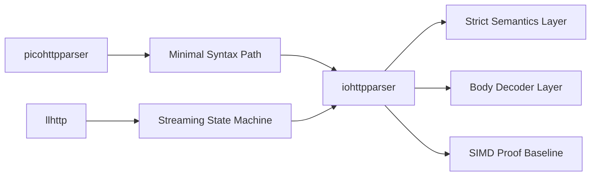
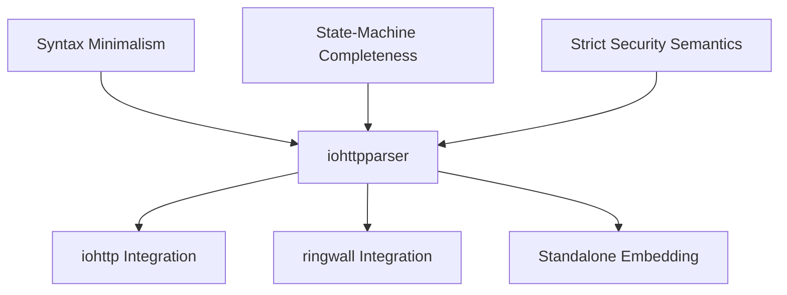

# Comparison with picohttpparser and llhttp

## Executive Summary

`iohttpparser` sits between two established parser families:
- `picohttpparser`: tiny, stateless, zero-copy, minimal semantics
- `llhttp`: generated, state-machine-heavy, callback-driven, broad edge-case coverage

The project goal is not to copy either one. The intended position is:
- keep the pull-based zero-copy ergonomics of `picohttpparser`
- borrow the verification discipline and streaming completeness of `llhttp`
- preserve a cleaner layer split than both

---

## Feature Matrix

| Criterion | iohttpparser | picohttpparser | llhttp |
|---|---|---|---|
| Language model | Handwritten C23 | Handwritten C | Generated C from llparse |
| Main API style | Pull-based | Pull-based | Callback-driven |
| Zero-copy spans | Yes | Yes | Usually event slices through callbacks |
| Explicit parser state | Yes, public | No public parser state | Yes |
| Header parsing | Yes | Yes | Yes |
| Chunked body decoder | Yes | Yes | Integrated in parser machine |
| Semantics layer | Yes | No | Mostly integrated into parser logic |
| Leniency control | Small policy surface | Minimal | Large set of flags |
| SIMD backends | Scalar, SSE4.2, AVX2 | Minimal parser, no separate backend model | No separate scanner backend layer |
| Fuzz and corpus strategy | Yes | Basic tests/bench | Mature generated-state verification |

---

## Detailed Comparison

### iohttpparser vs picohttpparser

`picohttpparser` remains the best reference for:
- tiny public surface
- stateless parsing on caller-owned buffers
- cheap integration in event loops

But it leaves important production decisions to the consumer:
- `Transfer-Encoding` vs `Content-Length`
- duplicate header ambiguity
- host and keep-alive semantics
- security-sensitive rejection policy

For `iohttp` and `ringwall`, that is too much downstream burden. `iohttpparser` intentionally carries more responsibility in semantics and body framing.

### iohttpparser vs llhttp

`llhttp` is stronger in:
- parser-state maturity
- breadth of edge-case handling
- generated state-machine verification

But it pays for that with:
- callback-first integration
- parser/semantics coupling
- broad leniency surfaces that are risky as a default security posture

`iohttpparser` chooses a narrower, stricter contract:
- caller-managed buffers
- zero-copy output structs
- explicit parser state without callback embedding

---

## Where iohttpparser Should Follow Others

### From picohttpparser

- keep the API small
- keep parsing cheap over accumulated buffers
- keep differential testing easy

### From llhttp

- improve streaming completeness
- grow corpus coverage for malformed and ambiguous cases
- keep parser state transitions explicit and testable

### Where iohttpparser Should Stay Different

- do not move to callback-first parsing
- do not collapse semantics into the syntax parser
- do not widen leniency defaults just to match legacy behavior

---

## Architectural Position

---

## Development Consequences

The comparison leads to four concrete priorities:

1. Keep strengthening the public parser-state API.
2. Add differential suites against `picohttpparser` and `llhttp`.
3. Preserve strict-by-default policy as the project baseline.
4. Treat SIMD optimizations as valid only after scalar equivalence is proven.
