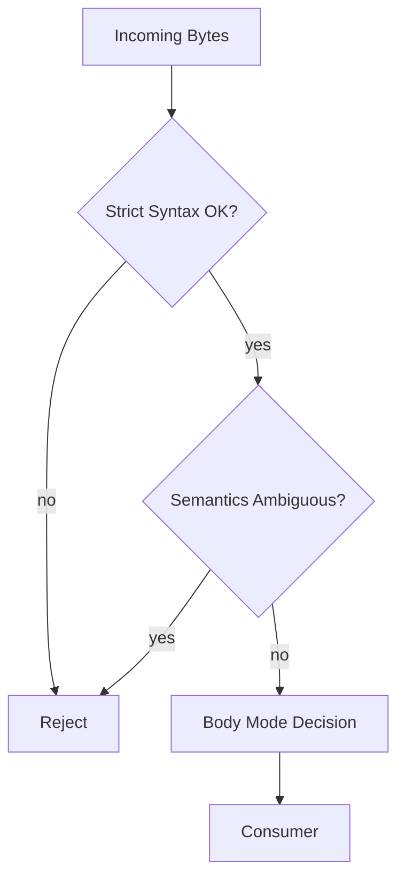
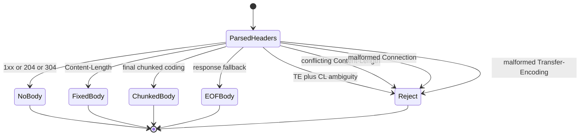
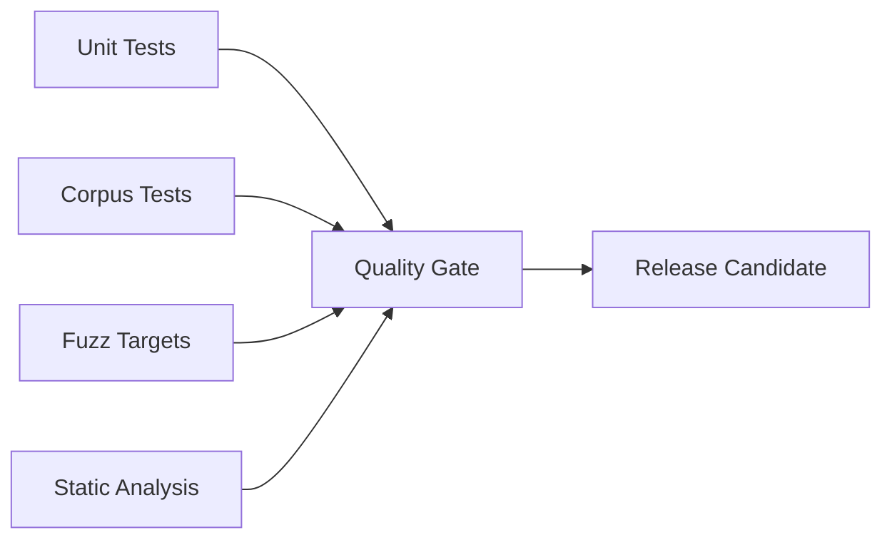

# Production Hardening

`iohttpparser` is not a generic text parser. It is a security-sensitive HTTP/1.1 wire parser. Production hardening therefore means making malformed, ambiguous, and hostile traffic fail closed while keeping integration predictable for `iohttp` and `ringwall`.

---

## Table of Contents

1. [Strict Policy Surface](#1-strict-policy-surface)
2. [Limits and Boundaries](#2-limits-and-boundaries)
3. [Semantics Rejection Rules](#3-semantics-rejection-rules)
4. [State and Buffer Ownership](#4-state-and-buffer-ownership)
5. [Verification Pipeline](#5-verification-pipeline)
6. [Consumer Profiles](#6-consumer-profiles)
7. [Release Gates](#7-release-gates)

---

## 1. Strict Policy Surface

The production baseline is `IHTP_POLICY_STRICT`.

| Policy | Default | Purpose |
|---|---|---|
| `reject_obs_fold` | `true` | Reject obsolete folded header syntax |
| `reject_bare_lf` | `true` | Reject line endings without `CRLF` |
| `reject_te_cl` | `true` | Reject ambiguous `Transfer-Encoding` + `Content-Length` |
| `allow_spaces_in_uri` | `false` | Keep request-target parsing fail-closed |

The goal is a small policy surface. If a rule matters for request smuggling or framing ambiguity, strict mode should reject it by default.

---

## 2. Limits and Boundaries

Hard parser limits are part of the production contract.

| Limit | Macro | Default |
|---|---|---|
| Max headers | `IHTP_MAX_HEADERS` | 64 |
| Max request line | `IHTP_MAX_REQUEST_LINE` | 8192 |
| Max header line | `IHTP_MAX_HEADER_LINE` | 8192 |

These limits should remain:
- explicit
- test-covered
- consumer-configurable at build time

For `ringwall`, the expected operating profile is smaller limits than the general-purpose `iohttp` profile.

---

## 3. Semantics Rejection Rules

Production hardening lives mostly in the semantics layer.

Current rejection classes already include:
- conflicting duplicate `Content-Length`
- malformed `Transfer-Encoding`
- duplicate `chunked`
- `Transfer-Encoding` chains that do not end in `chunked` on requests
- malformed `Connection` token lists
- missing or duplicate `Host` in strict HTTP/1.1 request handling
- no-body response precedence cases for `1xx`, `204`, and `304`

---

## 4. State and Buffer Ownership

Production embedding depends on simple ownership rules:
- the caller owns all input buffers
- parsed spans remain valid only while the caller buffer remains valid
- parser state tracks progress, not private storage
- body decoders keep framing state only

This is critical for:
- `io_uring` provided-buffer pipelines
- proxy/security use cases where copies must stay explicit
- preventing hidden heap allocation in hot paths

---

## 5. Verification Pipeline

Production hardening is enforced through multiple verification layers:

| Layer | Current Tooling |
|---|---|
| Unit tests | Unity |
| Corpus tests | Scanner, semantics, body corpora |
| Fuzzing | `fuzz_parser`, `fuzz_chunked`, `fuzz_scanner` |
| Formatting | `clang-format` |
| Static analysis | `cppcheck`, `PVS-Studio`, `CodeChecker` |
| Benchmark checks | scanner benchmark scripts |

---

## 6. Consumer Profiles

### iohttp

The `iohttp` profile should remain interoperable but strict by default. Leniency may exist, but only as an explicit compatibility choice.

### ringwall

The `ringwall` profile should remain smaller and stricter:
- smaller limits
- no legacy tolerance by default
- fail closed on ambiguity

---

## 7. Release Gates

Before a production-tagged release, the project should require:

1. Green `./scripts/quality.sh`
2. Green sanitizer matrix where supported
3. Green fuzz smoke runs
4. Differential checks against `picohttpparser` and `llhttp`
5. Documented consumer contract for `iohttp` and `ringwall`

The rule is simple: performance improvements are optional; strict correctness and explicit failure modes are mandatory.
