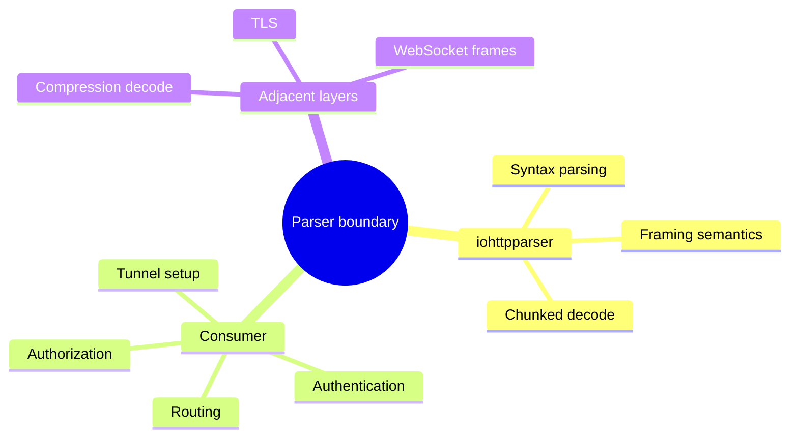

# Parser Ecosystem Comparison

## Purpose

This document defines which tasks belong inside `iohttpparser` and which tasks
belong in the consumer or in adjacent libraries.

## Responsibility Split

| Task | iohttpparser | Consumer | Adjacent library |
|---|---|---|---|
| request/status line parse | yes | no | no |
| header field parse | yes | no | no |
| framing semantics | yes | no | no |
| chunked decode | yes | no | no |
| keep-alive decision | yes | consumer uses result | no |
| routing | no | yes | no |
| URI normalization | no | yes | no |
| TLS | no | yes | yes |
| compression decode | no | yes | yes |
| cookies | no | yes | yes |
| WebSocket frames | no | yes | yes |

## Comparison with Other Parser Families

| Family | Typical boundary |
|---|---|
| minimal parser (`picohttpparser`) | syntax only; semantics mostly external |
| generated state machine (`llhttp`) | syntax and many protocol decisions inside parser callbacks |
| layered parser core (`iohttpparser`) | syntax, semantics, and body framing split into separate stages |

## Why `iohttpparser` Includes Semantics and Body Framing

The library includes:
- framing decisions
- ambiguity rejection
- keep-alive and no-body precedence
- chunked decode

Reason:
- both `iohttp` and `ioguard` need these decisions before application logic
- these decisions depend directly on parsed HTTP wire semantics
- keeping them in one library reduces duplicated parser-adjacent logic

## Why `iohttpparser` Excludes Higher Layers

The library excludes:
- routing
- authentication
- authorization
- URI normalization
- content decoders
- transport ownership

Reason:
- these tasks depend on application policy, not only on HTTP wire syntax
- consumers need different behavior
- adding them to the parser would widen the contract without improving parser
  correctness

## Boundary Diagram

## Compatibility with `picohttpparser` and `llhttp`

`iohttpparser` is compatible with the ecosystem in the following sense:
- it can be compared against `picohttpparser` and `llhttp` for syntax and
  parser behavior
- it does not try to copy either integration model

It is not compatible in the following sense:
- it does not expose a callback-first API like `llhttp`
- it does not reduce itself to syntax-only output like `picohttpparser`
