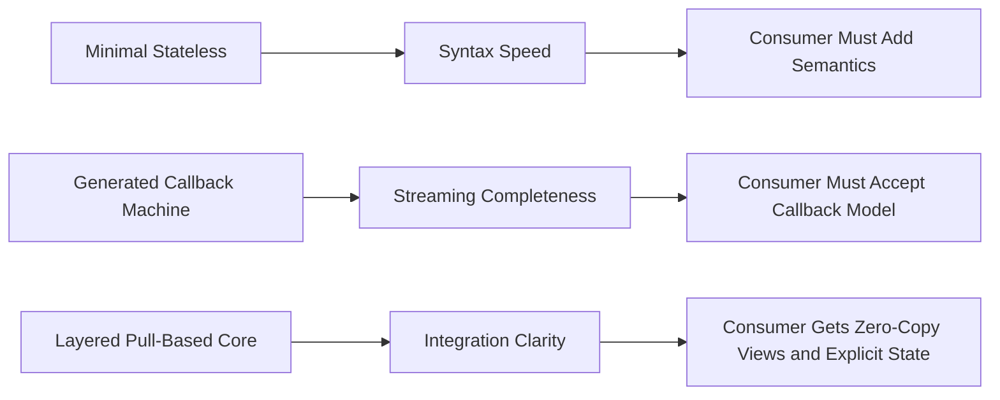
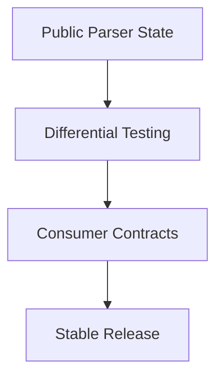

# Parser Ecosystem Comparison

## Executive Summary

The parser ecosystem around embedded HTTP/1.1 libraries is split into three broad implementation styles:

1. Minimal stateless parsers
2. Generated callback-driven state machines
3. Layered pull-based parser cores

`iohttpparser` is intentionally building the third category. This document compares those styles and explains why that matters for `iohttp`, `ringwall`, and generic embedders.

---

## Implementation Families

| Family | Representative | Strength | Weakness |
|---|---|---|---|
| Minimal stateless | `picohttpparser` | Tiny API, easy embedding, very fast syntax path | Consumer must own semantics and many edge cases |
| Generated callback state machine | `llhttp` | Rich streaming behavior, mature state coverage | Callback-first API, semantics and parser logic more tightly coupled |
| Layered pull-based core | `iohttpparser` | Explicit ownership, separate semantics/body layers, consumer-friendly state | Newer codebase, still maturing its ecosystem and docs |

---

## Fit for Target Consumers

### iohttp

`iohttp` wants a parser core that:
- does not own transport
- can sit under an `io_uring` server
- keeps body framing separate from routing and application logic

This aligns better with `iohttpparser` than with a callback-driven machine.

### ringwall

`ringwall` wants a parser core that:
- acts as a strict security boundary
- exposes explicit semantics decisions
- does not hide lenient behavior

Again, this favors a layered pull-based parser with an explicit semantics step.

### Generic Embedders

Standalone event loops often want:
- zero-copy structs
- explicit progress via parser state
- no mandatory dependency on a framework runtime

That is the exact niche the public stateful API is meant to serve.

---

## Comparison Matrix

| Criterion | iohttpparser | picohttpparser | llhttp |
|---|---|---|---|
| Caller-owned buffers | Yes | Yes | Yes, but exposed through callbacks |
| Public parser state | Yes | No | Yes |
| Pull-based result structs | Yes | Yes | No, callback events instead |
| Separate semantics phase | Yes | No | Mostly no |
| Separate body decoder | Yes | Partial | Mostly integrated |
| Differential testing value | High | High | High |
| Direct fit for `iohttp` and `ringwall` | Highest | Medium | Medium |

---

## Roadmap Consequences

The parser ecosystem comparison implies the following roadmap:

1. Keep the public parser-state API small and stable.
2. Grow differential testing instead of widening leniency.
3. Document consumer integration patterns as first-class docs.
4. Keep the semantics layer explicit rather than folding it into the syntax parser.

---

## Recommendation

`iohttpparser` should not try to become a clone of either `picohttpparser` or `llhttp`.

It should remain:
- stricter than `picohttpparser`
- simpler to embed than `llhttp`
- more explicit about ownership and semantics than both
