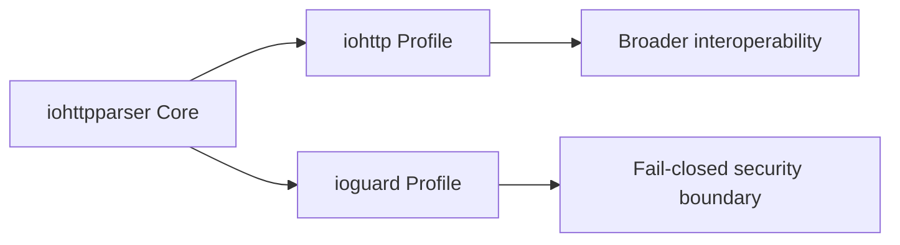
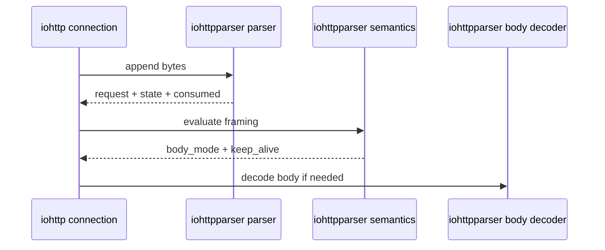

# Consumer Contracts

## Executive Summary

`iohttpparser` now has enough parser, semantics, body-decoder, and differential-testing coverage to publish explicit consumer contracts.

The two primary consumers are:
- `iohttp`
- `ioguard` (formerly `ringwall`)

They do not need identical parser behavior. They need the same parser core with different policy envelopes.

---

## Shared Base Contract

Both consumers rely on the same invariants:
- caller-owned input buffers
- zero-copy spans in parsed outputs
- no parser-owned transport state
- explicit semantics step after syntax parsing
- explicit body-framing handoff through `ihtp_semantics_*` and `ihtp_body_decoder_*`

The stateful parser API is the preferred integration path for both:
- `ihtp_parser_state_t`
- `ihtp_parse_request_stateful()`
- `ihtp_parse_response_stateful()`
- `ihtp_parse_headers_stateful()`

The semantics handoff is now also part of the public surface:
- `ihtp_request_apply_semantics()`
- `ihtp_response_apply_semantics()`
- header: `include/iohttpparser/ihtp_semantics.h`
- consumer-facing semantics flags:
  - `protocol_upgrade`
  - `expects_continue`
  - `has_trailer_fields`

---

## iohttp Contract

`iohttp` is an HTTP server library. Its parser contract should optimize for clear body framing and reusable connection-level state, while still defaulting to strict RFC behavior.

### Expected integration model

- accumulate bytes per connection
- reuse one `ihtp_parser_state_t` per in-flight message
- run semantics immediately after successful header parse
- hand body mode to request-processing code without embedding routing or app logic in the parser layer

### Required guarantees

- strict-by-default request parsing
- optional leniency only through explicit policy configuration
- stable `bytes_consumed` and parser-phase reporting across partial reads
- body mode separation:
  - `IHTP_BODY_NONE`
  - `IHTP_BODY_FIXED`
  - `IHTP_BODY_CHUNKED`
  - `IHTP_BODY_EOF`

---

## ioguard Contract

`ioguard` uses `iohttpparser` as a stricter boundary component. The parser contract should optimize for fail-closed behavior and ambiguity rejection.

### Expected integration model

- one parser state per control-plane message flow
- strict policy profile by default
- reject ambiguous framing before higher-level proxy or security logic sees the message

### Required guarantees

- reject-by-default handling for:
  - conflicting `Content-Length`
  - `Transfer-Encoding + Content-Length`
  - malformed `Connection`
  - malformed line endings
  - invalid request-target control bytes
- small, explicit limit surface
- no hidden fallback from strict decisions to lenient acceptance

`ioguard` should treat `iohttpparser` semantics output as a security decision point, not just a convenience parser result.

---

## Policy Split

| Area | iohttp | ioguard |
|---|---|---|
| Default mode | Strict | Strict |
| Lenient toggles | Allowed when explicitly configured | Discouraged; opt-in only for migration |
| Header limits | Moderate server defaults | Smaller fail-closed defaults |
| Ambiguous framing | Reject | Reject |
| Bare `LF` support | Only via explicit lenient policy | Off |
| `obs-fold` support | Only via explicit lenient policy | Off |

Named presets now exist in the public API:
- `IHTP_POLICY_IOHTTP`
- `IHTP_POLICY_IOGUARD`

Both currently map to the strict RFC profile. The separate names make consumer
intent explicit and leave room for future divergence without changing
integration call sites.

---

## Immediate Follow-Up

Sprint 7 should now lock down:

1. consumer-facing docs for body-mode handoff
2. `Upgrade`, `CONNECT`, and `Expect: 100-continue` semantics ownership
3. limit/profile presets for `iohttp` and `ioguard`
4. integration examples that show stateful parsing on accumulated buffers

### Semantics ownership details

- `protocol_upgrade` is set only when the parsed message itself makes the
  upgrade decision explicit:
  - request: `Connection: upgrade` plus non-empty `Upgrade`
  - response: `101 Switching Protocols` plus `Connection: upgrade` and `Upgrade`
- `expects_continue` is request-only and is set for exact `Expect: 100-continue`
- `has_trailer_fields` means the message advertises trailer fields and the
  consumer should hand off chunked body completion to the trailer-aware path
- `CONNECT` remains visible primarily through `req.method == IHTP_METHOD_CONNECT`;
  Sprint 7 does not add a redundant boolean for that case

### Integration example baseline

`examples/basic_parse.c` now shows the preferred consumer flow:

1. accumulate bytes into one caller-owned buffer
2. reuse `ihtp_parser_state_t`
3. parse with `IHTP_POLICY_IOHTTP`
4. call `ihtp_request_apply_semantics()`
5. hand the remaining bytes to `ihtp_decode_chunked()` when framing is chunked

## Recommendation

Treat `iohttp` and `ioguard` as policy consumers of one parser core, not as reasons to fork parser behavior into separate implementations.
