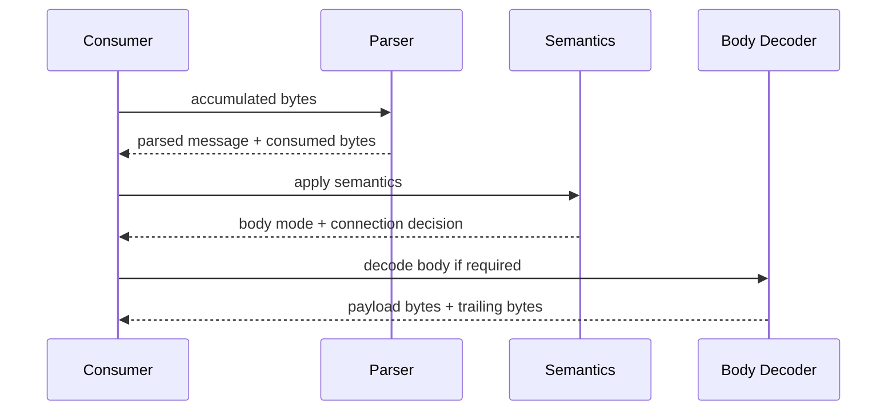

# Consumer Contracts

## Shared Contract

Both supported consumers use the same parser core.

Shared invariants:
- caller-owned input buffers
- zero-copy parsed spans
- explicit semantics step after syntax parsing
- explicit body-decoder handoff after semantics
- no transport ownership inside the library

Preferred API for both consumers:
- `ihtp_parser_state_t`
- `ihtp_parse_request_stateful()`
- `ihtp_parse_response_stateful()`
- `ihtp_parse_headers_stateful()`

Public semantics surface:
- `ihtp_request_apply_semantics()`
- `ihtp_response_apply_semantics()`
- `protocol_upgrade`
- `expects_continue`
- `has_trailer_fields`

## Policy Presets

| Preset | Current behavior |
|---|---|
| `IHTP_POLICY_IOHTTP` | strict RFC profile |
| `IHTP_POLICY_IOGUARD` | strict RFC profile |

Both presets are currently exact aliases of the strict profile.

## `iohttp` Contract

`iohttp` uses `iohttpparser` as an HTTP/1.1 wire codec.

Required behavior:
- parse over an accumulated caller buffer
- reuse parser state across partial reads
- apply semantics immediately after header parse
- hand body mode to the connection or request layer

Required outputs:
- `bytes_consumed`
- `body_mode`
- `keep_alive`
- request and response header spans

## `ioguard` Contract

`ioguard` uses `iohttpparser` as a strict boundary parser.

Required behavior:
- fail closed on ambiguity
- keep strict policy by default
- reject malformed framing before consumer logic

Required outputs:
- request method and target
- framing decision
- connection decision
- strict rejection on ambiguous syntax or semantics

## Ownership Rules

| Area | Rule |
|---|---|
| parser input | caller-owned |
| parsed spans | point into caller buffer |
| parser state | progress only |
| semantics result | copied consumer-owned struct |
| chunked payload | rewritten in caller buffer |
| trailing bytes | remain in caller buffer |

## Special Cases

### `CONNECT`

- exposed through `req.method == IHTP_METHOD_CONNECT`
- authority target is returned in `req.path`
- tunnel setup belongs to the consumer

### `101 Switching Protocols`

- `protocol_upgrade` is set only when the response explicitly upgrades
- parser ownership ends at the response header block
- bytes after the header block belong to the consumer

### `Expect: 100-continue`

- `expects_continue` is request-only
- the parser does not emit interim responses
- the consumer decides whether to send `100 Continue`

### Trailer Fields

- `has_trailer_fields` signals trailer advertisement
- `ihtp_chunked_decoder_t.consume_trailer` decides trailer ownership
- `consume_trailer = false` returns trailer bytes to the consumer

## Integration Sequence

