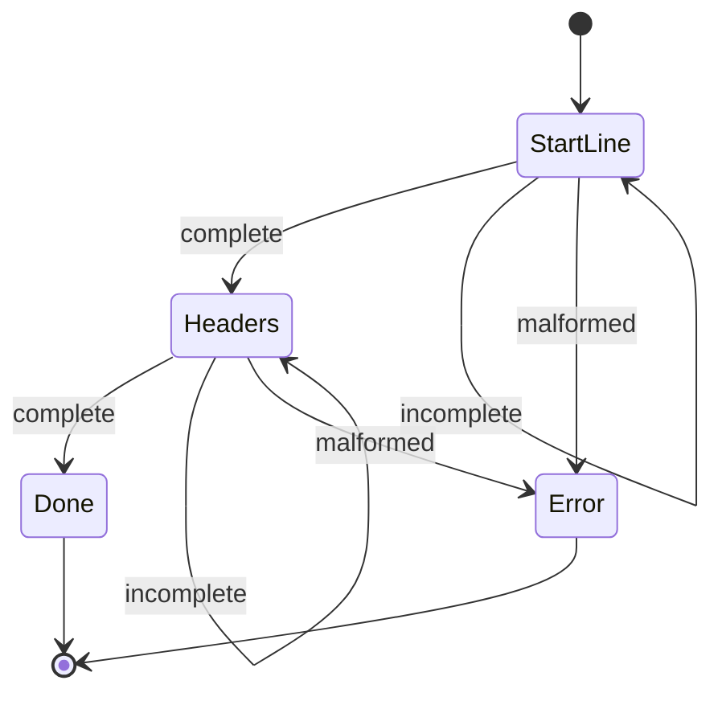

[](https://github.com/ioplane/iohttpparser)
[](https://www.iso.org/standard/82075.html)
[](https://www.doxygen.nl/)
[](https://mermaid.js.org/syntax/stateDiagram.html)

# Parser State

## Purpose

The parser-state API supports incremental parsing over an accumulated caller
buffer.

Supported message classes:
- requests
- responses
- standalone header blocks

## Public API

| API | Purpose |
|---|---|
| `ihtp_parser_state_t` | parser progress object |
| `ihtp_parser_state_init()` | initialize parser state |
| `ihtp_parser_state_reset()` | reuse parser state for the next message |
| `ihtp_parse_request_stateful()` | incremental request parse |
| `ihtp_parse_response_stateful()` | incremental response parse |
| `ihtp_parse_headers_stateful()` | incremental header-block parse |

## Invariants

- The caller owns the accumulated buffer.
- Parsed spans point into the accumulated buffer.
- The same accumulated buffer must remain valid across incremental calls.
- Parser state tracks progress; it does not own message bytes.
- `ihtp_parser_state_reset()` rewinds parser progress only.

## Progress Model



The state object exists to avoid rescanning already accepted bytes.

## Example

```c
#include <iohttpparser/ihtp_parser.h>
#include <string.h>

int main(void)
{
    const char *wire =
        "GET /health HTTP/1.1\r\n"
        "Host: example.com\r\n"
        "\r\n";

    ihtp_request_t req = {0};
    ihtp_parser_state_t st;
    size_t consumed = 0;

    ihtp_parser_state_init(&st, IHTP_PARSER_MODE_REQUEST);

    if (ihtp_parse_request_stateful(&st, wire, 20, &req, NULL, &consumed) == IHTP_INCOMPLETE) {
        /* append bytes to the same accumulated buffer */
    }

    if (ihtp_parse_request_stateful(&st, wire, strlen(wire), &req, NULL, &consumed) == IHTP_OK) {
        /* req spans point into wire */
    }

    return 0;
}
```

## When to Use

Use the stateful API when the consumer:
- reads from a connection in multiple steps
- retains an accumulated buffer
- wants parser progress without callback integration

Prefer the stateful API for throughput-sensitive consumers. The stateless
wrappers clear the output struct on every call before delegating to the same
parser logic, so they are simpler to use but slightly more expensive in tight
loops.

Use the stateless API when the consumer already has the full accumulated buffer
and does not need explicit parser progress state.
