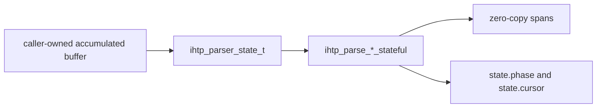

# Parser State API

`iohttpparser` now exposes an explicit parser-state API for incremental parsing of:
- requests
- responses
- standalone header blocks

The stateful API keeps the project on the same pull-based model as the original stateless functions. It does not introduce callbacks, hidden allocation, or parser-owned buffers.



## Available API

- `ihtp_parser_state_t`
- `ihtp_parser_state_init()`
- `ihtp_parser_state_reset()`
- `ihtp_parse_request_stateful()`
- `ihtp_parse_response_stateful()`
- `ihtp_parse_headers_stateful()`

## Contract

- The caller still owns the input buffer.
- Parsed spans still point into the caller buffer.
- Reuse the same `ihtp_parser_state_t` while the accumulated buffer grows.
- `state.cursor` tracks total consumed bytes inside the accumulated buffer.
- `state.phase` reports whether parsing is still in the start line, header block, done, or error phase.
- `ihtp_parser_state_reset()` preserves `state.mode` and rewinds progress for a fresh message.

## Example

```c
#include <iohttpparser/ihtp_parser.h>
#include <string.h>

int main(void)
{
    const char *wire =
        "GET /health HTTP/1.1\r\n"
        "Host: example.com\r\n"
        "\r\n";

    ihtp_request_t req = {0};
    ihtp_parser_state_t st;
    size_t consumed = 0;

    ihtp_parser_state_init(&st, IHTP_PARSER_MODE_REQUEST);

    if (ihtp_parse_request_stateful(&st, wire, 20, &req, nullptr, &consumed) == IHTP_INCOMPLETE) {
        /* append more bytes to the same accumulated buffer */
    }

    if (ihtp_parse_request_stateful(&st, wire, strlen(wire), &req, nullptr, &consumed) == IHTP_OK) {
        /* req now contains zero-copy spans into wire */
    }
}
```

## When to use it

Prefer the stateful API when the consumer already manages connection-level state and wants explicit parser progress. Keep the existing stateless API for simple accumulated-buffer parsing where an extra state object adds no value.
