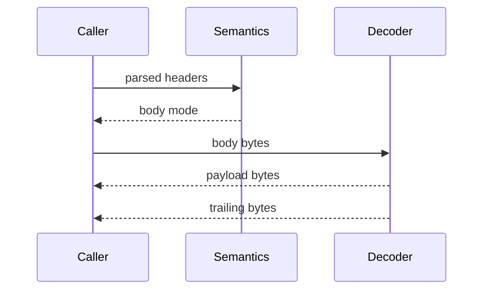

# Body Decoder

## Scope

The body decoder handles framing only.

Included:
- fixed-length byte accounting
- chunked decode
- trailer consumption control

Excluded:
- transport reads
- hidden buffering
- content-coding decode
- application payload interpretation

## Decoder Surface

| API | Purpose |
|---|---|
| `ihtp_fixed_decoder_init()` | initialize fixed-length accounting |
| `ihtp_decode_fixed()` | advance fixed-length decode state |
| `ihtp_chunked_decoder_t` | chunked decode state |
| `ihtp_decode_chunked()` | decode chunked body bytes in place |

## Chunked Decoder Contract

- Reuse one `ihtp_chunked_decoder_t` across calls.
- The decoder rewrites the caller buffer in place.
- `*bufsz` becomes the retained payload size in the current slice.
- `total_decoded` counts payload bytes only.
- A non-negative return value means completion and equals the number of
  trailing bytes after the terminal chunk processing path.

### Trailer Ownership

| `consume_trailer` | Effect |
|---|---|
| `true` | decoder consumes trailer fields through the terminating empty line |
| `false` | decoder leaves trailer bytes for the consumer |

Trailing bytes remain in the caller buffer immediately after the decoded
payload prefix.

## Fixed-Length Decoder Contract

- `ihtp_fixed_decoder_init()` sets the expected payload length.
- `ihtp_decode_fixed()` is accounting only.
- `remaining` decreases monotonically.
- `total_decoded` increases monotonically.
- Passing more bytes than `remaining` is an error.

## Ownership Rules

- Input bytes are caller-owned.
- Decoded payload bytes remain in caller-owned memory.
- Decoder state stores counters and phase only.

## Decode Sequence

