[](https://github.com/ioplane/iohttpparser)
[](https://www.rfc-editor.org/rfc/rfc9110.html)
[](https://www.rfc-editor.org/rfc/rfc9112.html)
[](https://valgrind.org/)
[](https://github.com/namhyung/uftrace)
[](https://mermaid.js.org/syntax/gantt.html)

# Test Program and Methodology

## Related Documents

| Document | Purpose |
|---|---|
| [02-comparison.md](./02-comparison.md) | comparison targets and compared capabilities |
| [09-test-results.md](./09-test-results.md) | functional and performance test results |
| [10-extended-contract-methodology.md](./10-extended-contract-methodology.md) | methodology for capabilities beyond the common matrix |
| [11-extended-contract-results.md](./11-extended-contract-results.md) | result status for the extended contract |
| [../plans/2026-03-11-sprint-11-comparison-report.md](../plans/2026-03-11-sprint-11-comparison-report.md) | detailed comparison and profiling history |

## Purpose

This document defines the repository-level test program and methodology.

It covers:
- functional acceptance testing
- performance acceptance testing
- comparison against `picohttpparser` and `llhttp`
- publication of repeatable artifacts in the repository

This document covers the common comparison layer.

Capabilities that require an extended-contract interpretation are documented in:
- [10-extended-contract-methodology.md](./10-extended-contract-methodology.md)
- [11-extended-contract-results.md](./11-extended-contract-results.md)

## Test Object

The test object is the public library surface:
- parser
- parser state
- semantics stage
- body decoder
- scanner backends

The test object excludes:
- transport I/O
- TLS
- routing
- application handlers

## Test Goals

| Goal | Question |
|---|---|
| syntax correctness | does the parser accept valid syntax and reject malformed syntax? |
| semantics correctness | do framing and connection rules match the documented contract? |
| consumer compatibility | can `iohttp` and `ioguard` use the library without hidden glue? |
| backend equivalence | do scalar and SIMD scanner paths produce identical results? |
| comparative behavior | where does behavior match or intentionally diverge from `picohttpparser` and `llhttp`? |
| throughput | how much parser work is completed per unit time? |
| hotspot localization | which internal stage dominates the remaining cost? |

## Test Inputs

| Input class | Source |
|---|---|
| unit cases | `tests/unit/` |
| corpus cases | `tests/corpus/` |
| differential cases | `tests/corpus/differential/`, `tests/corpus/semantics-differential/` |
| integration cases | `tests/unit/test_iohttp_integration.c` |
| throughput scenarios | `bench/bench_throughput_compare.c` |
| profiling targets | `bench/bench_throughput_compare.c`, scanner benchmarks |

## Environment

Required environment:
- development container from `deploy/podman/Containerfile`
- `clang-debug` preset for functional runs
- `clang-release` preset for throughput runs

Optional profiling tools inside the container:
- `valgrind`
- `uftrace`
- `gdb`
- `ftracer`

## Program Structure

```mermaid
gantt
    title PMI and PSI execution order
    dateFormat  X
    axisFormat %s
    section Functional
    Configure and build           :a1, 0, 1
    Run full ctest suite          :a2, after a1, 1
    section Performance
    Run single throughput matrix  :b1, after a2, 1
    Run median throughput matrix  :b2, after b1, 1
    section Publication
    Write artifacts to repository :c1, after b2, 1
    Update 09 results document    :c2, after c1, 1
```



## Functional Acceptance Testing

Functional acceptance testing uses:
- `cmake --preset clang-debug`
- `cmake --build --preset clang-debug`
- `ctest --preset clang-debug --output-on-failure`

The functional run covers:
- unit tests
- corpus tests
- differential tests
- consumer integration tests
- scanner backend tests

Acceptance rule:
- the full `ctest` run must pass without skipped failures in the tested preset

## Performance Acceptance Testing

Performance acceptance testing uses:
- `bench/bench_throughput_compare.c`
- `scripts/run-throughput-compare.sh`
- `scripts/run-throughput-median.sh`

The performance run must include all three parsers:
- `iohttpparser`
- `picohttpparser`
- `llhttp`

The performance run must include:
- common matrix
- `CONNECT`-focused matrix
- median aggregation across repeated runs

Measured values:
- `req/s`
- `MiB/s`
- `ns/req`

## Comparison Rules

Comparison rules:
1. run the same byte sequences through all three parsers
2. keep parser-only scope; do not add consumer-side work to one wrapper only
3. keep strict and lenient `iohttpparser` runs separate
4. classify divergence as:
   - matching
   - intentional
   - unexplained

## Artifact Publication

Repository-published artifacts are written under:

`tests/artifacts/pmi-psi/<date>/`

Repository-level entry points:
- [`tests/artifacts/pmi-psi/README.md`](../../tests/artifacts/pmi-psi/README.md)
- [`tests/artifacts/pmi-psi/index.tsv`](../../tests/artifacts/pmi-psi/index.tsv)
- [`tests/artifacts/pmi-psi/latest.txt`](../../tests/artifacts/pmi-psi/latest.txt)

Required files:
- `README.md`
- `run.txt`
- `host.txt`
- `toolchain.txt`
- `ctest.txt`
- `throughput.tsv`
- `throughput-connect.tsv`
- `throughput-median.tsv`
- `throughput-connect-median.tsv`

## Primary Runner

Primary repeatable runner:

```bash
bash scripts/run-pmi-psi.sh
```

This runner:
1. configures and builds the project
2. runs the full functional test suite
3. runs parser-only throughput measurements
4. stores all outputs in the repository

## Acceptance Criteria

The PMI/PSI batch is accepted only when:
1. the full functional suite passes
2. artifacts are written to the repository
3. the result document `09-test-results.md` is updated from the generated artifacts
4. three-way comparison against `picohttpparser` and `llhttp` is preserved
