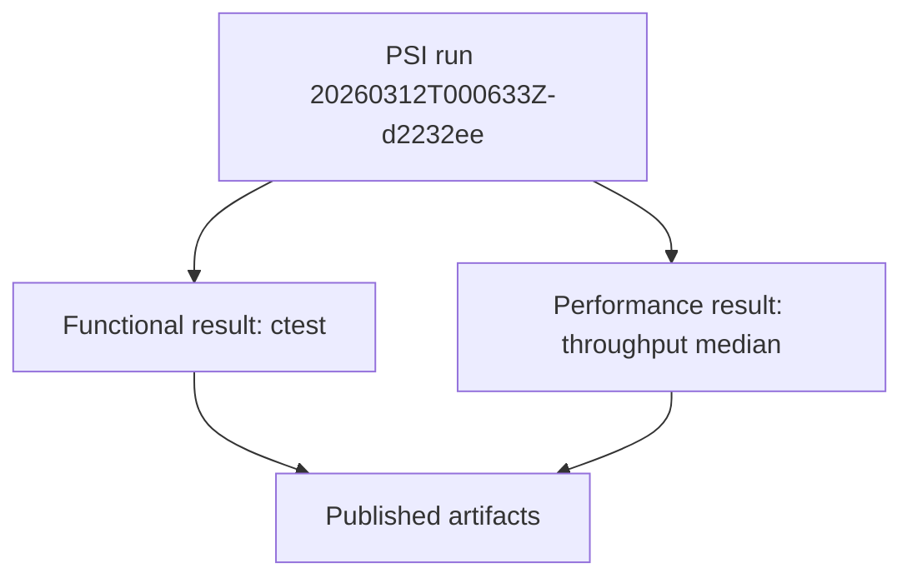
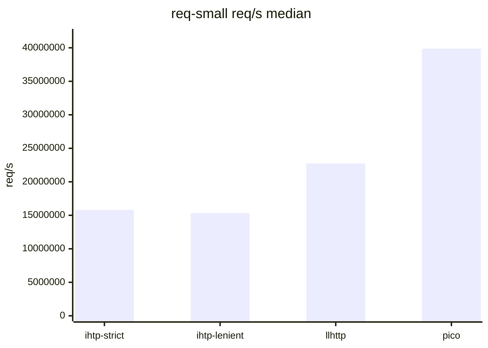
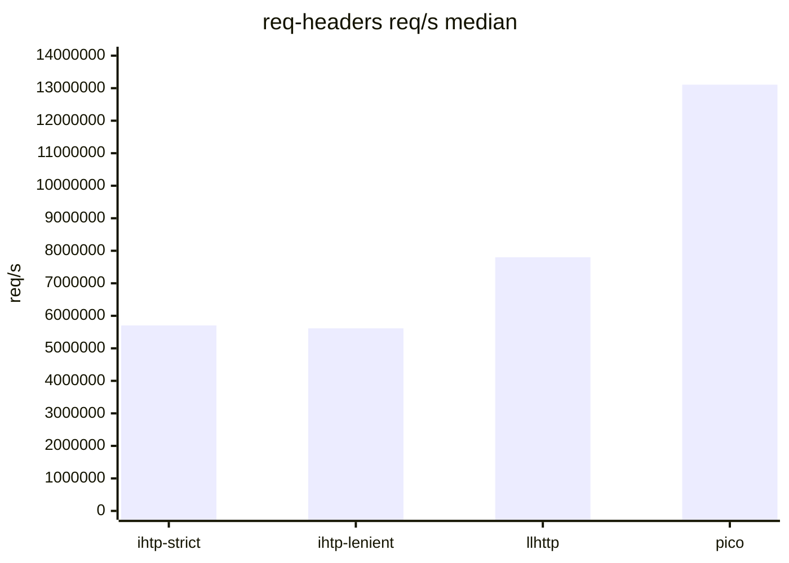
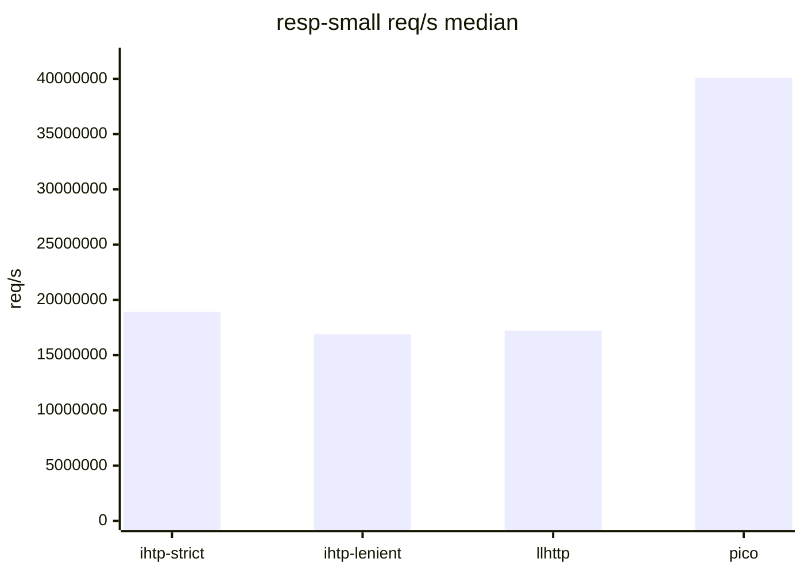
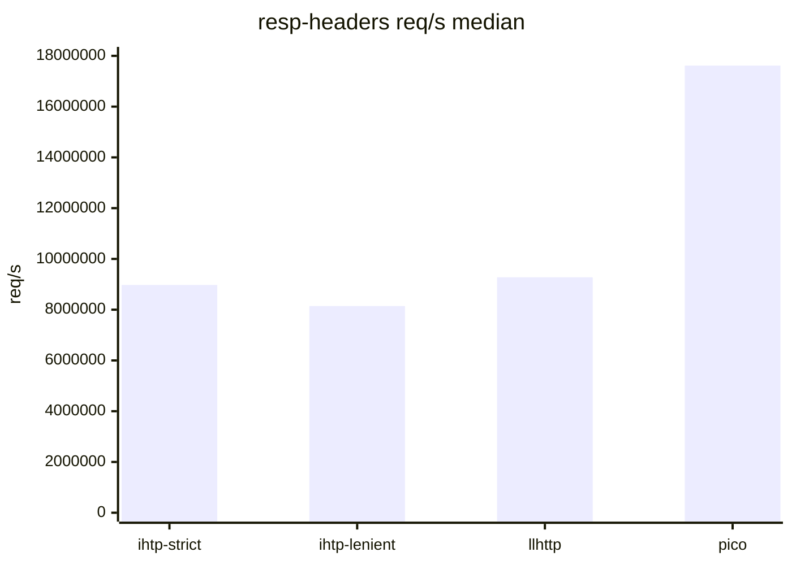
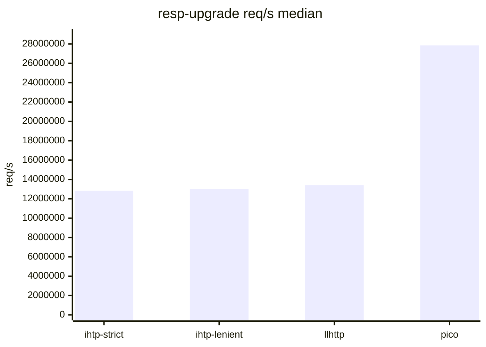
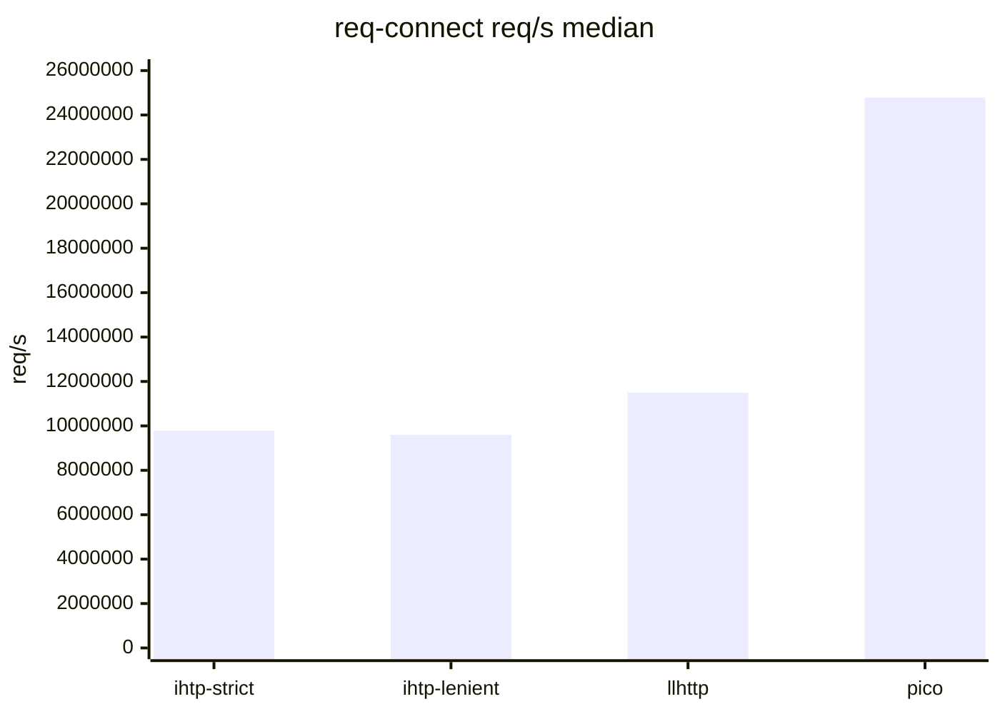

# Test Results

## Related Documents

| Document | Purpose |
|---|---|
| [02-comparison.md](./02-comparison.md) | compared capabilities and scenario scope |
| [08-testing-methodology.md](./08-testing-methodology.md) | PMI and PSI method |
| [../plans/2026-03-11-sprint-11-comparison-report.md](../plans/2026-03-11-sprint-11-comparison-report.md) | deeper comparison and profiling notes |

## Scope

This document stores repository-published functional and performance test
results.

## Artifact Set

Current artifact directory:

`tests/artifacts/pmi-psi/runs/20260312T000633Z-d2232ee/`

Repository entry points:
- [`tests/artifacts/pmi-psi/README.md`](../../tests/artifacts/pmi-psi/README.md)
- [`tests/artifacts/pmi-psi/index.tsv`](../../tests/artifacts/pmi-psi/index.tsv)
- [`tests/artifacts/pmi-psi/latest.txt`](../../tests/artifacts/pmi-psi/latest.txt)
- [`tests/artifacts/pmi-psi/runs/20260312T000633Z-d2232ee/summary.md`](../../tests/artifacts/pmi-psi/runs/20260312T000633Z-d2232ee/summary.md)

## Execution Summary

| Field | Value |
|---|---|
| run id | `20260312T000633Z-d2232ee` |
| git head | `d2232ee` |
| functional preset | `clang-debug` |
| throughput iterations | `200000` |
| median runs | `5` |
| status | `PASS` |

## Functional Results

`ctest --preset clang-debug --output-on-failure` result:

| Metric | Value |
|---|---|
| total tests | `12` |
| failed tests | `0` |
| pass rate | `100%` |
| wall clock | `0.02 sec` |

Covered executable set:
- `test_scanner`
- `test_scanner_backends`
- `test_scanner_corpus`
- `test_parser`
- `test_parser_state`
- `test_differential_corpus`
- `test_semantics_differential`
- `test_semantics`
- `test_semantics_corpus`
- `test_iohttp_integration`
- `test_body_decoder`
- `test_body_decoder_corpus`

## Performance Results

### Why these numbers do not match the newer perf work

This PSI run was executed on repository revision `d2232ee` from `main`.

The newer performance localization batch is still outside `main`:
- branch: `feature/sprint-13-perf-localization`
- PR: `#25`

That means this PSI reflects the stable merged baseline, not the latest
unmerged tuning work. The PSI result is therefore expected to lag behind the
latest profiler-driven branch.

### Scenario Definitions

| Scenario | Meaning |
|---|---|
| `req-small` | short request with a minimal header block |
| `req-headers` | request with a larger and more realistic header set |
| `resp-small` | short response without a large header block |
| `resp-headers` | response with a larger header block |
| `resp-upgrade` | `101 Switching Protocols` response path |
| `req-connect` | `CONNECT` request in authority form |

### Scenario Results

#### req-small

Short request with a minimal header block.

| Parser | req/s median | MiB/s median | ns/req median |
|---|---:|---:|---:|
| `iohttpparser-strict` | `15,802,711.37` | `738.46` | `63.28` |
| `iohttpparser-lenient` | `15,347,760.69` | `717.20` | `65.16` |
| `llhttp` | `22,734,335.87` | `1,062.38` | `43.99` |
| `picohttpparser` | `39,873,576.84` | `1,863.29` | `25.08` |

#### req-headers

Request with a larger and more realistic header set.

| Parser | req/s median | MiB/s median | ns/req median |
|---|---:|---:|---:|
| `iohttpparser-strict` | `5,703,031.35` | `1,011.62` | `175.35` |
| `iohttpparser-lenient` | `5,615,055.18` | `996.02` | `178.09` |
| `llhttp` | `7,799,817.98` | `1,383.56` | `128.21` |
| `picohttpparser` | `13,106,707.01` | `2,324.91` | `76.30` |

#### resp-small

Short response without a large header block.

| Parser | req/s median | MiB/s median | ns/req median |
|---|---:|---:|---:|
| `iohttpparser-strict` | `18,919,582.13` | `920.20` | `52.86` |
| `iohttpparser-lenient` | `16,892,389.82` | `821.60` | `59.20` |
| `llhttp` | `17,222,275.95` | `837.65` | `58.06` |
| `picohttpparser` | `40,101,939.13` | `1,950.45` | `24.94` |

#### resp-headers

Response with a larger header block.

| Parser | req/s median | MiB/s median | ns/req median |
|---|---:|---:|---:|
| `iohttpparser-strict` | `8,975,082.39` | `992.88` | `111.42` |
| `iohttpparser-lenient` | `8,141,790.25` | `900.70` | `122.82` |
| `llhttp` | `9,275,587.30` | `1,026.12` | `107.81` |
| `picohttpparser` | `17,615,896.30` | `1,948.78` | `56.77` |

#### resp-upgrade

`101 Switching Protocols` response path.

| Parser | req/s median | MiB/s median | ns/req median |
|---|---:|---:|---:|
| `iohttpparser-strict` | `12,829,842.42` | `942.13` | `77.94` |
| `iohttpparser-lenient` | `13,000,813.27` | `954.69` | `76.92` |
| `llhttp` | `13,391,228.97` | `983.36` | `74.68` |
| `picohttpparser` | `27,851,809.43` | `2,045.24` | `35.90` |

#### req-connect

`CONNECT` request in authority form.

| Parser | req/s median | MiB/s median | ns/req median |
|---|---:|---:|---:|
| `iohttpparser-strict` | `9,788,064.90` | `924.13` | `102.17` |
| `iohttpparser-lenient` | `9,600,916.77` | `906.46` | `104.16` |
| `llhttp` | `11,501,856.00` | `1,085.93` | `86.94` |
| `picohttpparser` | `24,784,351.36` | `2,339.98` | `40.35` |

## Interpretation

- Functional PSI passed without failures.
- Three-way comparison was executed for `iohttpparser`, `llhttp`, and `picohttpparser`.
- `picohttpparser` remains the raw-throughput leader in every recorded PSI scenario.
- `llhttp` is faster than the current `main` baseline on the short request-side PSI scenarios.
- `iohttpparser-strict` is faster than `iohttpparser-lenient` in this PSI run on the published scenarios.
- This PSI run does not invalidate the later profiler-driven work on PR `#25`; it predates that tuning branch and therefore measures the merged baseline only.
