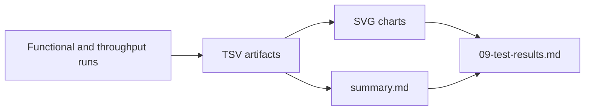
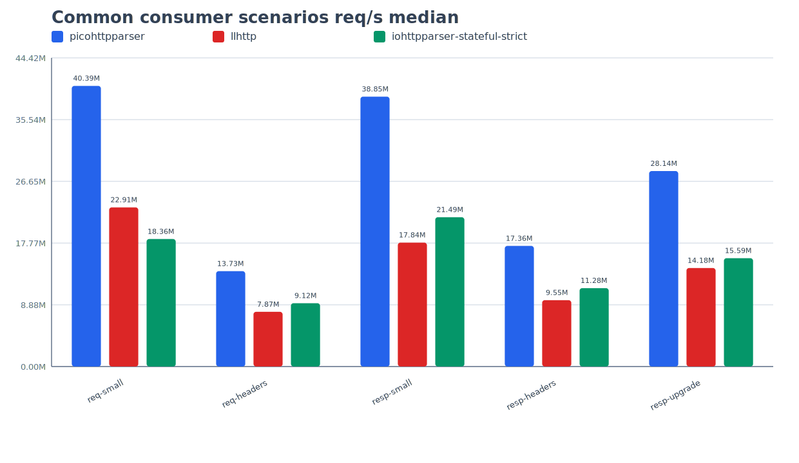
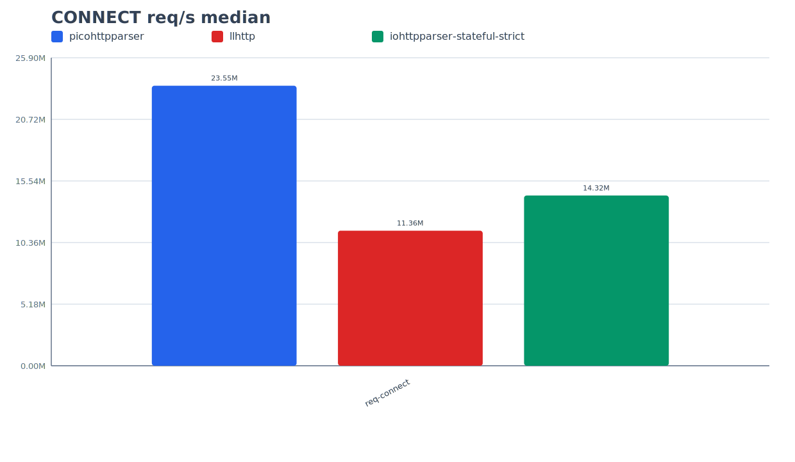

# Test Results

## Related Documents

| Document | Purpose |
|---|---|
| [02-comparison.md](./02-comparison.md) | compared capabilities and scenario scope |
| [08-testing-methodology.md](./08-testing-methodology.md) | PMI and PSI method |
| [10-extended-contract-methodology.md](./10-extended-contract-methodology.md) | methodology for extended-contract capabilities |
| [11-extended-contract-results.md](./11-extended-contract-results.md) | result status for capabilities outside the common matrix |
| [../plans/2026-03-11-sprint-11-comparison-report.md](../plans/2026-03-11-sprint-11-comparison-report.md) | deeper comparison and profiling notes |

## Scope

This document stores repository-published PSI results for:
- functional validation
- parser throughput comparison
- consumer-oriented scenario verification

This document publishes the common comparison matrix.

Capabilities that require an extended-contract interpretation are covered in:
- [10-extended-contract-methodology.md](./10-extended-contract-methodology.md)
- [11-extended-contract-results.md](./11-extended-contract-results.md)

## Artifact Set

Current artifact directory:

`tests/artifacts/pmi-psi/runs/20260313T210231Z-3b9c398/`

Repository entry points:
- [`tests/artifacts/pmi-psi/README.md`](../../tests/artifacts/pmi-psi/README.md)
- [`tests/artifacts/pmi-psi/index.tsv`](../../tests/artifacts/pmi-psi/index.tsv)
- [`tests/artifacts/pmi-psi/latest.txt`](../../tests/artifacts/pmi-psi/latest.txt)
- [`tests/artifacts/pmi-psi/runs/20260313T210231Z-3b9c398/summary.md`](../../tests/artifacts/pmi-psi/runs/20260313T210231Z-3b9c398/summary.md)
- [`tests/artifacts/pmi-psi/runs/20260313T210231Z-3b9c398/throughput-median.tsv`](../../tests/artifacts/pmi-psi/runs/20260313T210231Z-3b9c398/throughput-median.tsv)
- [`tests/artifacts/pmi-psi/runs/20260313T210231Z-3b9c398/throughput-connect-median.tsv`](../../tests/artifacts/pmi-psi/runs/20260313T210231Z-3b9c398/throughput-connect-median.tsv)
- [`tests/artifacts/pmi-psi/runs/20260313T210231Z-3b9c398/summary-extended.md`](../../tests/artifacts/pmi-psi/runs/20260313T210231Z-3b9c398/summary-extended.md)
- [`tests/artifacts/pmi-psi/runs/20260313T210231Z-3b9c398/scanner-bench.tsv`](../../tests/artifacts/pmi-psi/runs/20260313T210231Z-3b9c398/scanner-bench.tsv)

## Execution Summary

| Field | Value |
|---|---|
| run id | `20260313T210231Z-3b9c398` |
| git head | `3b9c398` |
| functional preset | `clang-debug` |
| throughput iterations | `200000` |
| median runs | `5` |
| status | `PASS` |

## Functional Results

`ctest --preset clang-debug --output-on-failure` result:

| Metric | Value |
|---|---|
| total tests | `12` |
| failed tests | `0` |
| pass rate | `100%` |
| wall clock | `0.02 sec` |

Covered executable set:
- `test_scanner`
- `test_scanner_backends`
- `test_scanner_corpus`
- `test_parser`
- `test_parser_state`
- `test_differential_corpus`
- `test_semantics_differential`
- `test_semantics`
- `test_semantics_corpus`
- `test_iohttp_integration`
- `test_body_decoder`
- `test_body_decoder_corpus`

## Performance Profiles

| Profile | Meaning |
|---|---|
| `picohttpparser` | minimal zero-copy parser baseline |
| `llhttp` | generated parser-core baseline |
| `iohttpparser-stateful-strict` | preferred hot path for throughput-sensitive consumers |
| `iohttpparser-strict` | stateless strict wrapper |
| `iohttpparser-stateful-lenient` | stateful compatibility profile |
| `iohttpparser-lenient` | stateless compatibility wrapper |

## Consumer Scenarios

### Scenario Definitions

| Scenario | Purpose |
|---|---|
| `req-small` | short request with a minimal header block |
| `req-headers` | request with a larger and more realistic header set |
| `resp-small` | short response without a large header block |
| `resp-headers` | response with a larger header block |
| `resp-upgrade` | `101 Switching Protocols` response handoff |
| `req-connect` | `CONNECT` request in authority form |

### Three-way Common Matrix

### Three-way CONNECT Focus

### req-small

Short request with a minimal header block.

| Parser | req/s median | MiB/s median | ns/req median |
|---|---:|---:|---:|
| `picohttpparser` | `40,385,707.74` | `1,887.23` | `24.76` |
| `llhttp` | `22,907,400.38` | `1,070.46` | `43.65` |
| `iohttpparser-stateful-strict` | `18,356,247.59` | `857.79` | `54.48` |
| `iohttpparser-lenient` | `17,002,573.76` | `794.53` | `58.81` |
| `iohttpparser-stateful-lenient` | `16,721,689.39` | `781.41` | `59.80` |
| `iohttpparser-strict` | `16,147,832.76` | `754.59` | `61.93` |

### req-headers

Request with a larger and more realistic header set.

| Parser | req/s median | MiB/s median | ns/req median |
|---|---:|---:|---:|
| `picohttpparser` | `13,729,089.91` | `2,435.31` | `72.84` |
| `iohttpparser-stateful-strict` | `9,119,757.79` | `1,617.69` | `109.65` |
| `iohttpparser-stateful-lenient` | `8,250,082.78` | `1,463.43` | `121.21` |
| `iohttpparser-strict` | `8,181,233.63` | `1,451.22` | `122.23` |
| `iohttpparser-lenient` | `7,990,219.65` | `1,417.33` | `125.15` |
| `llhttp` | `7,872,263.39` | `1,396.41` | `127.03` |

### resp-small

Short response without a large header block.

| Parser | req/s median | MiB/s median | ns/req median |
|---|---:|---:|---:|
| `picohttpparser` | `38,847,518.44` | `1,889.44` | `25.74` |
| `iohttpparser-stateful-lenient` | `21,923,305.26` | `1,066.29` | `45.61` |
| `iohttpparser-stateful-strict` | `21,488,479.01` | `1,045.14` | `46.54` |
| `iohttpparser-strict` | `21,222,363.57` | `1,032.20` | `47.12` |
| `iohttpparser-lenient` | `20,950,136.89` | `1,018.96` | `47.73` |
| `llhttp` | `17,837,704.54` | `867.58` | `56.06` |

### resp-headers

Response with a larger header block.

| Parser | req/s median | MiB/s median | ns/req median |
|---|---:|---:|---:|
| `picohttpparser` | `17,362,885.08` | `1,920.79` | `57.59` |
| `iohttpparser-stateful-lenient` | `12,080,476.75` | `1,336.42` | `82.78` |
| `iohttpparser-lenient` | `11,825,557.42` | `1,308.22` | `84.56` |
| `iohttpparser-stateful-strict` | `11,277,604.26` | `1,247.60` | `88.67` |
| `iohttpparser-strict` | `11,022,673.14` | `1,219.40` | `90.72` |
| `llhttp` | `9,553,977.80` | `1,056.92` | `104.67` |

### resp-upgrade

`101 Switching Protocols` response handoff.

| Parser | req/s median | MiB/s median | ns/req median |
|---|---:|---:|---:|
| `picohttpparser` | `28,136,039.44` | `2,066.11` | `35.54` |
| `iohttpparser-stateful-lenient` | `16,685,821.99` | `1,225.29` | `59.93` |
| `iohttpparser-lenient` | `15,634,622.62` | `1,148.10` | `63.96` |
| `iohttpparser-stateful-strict` | `15,592,956.47` | `1,145.04` | `64.13` |
| `iohttpparser-strict` | `15,271,738.44` | `1,121.45` | `65.48` |
| `llhttp` | `14,175,027.57` | `1,040.91` | `70.55` |

### req-connect

`CONNECT` request in authority form.

| Parser | req/s median | MiB/s median | ns/req median |
|---|---:|---:|---:|
| `picohttpparser` | `23,549,243.00` | `2,223.37` | `42.46` |
| `iohttpparser-stateful-strict` | `14,317,185.50` | `1,351.74` | `69.85` |
| `iohttpparser-strict` | `13,411,627.73` | `1,266.24` | `74.56` |
| `iohttpparser-stateful-lenient` | `12,248,678.55` | `1,156.44` | `81.64` |
| `iohttpparser-lenient` | `11,501,737.60` | `1,085.92` | `86.94` |
| `llhttp` | `11,360,359.29` | `1,072.57` | `88.03` |

## Auxiliary Profiling Scenarios

These scenarios are not consumer stories. They isolate parser costs for local
optimization work.

| Scenario | Purpose |
|---|---|
| `req-line-only` | start-line cost without a large header block |
| `req-line-hot` | typical short request-line hot path |
| `req-line-long-target` | long request-target validation cost |
| `req-line-connect` | method and authority-form path for `CONNECT` |
| `req-line-options` | method path for `OPTIONS *` |
| `req-pico-bench` | long request from upstream `picohttpparser/bench.c` |
| `hdr-common-heavy` | many common headers |
| `hdr-name-heavy` | header-name classification cost |
| `hdr-uncommon-valid` | uncommon but valid header names |
| `hdr-value-ascii-clean` | clean ASCII value path |
| `hdr-value-heavy` | long realistic value path |
| `hdr-value-obs-text` | value path with `obs-text` bytes |
| `hdr-value-trim-heavy` | trimming and validation path with outer OWS |
| `hdr-count-04-minimal` | fixed loop cost for four minimal headers |
| `hdr-count-16-minimal` | fixed loop cost for sixteen minimal headers |
| `hdr-count-32-minimal` | fixed loop cost for thirty-two minimal headers |

The full numeric matrix is published in:
- [`throughput-median.tsv`](../../tests/artifacts/pmi-psi/runs/20260313T210231Z-3b9c398/throughput-median.tsv)
- [2026-03-11-sprint-11-comparison-report.md](../plans/2026-03-11-sprint-11-comparison-report.md)

## Interpretation

- Functional PSI passed without failures.
- The current run includes the merged parser hot-path work from PR `#25`.
- Extended-contract and scanner evidence for the same run is published in `11`.
- `picohttpparser` remains the raw-throughput leader in every published scenario.
- `iohttpparser-stateful-strict` is now the correct performance baseline for
  hot-path consumers.
- `iohttpparser-stateful-strict` is faster than `llhttp` on:
  - `req-headers`
  - `resp-small`
  - `resp-headers`
  - `resp-upgrade`
  - `req-connect`
- `llhttp` remains faster on the shortest request-only path `req-small`.
- Stateless wrappers remain slower than the stateful API because they clear the
  output structure on every call by contract.
