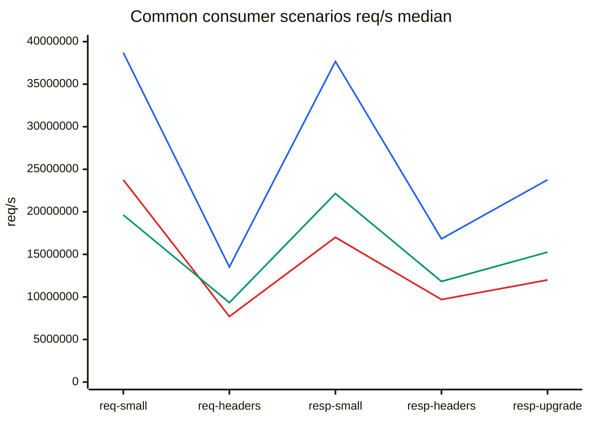

# Test Results

## Related Documents

| Document | Purpose |
|---|---|
| [02-comparison.md](./02-comparison.md) | compared capabilities and scenario scope |
| [08-testing-methodology.md](./08-testing-methodology.md) | PMI and PSI method |
| [10-extended-contract-methodology.md](./10-extended-contract-methodology.md) | methodology for extended-contract capabilities |
| [11-extended-contract-results.md](./11-extended-contract-results.md) | result status for capabilities outside the common matrix |
| [../plans/2026-03-11-sprint-11-comparison-report.md](../plans/2026-03-11-sprint-11-comparison-report.md) | deeper comparison and profiling notes |

## Scope

This document stores repository-published PSI results for:
- functional validation
- parser throughput comparison
- consumer-oriented scenario verification

This document publishes the common comparison matrix.

Capabilities that require an extended-contract interpretation are covered in:
- [10-extended-contract-methodology.md](./10-extended-contract-methodology.md)
- [11-extended-contract-results.md](./11-extended-contract-results.md)

## Artifact Set

Current artifact directory:

`tests/artifacts/pmi-psi/runs/20260312T014756Z-4998946/`

Repository entry points:
- [`tests/artifacts/pmi-psi/README.md`](../../tests/artifacts/pmi-psi/README.md)
- [`tests/artifacts/pmi-psi/index.tsv`](../../tests/artifacts/pmi-psi/index.tsv)
- [`tests/artifacts/pmi-psi/latest.txt`](../../tests/artifacts/pmi-psi/latest.txt)
- [`tests/artifacts/pmi-psi/runs/20260312T014756Z-4998946/summary.md`](../../tests/artifacts/pmi-psi/runs/20260312T014756Z-4998946/summary.md)
- [`tests/artifacts/pmi-psi/runs/20260312T014756Z-4998946/throughput-median.tsv`](../../tests/artifacts/pmi-psi/runs/20260312T014756Z-4998946/throughput-median.tsv)
- [`tests/artifacts/pmi-psi/runs/20260312T014756Z-4998946/throughput-connect-median.tsv`](../../tests/artifacts/pmi-psi/runs/20260312T014756Z-4998946/throughput-connect-median.tsv)

## Execution Summary

| Field | Value |
|---|---|
| run id | `20260312T014756Z-4998946` |
| git head | `4998946` |
| functional preset | `clang-debug` |
| throughput iterations | `200000` |
| median runs | `5` |
| status | `PASS` |

## Functional Results

`ctest --preset clang-debug --output-on-failure` result:

| Metric | Value |
|---|---|
| total tests | `12` |
| failed tests | `0` |
| pass rate | `100%` |
| wall clock | `0.02 sec` |

Covered executable set:
- `test_scanner`
- `test_scanner_backends`
- `test_scanner_corpus`
- `test_parser`
- `test_parser_state`
- `test_differential_corpus`
- `test_semantics_differential`
- `test_semantics`
- `test_semantics_corpus`
- `test_iohttp_integration`
- `test_body_decoder`
- `test_body_decoder_corpus`

## Performance Profiles

| Profile | Meaning |
|---|---|
| `picohttpparser` | minimal zero-copy parser baseline |
| `llhttp` | generated parser-core baseline |
| `iohttpparser-stateful-strict` | preferred hot path for throughput-sensitive consumers |
| `iohttpparser-strict` | stateless strict wrapper |
| `iohttpparser-stateful-lenient` | stateful compatibility profile |
| `iohttpparser-lenient` | stateless compatibility wrapper |

## Consumer Scenarios

### Scenario Definitions

| Scenario | Purpose |
|---|---|
| `req-small` | short request with a minimal header block |
| `req-headers` | request with a larger and more realistic header set |
| `resp-small` | short response without a large header block |
| `resp-headers` | response with a larger header block |
| `resp-upgrade` | `101 Switching Protocols` response handoff |
| `req-connect` | `CONNECT` request in authority form |

### Three-way Graph Legend

| Color | Library |
|---|---|
| blue | `picohttpparser` |
| red | `llhttp` |
| green | `iohttpparser-stateful-strict` |

### Three-way Common Matrix

`blue = picohttpparser` | `red = llhttp` | `green = iohttpparser-stateful-strict`

### Three-way CONNECT Focus

For a single-category `CONNECT` comparison, the table below is more precise
than an overlaid chart.

### req-small

Short request with a minimal header block.

| Parser | req/s median | MiB/s median | ns/req median |
|---|---:|---:|---:|
| `picohttpparser` | `38,695,677.07` | `1,808.25` | `25.84` |
| `llhttp` | `23,759,749.96` | `1,110.29` | `42.09` |
| `iohttpparser-stateful-strict` | `19,635,405.86` | `917.56` | `50.93` |
| `iohttpparser-strict` | `17,987,319.66` | `840.55` | `55.59` |
| `iohttpparser-stateful-lenient` | `18,004,235.86` | `841.34` | `55.54` |
| `iohttpparser-lenient` | `17,164,781.47` | `802.11` | `58.26` |

### req-headers

Request with a larger and more realistic header set.

| Parser | req/s median | MiB/s median | ns/req median |
|---|---:|---:|---:|
| `picohttpparser` | `13,525,043.61` | `2,399.12` | `73.94` |
| `iohttpparser-stateful-strict` | `9,334,685.68` | `1,655.82` | `107.13` |
| `iohttpparser-stateful-lenient` | `8,126,390.07` | `1,441.49` | `123.06` |
| `iohttpparser-strict` | `8,108,611.61` | `1,438.33` | `123.33` |
| `iohttpparser-lenient` | `7,829,076.23` | `1,388.75` | `127.73` |
| `llhttp` | `7,702,701.60` | `1,366.33` | `129.82` |

### resp-small

Short response without a large header block.

| Parser | req/s median | MiB/s median | ns/req median |
|---|---:|---:|---:|
| `picohttpparser` | `37,669,387.46` | `1,832.14` | `26.55` |
| `iohttpparser-stateful-strict` | `22,148,835.75` | `1,077.26` | `45.15` |
| `iohttpparser-lenient` | `20,422,035.66` | `993.27` | `48.97` |
| `iohttpparser-strict` | `19,865,508.52` | `966.21` | `50.34` |
| `iohttpparser-stateful-lenient` | `19,663,459.88` | `956.38` | `50.86` |
| `llhttp` | `17,006,629.18` | `827.16` | `58.80` |

### resp-headers

Response with a larger header block.

| Parser | req/s median | MiB/s median | ns/req median |
|---|---:|---:|---:|
| `picohttpparser` | `16,830,116.55` | `1,861.85` | `59.42` |
| `iohttpparser-stateful-lenient` | `11,925,962.43` | `1,319.32` | `83.85` |
| `iohttpparser-stateful-strict` | `11,824,577.19` | `1,308.11` | `84.57` |
| `iohttpparser-strict` | `11,730,949.04` | `1,297.75` | `85.24` |
| `iohttpparser-lenient` | `11,631,476.22` | `1,286.75` | `85.97` |
| `llhttp` | `9,694,390.17` | `1,072.45` | `103.15` |

### resp-upgrade

`101 Switching Protocols` response handoff.

| Parser | req/s median | MiB/s median | ns/req median |
|---|---:|---:|---:|
| `picohttpparser` | `23,766,424.53` | `1,745.24` | `42.08` |
| `iohttpparser-stateful-lenient` | `16,180,843.58` | `1,188.21` | `61.80` |
| `iohttpparser-lenient` | `15,416,374.30` | `1,132.07` | `64.87` |
| `iohttpparser-strict` | `15,362,211.37` | `1,128.09` | `65.09` |
| `iohttpparser-stateful-strict` | `15,261,886.34` | `1,120.72` | `65.52` |
| `llhttp` | `11,994,313.02` | `880.78` | `83.37` |

### req-connect

`CONNECT` request in authority form.

| Parser | req/s median | MiB/s median | ns/req median |
|---|---:|---:|---:|
| `picohttpparser` | `23,793,069.77` | `2,246.39` | `42.03` |
| `iohttpparser-stateful-strict` | `14,397,430.12` | `1,359.32` | `69.46` |
| `iohttpparser-strict` | `13,286,381.92` | `1,254.42` | `75.27` |
| `iohttpparser-stateful-lenient` | `12,044,569.24` | `1,137.17` | `83.02` |
| `iohttpparser-lenient` | `11,857,549.10` | `1,119.52` | `84.33` |
| `llhttp` | `11,256,663.52` | `1,062.78` | `88.84` |

## Auxiliary Profiling Scenarios

These scenarios are not consumer stories. They isolate parser costs for local
optimization work.

| Scenario | Purpose |
|---|---|
| `req-line-only` | start-line cost without a large header block |
| `req-line-hot` | typical short request-line hot path |
| `req-line-long-target` | long request-target validation cost |
| `req-line-connect` | method and authority-form path for `CONNECT` |
| `req-line-options` | method path for `OPTIONS *` |
| `req-pico-bench` | long request from upstream `picohttpparser/bench.c` |
| `hdr-common-heavy` | many common headers |
| `hdr-name-heavy` | header-name classification cost |
| `hdr-uncommon-valid` | uncommon but valid header names |
| `hdr-value-ascii-clean` | clean ASCII value path |
| `hdr-value-heavy` | long realistic value path |
| `hdr-value-obs-text` | value path with `obs-text` bytes |
| `hdr-value-trim-heavy` | trimming and validation path with outer OWS |
| `hdr-count-04-minimal` | fixed loop cost for four minimal headers |
| `hdr-count-16-minimal` | fixed loop cost for sixteen minimal headers |
| `hdr-count-32-minimal` | fixed loop cost for thirty-two minimal headers |

The full numeric matrix is published in:
- [`throughput-median.tsv`](../../tests/artifacts/pmi-psi/runs/20260312T014756Z-4998946/throughput-median.tsv)
- [2026-03-11-sprint-11-comparison-report.md](../plans/2026-03-11-sprint-11-comparison-report.md)

## Interpretation

- Functional PSI passed without failures.
- The current run includes the merged parser hot-path work from PR `#25`.
- `picohttpparser` remains the raw-throughput leader in every published scenario.
- `iohttpparser-stateful-strict` is now the correct performance baseline for
  hot-path consumers.
- `iohttpparser-stateful-strict` is faster than `llhttp` on:
  - `req-headers`
  - `resp-small`
  - `resp-headers`
  - `resp-upgrade`
  - `req-connect`
- `llhttp` remains faster on the shortest request-only path `req-small`.
- Stateless wrappers remain slower than the stateful API because they clear the
  output structure on every call by contract.
