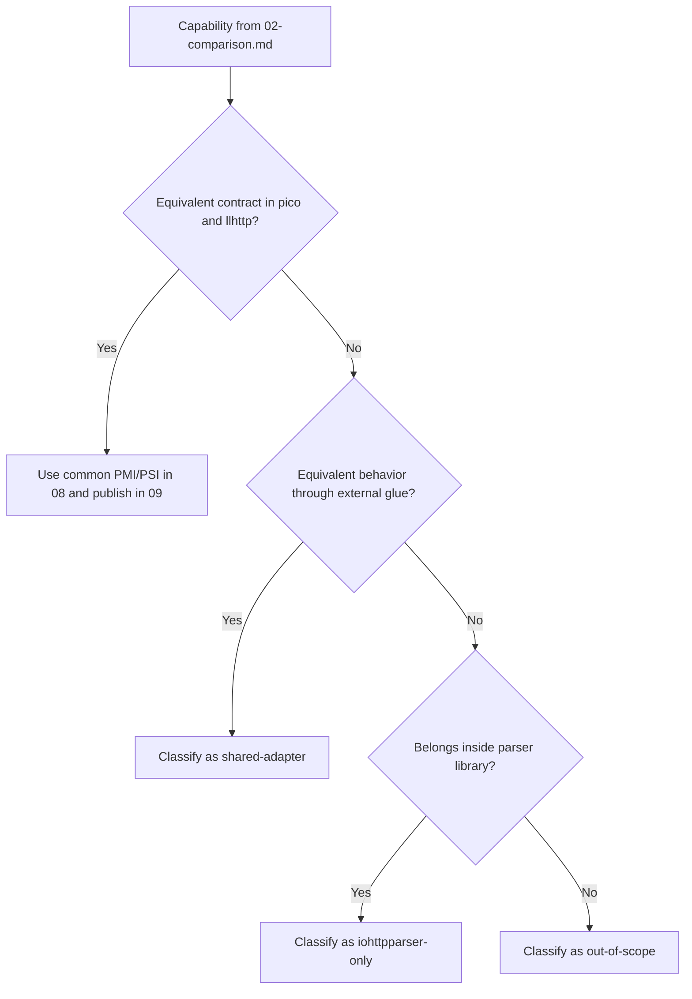

# Extended Contract Test Methodology

## Related Documents

| Document | Purpose |
|---|---|
| [02-comparison.md](./02-comparison.md) | capability inventory and comparison targets |
| [08-testing-methodology.md](./08-testing-methodology.md) | common PMI/PSI rules and shared parser-core comparison |
| [09-test-results.md](./09-test-results.md) | published common PMI/PSI results |
| [11-extended-contract-results.md](./11-extended-contract-results.md) | published results for extended contract features |

## Scope

This document defines the test methodology for capabilities that are present in
`iohttpparser` but are not directly comparable to `picohttpparser` and
`llhttp` on an equal API contract.

The document covers:
- extended functional checks
- internal performance checks for additional contract layers
- fairness rules for direct and indirect comparison
- artifact requirements for published evidence

## Classification Model

| Class | Meaning | Comparison rule |
|---|---|---|
| `shared-direct` | direct parser-core capability with equivalent external behavior | compare directly across all three libraries |
| `shared-adapter` | capability exists in all libraries, but requires external glue in at least one library | compare parser-core directly, then measure adapter cost separately |
| `iohttpparser-only` | capability is provided only by `iohttpparser` | measure absolute cost and overhead against nearest parser-core baseline |
| `out-of-scope` | capability belongs outside a wire-level parser library | do not include in parser performance comparison |

## Capability Groups From 02

### Shared-direct

- request line parse
- status line parse

### Shared-adapter

- standalone header parse
- public parser state
- stateless parse
- zero-copy spans
- framing semantics
- ambiguity rejection
- chunked body decode
- fixed-length accounting
- trailer ownership flags
- upgrade ownership flags
- `Expect: 100-continue` flag

### iohttpparser-only

- named strict presets
- SIMD scanner backends
- maintained differential corpus
- consumer integration tests

### out-of-scope

- URI normalization
- routing
- cookie parsing
- authentication policy
- compression decode
- WebSocket frame parsing
- application protocol handling after protocol upgrade

## Test Objects

| Object | Functional source | Performance source |
|---|---|---|
| parser-core shared layer | `tests/unit/test_differential_corpus.c` | `bench/bench_throughput_compare.c` |
| semantics layer | `tests/unit/test_semantics.c`, `tests/unit/test_semantics_corpus.c`, `tests/unit/test_semantics_differential.c` | nearest parser-core scenario plus dedicated contract scenario when published |
| body decoder layer | `tests/unit/test_body_decoder.c`, `tests/unit/test_body_decoder_corpus.c` | nearest parser-core scenario plus body handoff scenario when published |
| consumer contract layer | `tests/unit/test_iohttp_integration.c` | consumer-style throughput scenario when published |
| scanner backend layer | `tests/unit/test_scanner_backends.c`, `tests/unit/test_scanner_corpus.c` | `bench/bench_parser.c`, `scripts/check-scanner-bench.sh` |

## Functional Method

For each capability from `02-comparison.md`, the method is:

1. verify presence through unit, corpus, or integration tests;
2. map the capability to a published artifact or benchmark source;
3. classify the comparison type;
4. record direct result, indirect result, or explicit non-applicability.

Functional evidence must identify:
- source file
- scenario type
- owner of the contract
- expected output or rejection class

## Performance Method

### Shared-direct

Use the published PMI/PSI three-way comparison from:
- `scripts/run-pmi-psi.sh`
- `scripts/run-throughput-median.sh`
- `tests/artifacts/pmi-psi/runs/<run_id>/throughput-median.tsv`

The performance answer is:
- direct `req/s`
- direct `MiB/s`
- direct `ns/req`

### Shared-adapter

Use two measurements:

1. common parser-core baseline from the shared PMI/PSI matrix;
2. nearest integration or layer-specific scenario for the additional contract.

The performance answer is:
- parser-core baseline
- nearest extended scenario
- relative overhead of the additional contract

### iohttpparser-only

Use internal-only measurement.

Comparison target:
- nearest `iohttpparser` parser-core baseline
- stateful vs stateless wrapper cost
- parser-only vs parser-plus-semantics cost
- parser-plus-semantics vs parser-plus-semantics-plus-body cost

The performance answer is:
- absolute `req/s`
- absolute `MiB/s`
- absolute `ns/req`
- relative overhead against the nearest baseline

### out-of-scope

No parser-library performance comparison is permitted.

## Required Evidence Per Capability

| Field | Requirement |
|---|---|
| capability | exact capability name from `02-comparison.md` |
| class | one of the four classes defined above |
| functional evidence | test file or artifact |
| performance evidence | shared matrix, extended matrix, scanner bench, or `not applicable` |
| comparison mode | direct, indirect, internal-only, or out-of-scope |
| interpretation | one factual sentence |

## Extended Performance Targets

The following capability groups require dedicated internal measurement even when
no direct external equivalent exists.

| Group | Required scenario family | Goal |
|---|---|---|
| public parser state | `stateful-reuse-*` | measure cost and benefit of parser state reuse |
| semantics application | `semantics-*` | measure cost of framing and ownership decisions after parse |
| body decoder handoff | `body-handoff-*` | measure cost of body-stage transition |
| consumer integration | `consumer-iohttp-*`, `consumer-ioguard-*` | measure contract cost on realistic embedding flows |
| named presets | preset selection within the same parser path | verify that preset choice does not add avoidable runtime cost |

## Artifact Contract

Extended-contract results must be published in repository artifacts with:

- scenario description
- parser profile
- median `req/s`
- median `MiB/s`
- median `ns/req`
- baseline relation
- run metadata

Required artifact files for the extended layer:

- `throughput-extended.tsv`
- `throughput-extended-median.tsv`
- `summary-extended.md`
- `manifest.json`

If a capability has no dedicated artifact yet, the result must state:
- `not yet published`
- nearest available evidence
- why no direct comparison exists

## Acceptance Rules

An extended-contract result is valid only if:

- the functional test passes;
- the scenario is reproducible from a repository script;
- the baseline relation is explicit;
- the result does not mix parser-core throughput with external application code.

## Non-Goals

This methodology does not measure:
- socket throughput
- TLS cost
- scheduler overhead
- external proxy behavior
- application routing cost

These belong to consumer applications, not to the parser library.
