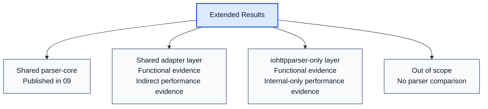
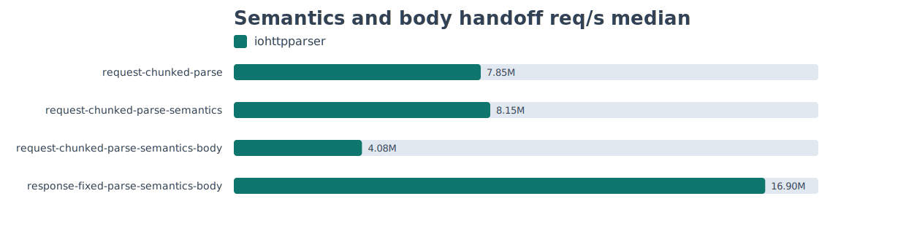
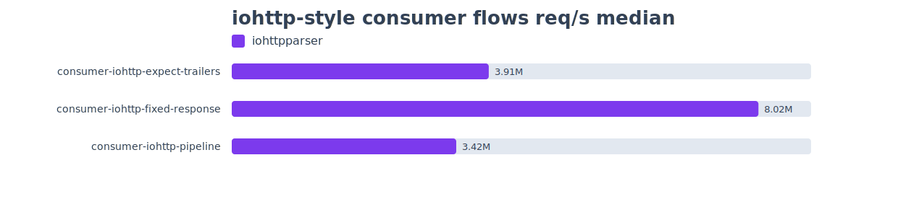
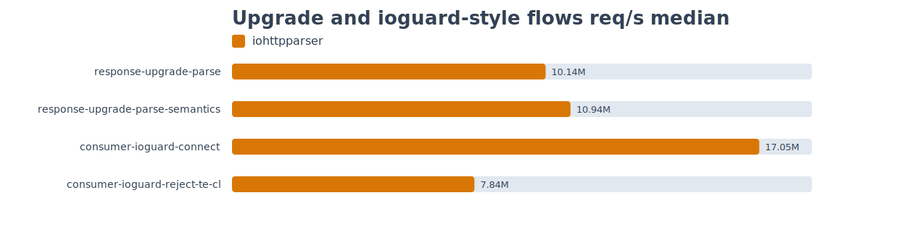

# Extended Contract Results

## Related Documents

| Document | Purpose |
|---|---|
| [02-comparison.md](./02-comparison.md) | capability inventory |
| [08-testing-methodology.md](./08-testing-methodology.md) | common PMI/PSI methodology |
| [09-test-results.md](./09-test-results.md) | published common PMI/PSI results |
| [10-extended-contract-methodology.md](./10-extended-contract-methodology.md) | methodology for the extended layer |

## Scope

This document records result status for capabilities from
`02-comparison.md` that are not fully represented by the common PMI/PSI
matrix in `09-test-results.md`.

The document answers:
- which capability is already verified functionally;
- which capability has published performance evidence;
- which capability is only indirectly covered;
- which capability has no direct parser-library comparison target.

Published extended run used by this document:

- `tests/artifacts/pmi-psi/runs/20260312T014756Z-4998946/summary-extended.md`
- `tests/artifacts/pmi-psi/runs/20260312T014756Z-4998946/throughput-extended-median.tsv`

## Result Classes

| Status | Meaning |
|---|---|
| `published-direct` | direct functional and performance evidence exists |
| `published-indirect` | functional evidence exists and performance is derived from nearest baseline |
| `functional-only` | functional evidence exists, but no dedicated performance artifact is published |
| `not-applicable` | performance comparison does not belong to parser-library scope |

## Capability Result Matrix

| Capability | Class | Functional evidence | Performance evidence | Status | Interpretation |
|---|---|---|---|---|---|
| request line parse | `shared-direct` | `test_parser.c`, `test_differential_corpus.c` | `09` scenarios `req-small`, `req-line-*`, `req-pico-bench` | `published-direct` | direct three-way comparison exists |
| status line parse | `shared-direct` | `test_parser.c`, `test_differential_corpus.c` | `09` scenarios `resp-small`, `resp-headers`, `resp-upgrade` | `published-direct` | direct three-way comparison exists |
| standalone header parse | `shared-adapter` | `test_parser.c`, `test_differential_corpus.c` | `09` scenarios `req-headers`, `resp-headers`, `hdr-*` | `published-indirect` | direct parser-core evidence exists; external glue cost is not separated per competitor |
| public parser state | `shared-adapter` | `test_parser_state.c` | `stateful-reuse-request` in `throughput-extended-median.tsv` | `published-direct` | a dedicated state-reuse throughput scenario is published |
| stateless parse | `shared-adapter` | `test_parser.c` | `09` comparison of `iohttpparser-*` vs `iohttpparser-stateful-*` | `published-indirect` | wrapper overhead is measurable for `iohttpparser`, not for all external APIs on equal terms |
| zero-copy spans | `shared-adapter` | `test_parser.c`, `test_iohttp_integration.c` | nearest parser-core scenarios in `09` | `published-indirect` | zero-copy ownership is part of parser outputs but not isolated as a standalone benchmark |
| framing semantics | `shared-adapter` | `test_semantics.c`, `test_semantics_corpus.c`, `test_semantics_differential.c` | `request-chunked-parse-semantics`, `response-upgrade-parse-semantics`, `consumer-ioguard-reject-te-cl` in `throughput-extended-median.tsv` | `published-direct` | dedicated semantics-stage scenarios are published |
| ambiguity rejection | `shared-adapter` | `test_semantics.c`, `test_semantics_differential.c`, `test_iohttp_integration.c` | `consumer-ioguard-reject-te-cl` in `throughput-extended-median.tsv` | `published-direct` | the reject path is measured directly |
| chunked body decode | `shared-adapter` | `test_body_decoder.c`, `test_body_decoder_corpus.c` | `request-chunked-parse-semantics-body` in `throughput-extended-median.tsv` | `published-direct` | chunked body handoff and decode cost is published |
| fixed-length accounting | `shared-adapter` | `test_body_decoder.c`, `test_iohttp_integration.c` | `response-fixed-parse-semantics-body` and `consumer-iohttp-fixed-response` in `throughput-extended-median.tsv` | `published-direct` | fixed-length body accounting and handoff are measured directly |
| trailer ownership flags | `shared-adapter` | `test_semantics.c`, `test_body_decoder.c`, `test_iohttp_integration.c` | `consumer-iohttp-expect-trailers` in `throughput-extended-median.tsv` | `published-direct` | trailer handoff cost is published |
| upgrade ownership flags | `shared-adapter` | `test_semantics.c`, `test_iohttp_integration.c` | `response-upgrade-parse-semantics` in `throughput-extended-median.tsv` | `published-direct` | upgrade ownership cost is measured directly |
| `Expect: 100-continue` flag | `shared-adapter` | `test_semantics.c`, `test_iohttp_integration.c` | `consumer-iohttp-expect-trailers` in `throughput-extended-median.tsv` | `published-direct` | the `Expect` flow is measured directly |
| named strict presets | `iohttpparser-only` | `test_semantics.c`, public headers | strict vs lenient rows in `09`; no standalone preset artifact | `published-indirect` | preset selection is visible through policy profiles but not isolated as zero-cost proof |
| SIMD scanner backends | `iohttpparser-only` | `test_scanner_backends.c`, `test_scanner_corpus.c` | `bench/bench_parser.c`, `scripts/check-scanner-bench.sh`, profiler notes in sprint report | `published-indirect` | performance evidence exists in repository tooling, but not yet inside PMI/PSI artifact bundle |
| maintained differential corpus | `iohttpparser-only` | `test_differential_corpus.c`, `test_semantics_differential.c` | not a throughput feature | `not-applicable` | this is a verification asset, not a runtime capability |
| consumer integration tests | `iohttpparser-only` | `test_iohttp_integration.c` | `consumer-iohttp-*` and `consumer-ioguard-*` in `throughput-extended-median.tsv` | `published-direct` | direct consumer-flow throughput is now published |
| URI normalization | `out-of-scope` | excluded by design | not applicable | `not-applicable` | belongs outside the wire-level parser |
| routing | `out-of-scope` | excluded by design | not applicable | `not-applicable` | belongs to application logic |
| cookie parsing | `out-of-scope` | excluded by design | not applicable | `not-applicable` | belongs to higher protocol layers |
| authentication policy | `out-of-scope` | excluded by design | not applicable | `not-applicable` | belongs to the consumer |
| compression decode | `out-of-scope` | excluded by design | not applicable | `not-applicable` | belongs after body handoff |
| WebSocket frame parsing | `out-of-scope` | excluded by design | not applicable | `not-applicable` | belongs after protocol upgrade |
| application protocol after upgrade | `out-of-scope` | excluded by design | not applicable | `not-applicable` | belongs to the upgraded protocol handler |

## Published Extended Scenario Results

The following sections publish the measured results for capabilities that do
not belong to the common three-way parser-core matrix from `09`.

Published run:

- `tests/artifacts/pmi-psi/runs/20260312T014756Z-4998946/summary-extended.md`
- `tests/artifacts/pmi-psi/runs/20260312T014756Z-4998946/throughput-extended-median.tsv`

### Parser State Reuse

| Scenario | Capability | Baseline | req/s median | MiB/s median | ns/op median |
|---|---|---|---:|---:|---:|
| `stateful-reuse-request` | public parser state | `req-small/iohttpparser-stateful-strict` | `7,981,577.56` | `1,019.98` | `125.29` |

### Semantics And Body Handoff

| Scenario | Capability | Baseline | req/s median | MiB/s median | ns/op median |
|---|---|---|---:|---:|---:|
| `request-chunked-parse` | parser plus chunked framing input | `req-headers/iohttpparser-stateful-strict` | `7,852,263.74` | `666.48` | `127.35` |
| `request-chunked-parse-semantics` | framing semantics | `request-chunked-parse` | `8,154,989.49` | `692.17` | `122.62` |
| `request-chunked-parse-semantics-body` | chunked body decode | `request-chunked-parse-semantics` | `4,075,425.45` | `380.89` | `245.37` |
| `response-fixed-parse-semantics-body` | fixed-length accounting | `resp-headers/iohttpparser-stateful-strict` | `16,895,333.75` | `692.84` | `59.19` |

### iohttp-style Consumer Flows

| Scenario | Capability | Baseline | req/s median | MiB/s median | ns/op median |
|---|---|---|---:|---:|---:|
| `consumer-iohttp-expect-trailers` | `Expect: 100-continue` and trailer ownership | `request-chunked-parse-semantics-body` | `3,913,056.27` | `966.53` | `255.55` |
| `consumer-iohttp-fixed-response` | fixed-length body handoff | `response-fixed-parse-semantics-body` | `8,018,723.08` | `1,032.38` | `124.71` |
| `consumer-iohttp-pipeline` | pipelined stateful consumer flow | `request-chunked-parse-semantics-body` | `3,418,498.73` | `704.19` | `292.53` |

### Upgrade And ioguard-style Flows

| Scenario | Capability | Baseline | req/s median | MiB/s median | ns/op median |
|---|---|---|---:|---:|---:|
| `response-upgrade-parse` | response upgrade handoff | `resp-upgrade/iohttpparser-stateful-strict` | `10,138,496.42` | `744.50` | `98.63` |
| `response-upgrade-parse-semantics` | upgrade ownership flags | `response-upgrade-parse` | `10,942,576.59` | `803.55` | `91.39` |
| `consumer-ioguard-connect` | strict `CONNECT` handoff | `req-connect/iohttpparser-stateful-strict` | `17,046,011.45` | `1,056.66` | `58.66` |
| `consumer-ioguard-reject-te-cl` | strict ambiguity rejection | `request-chunked-parse-semantics` | `7,838,169.09` | `680.23` | `127.58` |

## Extended Contract Performance Interpretation

### What is already measured

- parser-core throughput for direct comparison
- stateful versus stateless wrapper cost inside `iohttpparser`
- request, response, upgrade, and `CONNECT` parser scenarios
- scanner backend performance through dedicated scanner bench tooling

### What is not yet published as a dedicated matrix

- named preset zero-overhead proof
- zero-copy span ownership cost isolated from parser-core throughput
- scanner backend results inside the PMI/PSI artifact bundle

## Current Conclusion

The repository already proves the following facts:

- the shared parser-core layer is measured directly in `09`;
- the extended `iohttpparser` contract is functionally covered;
- some extended cost is visible indirectly through stateful/stateless and strict/lenient profiles;
- the remaining gap is not absence of verification, but absence of dedicated publication for presets, isolated zero-copy ownership cost, and scanner results inside the PMI/PSI bundle.

## Remaining Publication Targets

The next artifact bundle for this document should add only the remaining
specialized evidence:

- named preset zero-overhead proof;
- isolated zero-copy span ownership cost;
- scanner backend results inside the PMI/PSI bundle.
