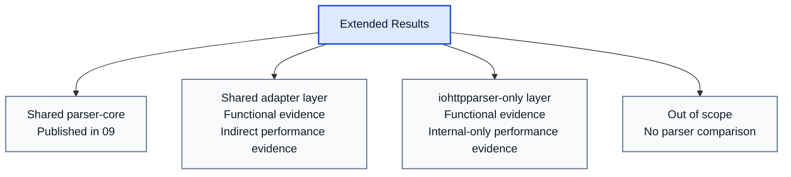

# Extended Contract Results

## Related Documents

| Document | Purpose |
|---|---|
| [02-comparison.md](./02-comparison.md) | capability inventory |
| [08-testing-methodology.md](./08-testing-methodology.md) | common PMI/PSI methodology |
| [09-test-results.md](./09-test-results.md) | published common PMI/PSI results |
| [10-extended-contract-methodology.md](./10-extended-contract-methodology.md) | methodology for the extended layer |

## Scope

This document records result status for capabilities from
`02-comparison.md` that are not fully represented by the common PMI/PSI
matrix in `09-test-results.md`.

The document answers:
- which capability is already verified functionally;
- which capability has published performance evidence;
- which capability is only indirectly covered;
- which capability has no direct parser-library comparison target.

Published extended run used by this document:

- `tests/artifacts/pmi-psi/runs/20260313T210231Z-3b9c398/summary-extended.md`
- `tests/artifacts/pmi-psi/runs/20260313T210231Z-3b9c398/throughput-extended-median.tsv`
- `tests/artifacts/pmi-psi/runs/20260313T210231Z-3b9c398/scanner-bench.tsv`

## Result Classes

| Status | Meaning |
|---|---|
| `published-direct` | direct functional and performance evidence exists |
| `published-indirect` | functional evidence exists and performance is derived from nearest baseline |
| `functional-only` | functional evidence exists, but no dedicated performance artifact is published |
| `not-applicable` | performance comparison does not belong to parser-library scope |

## Capability Result Matrix

| Capability | Class | Functional evidence | Performance evidence | Status | Interpretation |
|---|---|---|---|---|---|
| request line parse | `shared-direct` | `test_parser.c`, `test_differential_corpus.c` | `09` scenarios `req-small`, `req-line-*`, `req-pico-bench` | `published-direct` | direct three-way comparison exists |
| status line parse | `shared-direct` | `test_parser.c`, `test_differential_corpus.c` | `09` scenarios `resp-small`, `resp-headers`, `resp-upgrade` | `published-direct` | direct three-way comparison exists |
| standalone header parse | `shared-adapter` | `test_parser.c`, `test_differential_corpus.c` | `09` scenarios `req-headers`, `resp-headers`, `hdr-*` | `published-indirect` | direct parser-core evidence exists; external glue cost is not separated per competitor |
| public parser state | `shared-adapter` | `test_parser_state.c` | `stateful-reuse-request` in `throughput-extended-median.tsv` | `published-direct` | a dedicated state-reuse throughput scenario is published |
| stateless parse | `shared-adapter` | `test_parser.c` | `09` comparison of `iohttpparser-*` vs `iohttpparser-stateful-*` | `published-indirect` | wrapper overhead is measurable for `iohttpparser`, not for all external APIs on equal terms |
| zero-copy spans | `shared-adapter` | `test_parser.c`, `test_iohttp_integration.c` | `zero-copy-request-parse` and `zero-copy-request-observe` in `throughput-extended-median.tsv` | `published-direct` | parse cost and observation cost are published separately |
| framing semantics | `shared-adapter` | `test_semantics.c`, `test_semantics_corpus.c`, `test_semantics_differential.c` | `request-chunked-parse-semantics`, `response-upgrade-parse-semantics`, `consumer-ioguard-reject-te-cl` in `throughput-extended-median.tsv` | `published-direct` | dedicated semantics-stage scenarios are published |
| ambiguity rejection | `shared-adapter` | `test_semantics.c`, `test_semantics_differential.c`, `test_iohttp_integration.c` | `consumer-ioguard-reject-te-cl` in `throughput-extended-median.tsv` | `published-direct` | the reject path is measured directly |
| chunked body decode | `shared-adapter` | `test_body_decoder.c`, `test_body_decoder_corpus.c` | `request-chunked-parse-semantics-body` in `throughput-extended-median.tsv` | `published-direct` | chunked body handoff and decode cost is published |
| fixed-length accounting | `shared-adapter` | `test_body_decoder.c`, `test_iohttp_integration.c` | `response-fixed-parse-semantics-body` and `consumer-iohttp-fixed-response` in `throughput-extended-median.tsv` | `published-direct` | fixed-length body accounting and handoff are measured directly |
| trailer ownership flags | `shared-adapter` | `test_semantics.c`, `test_body_decoder.c`, `test_iohttp_integration.c` | `consumer-iohttp-expect-trailers` in `throughput-extended-median.tsv` | `published-direct` | trailer handoff cost is published |
| upgrade ownership flags | `shared-adapter` | `test_semantics.c`, `test_iohttp_integration.c` | `response-upgrade-parse-semantics` in `throughput-extended-median.tsv` | `published-direct` | upgrade ownership cost is measured directly |
| `Expect: 100-continue` flag | `shared-adapter` | `test_semantics.c`, `test_iohttp_integration.c` | `consumer-iohttp-expect-trailers` in `throughput-extended-median.tsv` | `published-direct` | the `Expect` flow is measured directly |
| named strict presets | `iohttpparser-only` | `test_semantics.c`, public headers | `policy-strict-request-semantics`, `policy-iohttp-request-semantics`, `policy-ioguard-request-semantics` in `throughput-extended-median.tsv` | `published-direct` | preset-specific rows prove there is no separate hidden slow path |
| SIMD scanner backends | `iohttpparser-only` | `test_scanner_backends.c`, `test_scanner_corpus.c` | `scanner-bench.tsv` and `charts/scanner-backends.svg` inside the PMI/PSI artifact set | `published-direct` | scanner backend evidence is now part of the published artifact bundle |
| maintained differential corpus | `iohttpparser-only` | `test_differential_corpus.c`, `test_semantics_differential.c` | not a throughput feature | `not-applicable` | this is a verification asset, not a runtime capability |
| consumer integration tests | `iohttpparser-only` | `test_iohttp_integration.c` | `consumer-iohttp-*` and `consumer-ioguard-*` in `throughput-extended-median.tsv` | `published-direct` | direct consumer-flow throughput is now published |
| URI normalization | `out-of-scope` | excluded by design | not applicable | `not-applicable` | belongs outside the wire-level parser |
| routing | `out-of-scope` | excluded by design | not applicable | `not-applicable` | belongs to application logic |
| cookie parsing | `out-of-scope` | excluded by design | not applicable | `not-applicable` | belongs to higher protocol layers |
| authentication policy | `out-of-scope` | excluded by design | not applicable | `not-applicable` | belongs to the consumer |
| compression decode | `out-of-scope` | excluded by design | not applicable | `not-applicable` | belongs after body handoff |
| WebSocket frame parsing | `out-of-scope` | excluded by design | not applicable | `not-applicable` | belongs after protocol upgrade |
| application protocol after upgrade | `out-of-scope` | excluded by design | not applicable | `not-applicable` | belongs to the upgraded protocol handler |

## Published Extended Scenario Results

The following sections publish the measured results for capabilities that do
not belong to the common three-way parser-core matrix from `09`.

Published run:

- `tests/artifacts/pmi-psi/runs/20260313T210231Z-3b9c398/summary-extended.md`
- `tests/artifacts/pmi-psi/runs/20260313T210231Z-3b9c398/throughput-extended-median.tsv`
- `tests/artifacts/pmi-psi/runs/20260313T210231Z-3b9c398/scanner-bench.tsv`

### Parser State Reuse

| Scenario | Capability | Baseline | req/s median | MiB/s median | ns/op median |
|---|---|---|---:|---:|---:|
| `stateful-reuse-request` | public parser state | `req-small/iohttpparser-stateful-strict` | `7,173,783.07` | `916.75` | `139.40` |

### Named Strict Presets

| Scenario | Capability | Baseline | req/s median | MiB/s median | ns/op median |
|---|---|---|---:|---:|---:|
| `policy-strict-request-semantics` | strict preset baseline | `req-headers/iohttpparser-stateful-strict` | `8,211,956.51` | `806.65` | `121.77` |
| `policy-iohttp-request-semantics` | named `IHTP_POLICY_IOHTTP` preset | `policy-strict-request-semantics` | `8,744,997.15` | `859.01` | `114.35` |
| `policy-ioguard-request-semantics` | named `IHTP_POLICY_IOGUARD` preset | `policy-strict-request-semantics` | `8,796,864.30` | `864.10` | `113.68` |

### Semantics And Body Handoff

| Scenario | Capability | Baseline | req/s median | MiB/s median | ns/op median |
|---|---|---|---:|---:|---:|
| `request-chunked-parse` | parser plus chunked framing input | `req-headers/iohttpparser-stateful-strict` | `7,653,287.11` | `649.59` | `130.66` |
| `request-chunked-parse-semantics` | framing semantics | `request-chunked-parse` | `7,590,657.40` | `644.27` | `131.74` |
| `request-chunked-parse-semantics-body` | chunked body decode | `request-chunked-parse-semantics` | `4,932,477.34` | `460.99` | `202.74` |
| `response-fixed-parse-semantics-body` | fixed-length accounting | `resp-headers/iohttpparser-stateful-strict` | `17,064,526.09` | `699.78` | `58.60` |

### Zero-copy Span Observation

| Scenario | Capability | Baseline | req/s median | MiB/s median | ns/op median |
|---|---|---|---:|---:|---:|
| `zero-copy-request-parse` | parse plus zero-copy result formation | `req-headers/iohttpparser-stateful-strict` | `8,783,805.30` | `1,725.64` | `113.85` |
| `zero-copy-request-observe` | consumer-side span observation | `zero-copy-request-parse` | `8,242,407.56` | `1,619.28` | `121.32` |

### iohttp-style Consumer Flows

| Scenario | Capability | Baseline | req/s median | MiB/s median | ns/op median |
|---|---|---|---:|---:|---:|
| `consumer-iohttp-expect-trailers` | `Expect: 100-continue` and trailer ownership | `request-chunked-parse-semantics-body` | `3,581,515.46` | `884.64` | `279.21` |
| `consumer-iohttp-fixed-response` | fixed-length body handoff | `response-fixed-parse-semantics-body` | `7,849,751.05` | `1,010.62` | `127.39` |
| `consumer-iohttp-pipeline` | pipelined stateful consumer flow | `request-chunked-parse-semantics-body` | `3,736,765.92` | `769.75` | `267.61` |

### Upgrade And ioguard-style Flows

| Scenario | Capability | Baseline | req/s median | MiB/s median | ns/op median |
|---|---|---|---:|---:|---:|
| `response-upgrade-parse` | response upgrade handoff | `resp-upgrade/iohttpparser-stateful-strict` | `9,647,043.15` | `708.41` | `103.66` |
| `response-upgrade-parse-semantics` | upgrade ownership flags | `response-upgrade-parse` | `10,398,724.53` | `763.61` | `96.17` |
| `consumer-ioguard-connect` | strict `CONNECT` handoff | `req-connect/iohttpparser-stateful-strict` | `17,192,341.12` | `1,065.73` | `58.17` |
| `consumer-ioguard-reject-te-cl` | strict ambiguity rejection | `request-chunked-parse-semantics` | `8,234,980.90` | `714.67` | `121.43` |

### Scanner Backend Results

| Backend | Meaning | Evidence |
|---|---|---|
| `dispatch` | runtime-selected backend | `scanner-bench.tsv` |
| `scalar` | scalar fallback path | `scanner-bench.tsv` |
| `sse42` | SSE4.2 path on supported hosts | `scanner-bench.tsv` |
| `avx2` | AVX2 path on supported hosts | `scanner-bench.tsv` |

## Extended Contract Performance Interpretation

### What is already measured

- parser-core throughput for direct comparison
- stateful versus stateless wrapper cost inside `iohttpparser`
- request, response, upgrade, and `CONNECT` parser scenarios
- scanner backend performance through dedicated scanner bench tooling

### What is now published directly

- named preset selection through dedicated `policy-*` rows
- zero-copy parse cost and observation cost through dedicated `zero-copy-*` rows
- scanner backend results inside the PMI/PSI artifact bundle

## Current Conclusion

The repository already proves the following facts:

- the shared parser-core layer is measured directly in `09`;
- the extended `iohttpparser` contract is functionally covered;
- some extended cost is visible indirectly through stateful/stateless and strict/lenient profiles;
- the previously missing publication targets are now covered by dedicated rows and scanner artifacts inside the PMI/PSI bundle.

## Remaining Publication Targets

No open publication target remains for the extended-contract matrix. Future runs only need to refresh numbers for the current artifact format.
