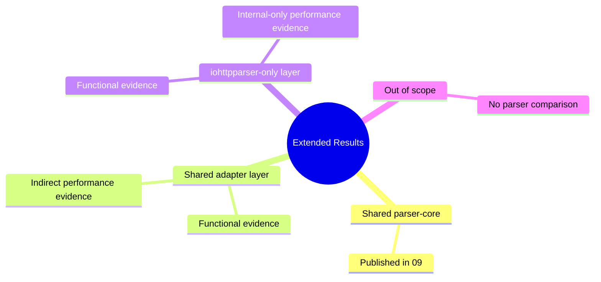

# Extended Contract Results

## Related Documents

| Document | Purpose |
|---|---|
| [02-comparison.md](./02-comparison.md) | capability inventory |
| [08-testing-methodology.md](./08-testing-methodology.md) | common PMI/PSI methodology |
| [09-test-results.md](./09-test-results.md) | published common PMI/PSI results |
| [10-extended-contract-methodology.md](./10-extended-contract-methodology.md) | methodology for the extended layer |

## Scope

This document records result status for capabilities from
`02-comparison.md` that are not fully represented by the common PMI/PSI
matrix in `09-test-results.md`.

The document answers:
- which capability is already verified functionally;
- which capability has published performance evidence;
- which capability is only indirectly covered;
- which capability has no direct parser-library comparison target.

## Result Classes

| Status | Meaning |
|---|---|
| `published-direct` | direct functional and performance evidence exists |
| `published-indirect` | functional evidence exists and performance is derived from nearest baseline |
| `functional-only` | functional evidence exists, but no dedicated performance artifact is published |
| `not-applicable` | performance comparison does not belong to parser-library scope |

## Capability Result Matrix

| Capability | Class | Functional evidence | Performance evidence | Status | Interpretation |
|---|---|---|---|---|---|
| request line parse | `shared-direct` | `test_parser.c`, `test_differential_corpus.c` | `09` scenarios `req-small`, `req-line-*`, `req-pico-bench` | `published-direct` | direct three-way comparison exists |
| status line parse | `shared-direct` | `test_parser.c`, `test_differential_corpus.c` | `09` scenarios `resp-small`, `resp-headers`, `resp-upgrade` | `published-direct` | direct three-way comparison exists |
| standalone header parse | `shared-adapter` | `test_parser.c`, `test_differential_corpus.c` | `09` scenarios `req-headers`, `resp-headers`, `hdr-*` | `published-indirect` | direct parser-core evidence exists; external glue cost is not separated per competitor |
| public parser state | `shared-adapter` | `test_parser_state.c` | `09` comparison of `iohttpparser-stateful-*` vs `iohttpparser-*` | `published-indirect` | state exposure cost is visible only inside `iohttpparser` profiles |
| stateless parse | `shared-adapter` | `test_parser.c` | `09` comparison of `iohttpparser-*` vs `iohttpparser-stateful-*` | `published-indirect` | wrapper overhead is measurable for `iohttpparser`, not for all external APIs on equal terms |
| zero-copy spans | `shared-adapter` | `test_parser.c`, `test_iohttp_integration.c` | nearest parser-core scenarios in `09` | `published-indirect` | zero-copy ownership is part of parser outputs but not isolated as a standalone benchmark |
| framing semantics | `shared-adapter` | `test_semantics.c`, `test_semantics_corpus.c`, `test_semantics_differential.c` | nearest parser-core scenarios in `09`; no dedicated published semantics throughput matrix yet | `functional-only` | behavior is verified; dedicated cost publication is pending |
| ambiguity rejection | `shared-adapter` | `test_semantics.c`, `test_semantics_differential.c`, `test_iohttp_integration.c` | strict parser-core scenarios in `09` | `published-indirect` | strict-path cost is visible, but rejection logic is not isolated as a separate matrix |
| chunked body decode | `shared-adapter` | `test_body_decoder.c`, `test_body_decoder_corpus.c` | no dedicated published body throughput artifact yet | `functional-only` | functional coverage is complete; dedicated throughput publication is pending |
| fixed-length accounting | `shared-adapter` | `test_body_decoder.c`, `test_iohttp_integration.c` | no dedicated published body throughput artifact yet | `functional-only` | accounted functionally; no standalone published body matrix yet |
| trailer ownership flags | `shared-adapter` | `test_semantics.c`, `test_body_decoder.c`, `test_iohttp_integration.c` | no dedicated published trailer throughput artifact yet | `functional-only` | contract is verified; cost is not isolated |
| upgrade ownership flags | `shared-adapter` | `test_semantics.c`, `test_iohttp_integration.c` | `09` scenario `resp-upgrade` | `published-indirect` | realistic upgrade handoff cost is already visible |
| `Expect: 100-continue` flag | `shared-adapter` | `test_semantics.c`, `test_iohttp_integration.c` | no dedicated published `expect` throughput artifact yet | `functional-only` | behavior is verified; no standalone published performance case |
| named strict presets | `iohttpparser-only` | `test_semantics.c`, public headers | strict vs lenient rows in `09`; no standalone preset artifact | `published-indirect` | preset selection is visible through policy profiles but not isolated as zero-cost proof |
| SIMD scanner backends | `iohttpparser-only` | `test_scanner_backends.c`, `test_scanner_corpus.c` | `bench/bench_parser.c`, `scripts/check-scanner-bench.sh`, profiler notes in sprint report | `published-indirect` | performance evidence exists in repository tooling, but not yet inside PMI/PSI artifact bundle |
| maintained differential corpus | `iohttpparser-only` | `test_differential_corpus.c`, `test_semantics_differential.c` | not a throughput feature | `not-applicable` | this is a verification asset, not a runtime capability |
| consumer integration tests | `iohttpparser-only` | `test_iohttp_integration.c` | nearest parser-core scenarios in `09`; no dedicated published consumer throughput artifact yet | `functional-only` | contract is verified; direct consumer-throughput publication is pending |
| URI normalization | `out-of-scope` | excluded by design | not applicable | `not-applicable` | belongs outside the wire-level parser |
| routing | `out-of-scope` | excluded by design | not applicable | `not-applicable` | belongs to application logic |
| cookie parsing | `out-of-scope` | excluded by design | not applicable | `not-applicable` | belongs to higher protocol layers |
| authentication policy | `out-of-scope` | excluded by design | not applicable | `not-applicable` | belongs to the consumer |
| compression decode | `out-of-scope` | excluded by design | not applicable | `not-applicable` | belongs after body handoff |
| WebSocket frame parsing | `out-of-scope` | excluded by design | not applicable | `not-applicable` | belongs after protocol upgrade |
| application protocol after upgrade | `out-of-scope` | excluded by design | not applicable | `not-applicable` | belongs to the upgraded protocol handler |

## Extended Contract Performance Interpretation

### What is already measured

- parser-core throughput for direct comparison
- stateful versus stateless wrapper cost inside `iohttpparser`
- request, response, upgrade, and `CONNECT` parser scenarios
- scanner backend performance through dedicated scanner bench tooling

### What is not yet published as a dedicated matrix

- parser plus semantics throughput
- parser plus body-decoder throughput
- trailer-specific cost
- `Expect: 100-continue` specific cost
- end-to-end consumer-style throughput for `iohttp` and `ioguard`

## Current Conclusion

The repository already proves the following facts:

- the shared parser-core layer is measured directly in `09`;
- the extended `iohttpparser` contract is functionally covered;
- some extended cost is visible indirectly through stateful/stateless and strict/lenient profiles;
- the remaining gap is not absence of verification, but absence of a dedicated published extended-throughput matrix.

## Next Publication Targets

The next artifact bundle for this document must add:

- `throughput-extended.tsv`
- `throughput-extended-median.tsv`
- `summary-extended.md`

These files must cover:
- stateful reuse
- semantics application
- body handoff
- consumer-style `iohttp` flow
- consumer-style `ioguard` flow
