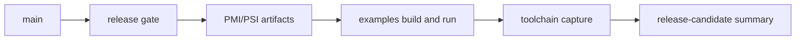

# Release Candidate Checklist

## Related Documents

| Document | Purpose |
|---|---|
| [08-testing-methodology.md](./08-testing-methodology.md) | common verification method |
| [09-test-results.md](./09-test-results.md) | published common PSI results |
| [10-extended-contract-methodology.md](./10-extended-contract-methodology.md) | methodology for extended-contract verification |
| [11-extended-contract-results.md](./11-extended-contract-results.md) | published extended-contract results |
| [api-reference.md](./api-reference.md) | public API entry page |

## Scope

This document defines the repository-level checklist for a release-candidate cut.

## Release Candidate Inputs

- clean `main`
- published PMI/PSI bundle
- published extended-contract bundle
- generated Doxygen output
- built and executed public examples
- captured toolchain versions

## Release Candidate Flow

## Mandatory Checks

| Check | Command or source | Acceptance |
|---|---|---|
| release gate | `scripts/run-release-gate.sh` | pass |
| common PMI/PSI artifacts | `tests/artifacts/pmi-psi/latest.txt` | present and current |
| extended-contract artifacts | `tests/artifacts/pmi-psi/runs/<run>/summary-extended.md` | present |
| Doxygen build | `cmake --build --preset clang-debug --target docs` | pass |
| docs lint | `python3 scripts/lint-docs.py` | pass |
| example build | `cmake --build --preset clang-debug --target example_basic example_connect example_expect_trailers example_response_upgrade` | pass |
| example execution | `build/clang-debug/example_*` | pass |
| toolchain capture | `tests/artifacts/release-candidate/runs/<run>/toolchain.txt` | present |

## Published Release Candidate Evidence

The release-candidate bundle must be produced by:

- `scripts/run-release-candidate.sh`

Published output location:

- `tests/artifacts/release-candidate/`

## Release Notes Structure

Release notes must contain:

1. release identifier
2. supported scope
3. public API surface
4. verification summary
5. published artifact references
6. known non-goals

## Exit Criteria

- every mandatory check passes
- release-candidate artifacts are published in the repository
- public examples execute without failure
- Doxygen output is generated without warnings
- `09` and `11` point to current evidence
