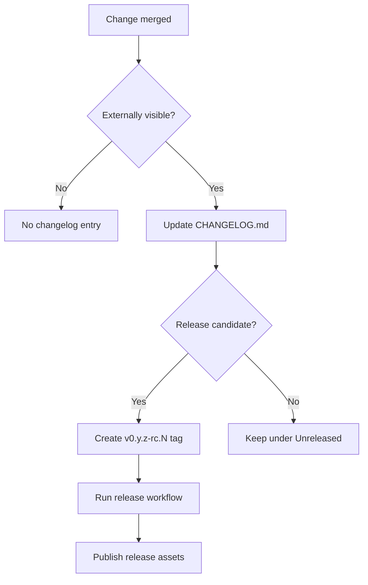

[](https://github.com/ioplane/iohttpparser)
[](https://semver.org/spec/v2.0.0.html)
[](https://keepachangelog.com/en/1.1.0/)
[](https://mermaid.js.org/syntax/flowchart.html)

# 13. Versioning And Changelog

## Scope

This document defines release identifiers, pre-1.0 versioning rules, and
changelog rules for `iohttpparser`.

## Version Format

`iohttpparser` uses Semantic Versioning 2.0.0 with a leading `v` in Git tags.

Examples:

```text
v0.1.0-rc.1
v0.1.0
v0.2.0
v1.0.0
```

## Pre-1.0 Policy

| Pattern | Meaning | When to use |
|---|---|---|
| `v0.y.z-rc.N` | Release candidate | Release pipeline is ready and the build is intended for external validation |
| `v0.y.z` | Public pre-1.0 release | The release-candidate line is accepted and published as the current pre-1.0 baseline |
| `v1.0.0` | First stable release | Public API, release gate, published evidence, and support policy are declared stable |

## Initial Release Line

The initial public release line for this repository is:

```text
v0.1.0-rc.N
```

The first tag in that line is:

```text
v0.1.0-rc.1
```

## Changelog Rules

`CHANGELOG.md` is mandatory. It follows Keep a Changelog 1.1.0.

Required sections:

| Section | Use |
|---|---|
| `Added` | New externally visible capabilities |
| `Changed` | Behavior, contract, workflow, or evidence changes |
| `Deprecated` | Supported features scheduled for removal |
| `Removed` | Removed public behavior or support |
| `Fixed` | Behavior corrections and bug fixes |
| `Security` | Security-sensitive behavior changes and hardening |

Rules:

- Keep `Unreleased` at the top.
- Update the changelog in the same branch as the change.
- Record only externally visible changes.
- Keep entries factual and short.
- Move released items from `Unreleased` into a dated version section before a
  release tag is created.

## Release Decision Flow


