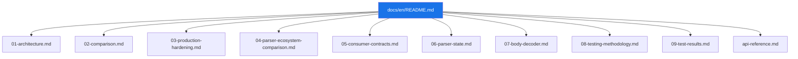

# English Documentation

Authoritative documentation for `iohttpparser`.

## Documentation Map

## Numbered Documents

| # | Document | Scope |
|---|---|---|
| 01 | [Architecture](./01-architecture.md) | Scope, layers, ownership, integration boundaries |
| 02 | [Comparison](./02-comparison.md) | Feature and contract comparison with `picohttpparser` and `llhttp` |
| 03 | [Production Hardening](./03-production-hardening.md) | Strict policy, limits, rejection classes, verification surface |
| 04 | [Parser Ecosystem Comparison](./04-parser-ecosystem-comparison.md) | Responsibility split between parser core, consumer, and adjacent layers |
| 05 | [Consumer Contracts](./05-consumer-contracts.md) | Integration contract for `iohttp` and `ioguard` |
| 06 | [Parser State](./06-parser-state.md) | Stateful parser API and ownership rules |
| 07 | [Body Decoder](./07-body-decoder.md) | Chunked and fixed-length decoder contracts |
| 08 | [Testing Methodology](./08-testing-methodology.md) | PMI, PSI, comparison rules, and artifact publication |
| 09 | [Test Results](./09-test-results.md) | Published PMI/PSI results and artifact index |

## Reference

| Document | Purpose |
|---|---|
| [api-reference.md](./api-reference.md) | Doxygen entry page |
| [../README.md](../README.md) | Top-level docs index |
| [../plans/README.md](../plans/README.md) | Plans index |
| [../rfc/README.md](../rfc/README.md) | Local RFC mirror |
