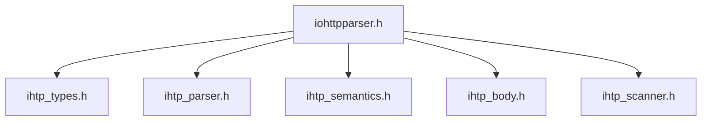

# API Reference

Doxygen entry page for the public `iohttpparser` API.

## Related Documents

| Document | Purpose |
|---|---|
| [05-consumer-contracts.md](./05-consumer-contracts.md) | consumer integration contract |
| [06-parser-state.md](./06-parser-state.md) | stateful parser contract |
| [07-body-decoder.md](./07-body-decoder.md) | body decoder contract |

## Public Headers

- `include/iohttpparser/iohttpparser.h`
- `include/iohttpparser/ihtp_types.h`
- `include/iohttpparser/ihtp_parser.h`
- `include/iohttpparser/ihtp_semantics.h`
- `include/iohttpparser/ihtp_body.h`
- `include/iohttpparser/ihtp_scanner.h`

## Module Map

| Module | Scope |
|---|---|
| Public API | umbrella header and version helpers |
| Types and Policies | enums, structs, limits, named policy presets |
| Parser API | stateless and stateful parse functions |
| Semantics API | framing, keep-alive, upgrade, `Expect`, trailer flags |
| Body Decoder API | chunked and fixed-length decoder contracts |
| Scanner API | low-level delimiter search and token checks |

## Contract Summary

- strict-by-default HTTP/1.1 parsing
- zero-copy spans into caller-owned input
- separate parser, semantics, and body-decoder stages
- stateful and stateless parser entry points
- consumer-owned handoff for upgrades, `Expect: 100-continue`, and trailers

## Consumer Checklist

1. Keep input bytes alive while zero-copy spans are in use.
2. Run semantics after syntax parsing.
3. Run the body decoder only after semantics selects the body mode.
4. Use named policy presets instead of open-coded anonymous policies.
