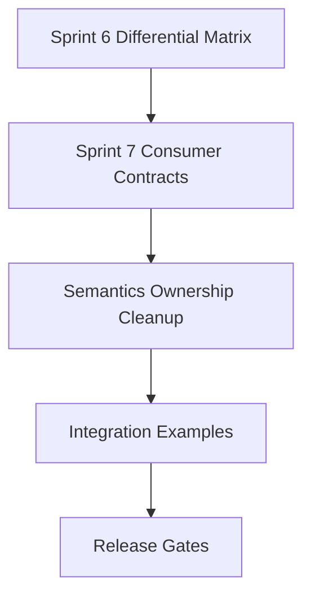

# Sprint 7: Consumer Contracts

## Goal

Turn the merged parser, semantics, body-decoder, and differential work into explicit integration contracts for:
- `iohttp`
- `ioguard` (formerly `ringwall`)

## Inputs

- public stateful parser API is on `main`
- parser-level and semantics-level differential coverage is on `main`
- strict-vs-lenient policy behavior is already regression-covered

## Deliverables

1. consumer contract docs in `docs/en/` and `docs/ru/`
2. explicit ownership notes for parser, semantics, and body-decoder handoff
3. public semantics API in `include/iohttpparser/ihtp_semantics.h`
4. integration-oriented execution queue for remaining semantics work
5. rename-aware planning that treats `ioguard` as the future strict consumer

## Task Breakdown

### Task 1

Publish the baseline contract split:
- `iohttp` as the interoperable server-side consumer
- `ioguard` as the stricter fail-closed consumer

### Task 2

Translate that split into concrete next engineering tasks:
- `Upgrade`
- `CONNECT`
- `Expect: 100-continue`
- trailer ownership and handoff

### Task 3

Promote semantics from de facto internal entry points to an explicit public integration surface.

### Task 4

Prepare follow-up implementation work:
- policy presets
- integration examples
- consumer-facing tests

## Exit Criteria

- English consumer contract doc exists
- Russian mirror exists
- public semantics header exists and is used by tests
- roadmap reflects Sprint 7 as the active delivery track
- docs indices link the new materials

## Validation

- `python3 scripts/lint-docs.py`
