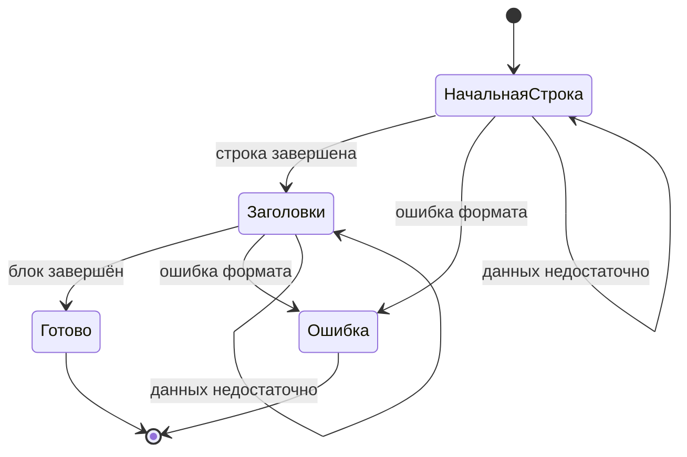

# Архитектура

## Область Применения

`iohttpparser` — парсер HTTP/1.1 на уровне байтового протокола для C23.

Внутри области применения:
- разбор строки запроса
- разбор строки статуса
- разбор полей заголовков
- состояние парсера для инкрементального разбора
- семантика фрейминга
- учёт тела фиксированной длины
- декодирование `chunked`

Вне области применения:
- нормализация `URI`
- декодирование процентов
- cookies
- `multipart`
- декодирование сжатого содержимого
- маршрутизация
- владение транспортом
- разбор кадров WebSocket

## Модель Слоёв

| Слой | Ответственность | Результат |
|---|---|---|
| Сканер | поиск разделителей, проверка токенов, проверка `CRLF`, выбор SIMD-пути | валидированные диапазоны байтов |
| Парсер | разбор начальной строки, извлечение полей заголовков, ведение состояния | представления `request`, `response` или `headers` без копирования |
| Семантика | правила фрейминга, правила `Host`, `keep-alive`, отклонение неоднозначностей | режим тела и решение по соединению |
| Декодер Тела | учёт `fixed-length`, декодирование `chunked`, обработка хвостовых полей | байты полезной нагрузки и хвостовые байты |

## Владение Данными

- Все входные буферы принадлежат потребителю.
- Разобранные диапазоны указывают в память потребителя.
- Состояние парсера хранит только прогресс.
- Декодер тела хранит только состояние фрейминга.
- Библиотека не выделяет скрытые буферы в горячем пути.

## Публичная Поверхность

| Область | API |
|---|---|
| Разбор без состояния | `ihtp_parse_request()`, `ihtp_parse_response()`, `ihtp_parse_headers()` |
| Разбор с состоянием | `ihtp_parser_state_t`, `ihtp_parser_state_init()`, `ihtp_parser_state_reset()`, `ihtp_parse_*_stateful()` |
| Семантика | `ihtp_request_apply_semantics()`, `ihtp_response_apply_semantics()` |
| Декодирование тела | `ihtp_decode_fixed()`, `ihtp_decode_chunked()` |
| Сканер | `ihtp_scan_*` для внутреннего использования и бенчмарков |

## Режимы Разбора

Библиотека поддерживает:
- разбор по накопленному буферу без отдельного объекта состояния
- разбор по тому же накопленному буферу с явным объектом состояния и явным прогрессом

Модель владения одинакова в обоих режимах.

## Границы Интеграции

| Потребитель | Ожидаемое использование |
|---|---|
| `iohttp` | общий разбор HTTP/1.1 с явной передачей результата фрейминга |
| `ioguard` | строгий граничный разбор с политикой отказа по умолчанию |
| отдельный цикл событий | разбор без привязки к транспорту |

Парсер не владеет:
- сокетами
- `TLS`
- циклами событий
- маршрутизацией сообщений

## Инварианты

- строгая политика является базовым режимом
- SIMD-пути должны быть эквивалентны скалярному пути
- синтаксический разбор и семантика разделены
- декодирование тела начинается только после выбора режима тела на этапе семантики
