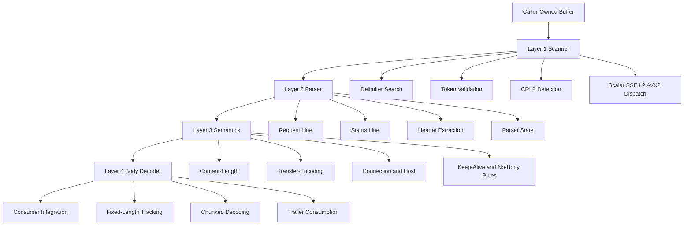
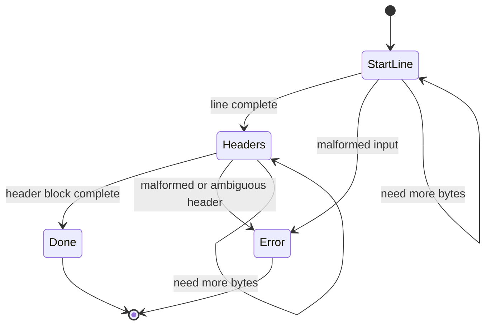
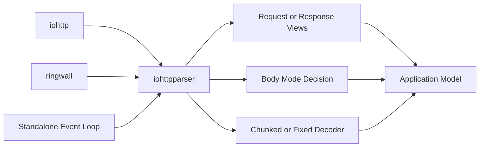

# Архитектура iohttpparser

## Обзор

`iohttpparser` — это строгая HTTP/1.1 parser library для C23. Она проектируется как переиспользуемое wire-level ядро для `iohttp`, `ringwall` и других проектов, которым нужны:
- zero-copy parsing
- отсутствие скрытых аллокаций в hot path
- явный контроль strict/lenient policy
- transport-agnostic интеграция

**Философия дизайна:** разнести syntax parsing, security semantics и body framing по отдельным слоям. Сначала доказывать корректность, потом ускорять SIMD и incremental behavior относительно scalar truth.

---

## Базовая архитектура

---

## Декомпозиция по слоям

| Слой | Ответственность | Текущее состояние |
|---|---|---|
| Scanner | Поиск delimiters, token validation, runtime SIMD dispatch | Реализован: scalar, SSE4.2, AVX2 |
| Parser | Разбор request/status line, извлечение headers, consumed-byte reporting | Реализован: stateless и stateful API |
| Semantics | `Content-Length`, `Transfer-Encoding`, `Connection`, `Host`, keep-alive, ambiguity rejection | Реализован и покрыт corpus-тестами |
| Body Decoder | Fixed-length accounting, chunked decoding, trailer handling | Реализован и покрыт unit/corpus/fuzz |

---

## Режимы разбора

Библиотека теперь поддерживает два parser entry style:

1. Stateless parsing по accumulated buffer.
2. Stateful parsing через явный `ihtp_parser_state_t`.

Оба режима сохраняют одинаковую zero-copy ownership model.

---

## Форма публичного API

| API | Назначение |
|---|---|
| `ihtp_parse_request()` | Stateless request parse по accumulated buffer |
| `ihtp_parse_response()` | Stateless response parse по accumulated buffer |
| `ihtp_parse_headers()` | Stateless parse отдельного header block |
| `ihtp_parser_state_init()` | Инициализация явного parser state |
| `ihtp_parser_state_reset()` | Переиспользование parser state для следующего сообщения |
| `ihtp_parse_request_stateful()` | Stateful request parsing |
| `ihtp_parse_response_stateful()` | Stateful response parsing |
| `ihtp_parse_headers_stateful()` | Stateful parse header block |
| `ihtp_decode_chunked()` | Incremental decode chunked body |
| `ihtp_decode_fixed()` | Accounting для fixed-length body |

Stateful API не меняет ownership rules:
- входные байты по-прежнему принадлежат caller
- разобранные spans по-прежнему указывают в caller memory
- parser state хранит только progress, а не private buffers

---

## Границы интеграции

### iohttp

`iohttp` должен использовать `iohttpparser` как HTTP/1.1 wire codec под более широким server/runtime layer.

### ringwall

`ringwall` должен рассматривать `iohttpparser` как строгую security boundary с fail-closed defaults и меньшими operational limits.

### Generic Consumers

Отдельные приложения могут использовать как stateless, так и stateful parser entry points без зависимости от `io_uring`, TLS, routing или `iohttp`-specific abstractions.

---

## Что не входит в задачи parser core

В parser core намеренно не входят:
- URI normalization
- percent-decoding
- cookies
- multipart parsing
- compression decoding
- WebSocket frames
- routing
- transport ownership

Это зона верхних слоёв или соседних библиотек.

---

## Текущие приоритеты

1. Стабилизировать публичный stateful parser API.
2. Расширить differential testing против `picohttpparser` и `llhttp`.
3. Сохранять SIMD-ускорение только при доказанной эквивалентности scalar truth.
4. Усилить consumer-facing integration contracts для `iohttp` и `ringwall`.
