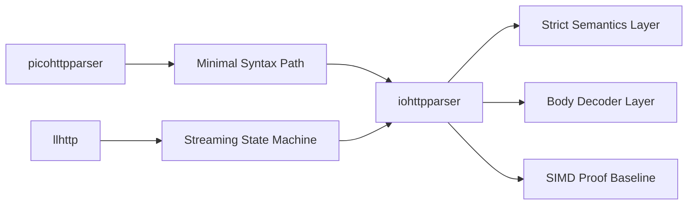
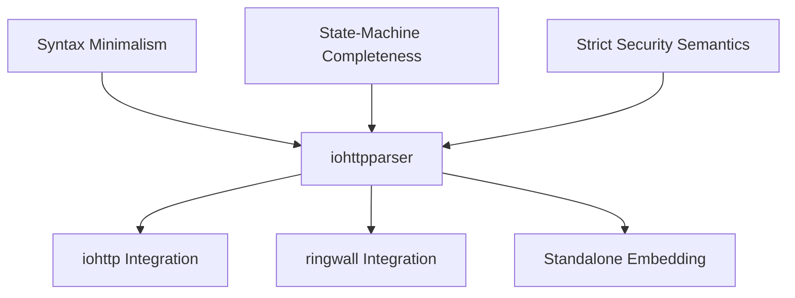

# Сравнение с picohttpparser и llhttp

## Executive Summary

`iohttpparser` находится между двумя устоявшимися parser family:
- `picohttpparser`: маленький, stateless, zero-copy, с минимальной semantics
- `llhttp`: generated, state-machine-heavy, callback-driven, с широким покрытием edge cases

Цель проекта не в том, чтобы копировать один из них. Нужная позиция такая:
- сохранить pull-based zero-copy ergonomics уровня `picohttpparser`
- позаимствовать verification discipline и streaming completeness уровня `llhttp`
- сохранить более чистое разделение слоёв, чем у обоих

---

## Feature Matrix

| Критерий | iohttpparser | picohttpparser | llhttp |
|---|---|---|---|
| Языковая модель | Handwritten C23 | Handwritten C | Generated C from llparse |
| Основной API style | Pull-based | Pull-based | Callback-driven |
| Zero-copy spans | Да | Да | Обычно через callback slices |
| Явный parser state | Да, публичный | Нет публичного state | Да |
| Header parsing | Да | Да | Да |
| Chunked body decoder | Да | Да | Встроен в parser machine |
| Semantics layer | Да | Нет | В основном встроен в parser logic |
| Leniency control | Небольшой policy surface | Почти отсутствует | Большой набор flags |
| SIMD backends | Scalar, SSE4.2, AVX2 | Нет отдельной multi-backend модели | Нет отдельного scanner backend layer |
| Fuzz и corpus strategy | Да | Базовые tests/bench | Более зрелая generated-state verification |

---

## Детальное сравнение

### iohttpparser vs picohttpparser

`picohttpparser` остаётся хорошим reference для:
- маленького public surface
- stateless parsing поверх caller-owned buffers
- дешёвой интеграции в event loops

Но он оставляет критичные production decisions на стороне consumer:
- `Transfer-Encoding` vs `Content-Length`
- ambiguity в duplicate headers
- host и keep-alive semantics
- security-sensitive rejection policy

Для `iohttp` и особенно `ringwall` это слишком большой downstream burden. Поэтому `iohttpparser` сознательно берёт на себя больше ответственности в semantics и body framing.

### iohttpparser vs llhttp

`llhttp` сильнее нас в:
- зрелости parser-state
- широте покрытия edge cases
- generated state-machine verification

Но платит за это:
- callback-first integration
- более сильным смешением parser и semantics
- широкой leniency surface, опасной как baseline для security-sensitive library

`iohttpparser` выбирает более узкий и строгий контракт:
- caller-managed buffers
- zero-copy output structs
- явный parser state без callback embedding

---

## Что стоит заимствовать

### От picohttpparser

- держать API маленьким
- сохранять дешёвый parsing поверх accumulated buffers
- делать differential testing простым

### От llhttp

- улучшать streaming completeness
- наращивать corpus coverage для malformed и ambiguous cases
- держать parser state transitions явными и testable

### Где надо оставаться отличными

- не переходить в callback-first parsing
- не переносить semantics внутрь syntax parser
- не расширять leniency defaults ради совпадения с legacy behavior

---

## Архитектурная позиция

---

## Выводы для roadmap

Сравнение приводит к четырём прямым приоритетам:

1. Усиливать публичный parser-state API.
2. Добавить differential suites против `picohttpparser` и `llhttp`.
3. Сохранять strict-by-default policy как baseline проекта.
4. Считать SIMD-оптимизации валидными только после доказанной эквивалентности scalar truth.
