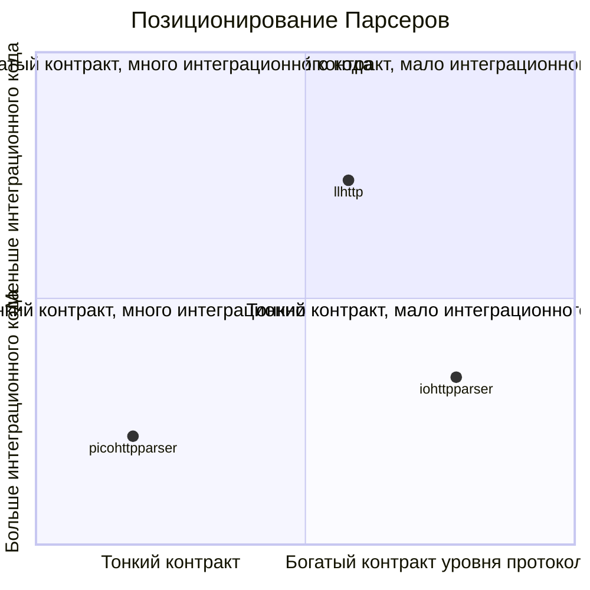

# Сравнение

## Связанные Документы

| Документ | Назначение |
|---|---|
| [08-testing-methodology.md](./08-testing-methodology.md) | программа и методика испытаний, правила сравнения и публикация артефактов |
| [09-test-results.md](./09-test-results.md) | текущие результаты ПМИ/ПСИ для сравниваемых парсеров |

## Область Сравнения

Сравниваются `iohttpparser`, `picohttpparser` и `llhttp` по:
- форме интерфейса
- возможностям на уровне протокола
- модели владения данными
- стоимости интеграции
- целевым сценариям применения

`iohttpparser` разрабатывался для:
- `iohttp`
- `ioguard`

Область применения библиотеки шире этих двух потребителей.

## Архитектурная Позиция

| Библиотека | Основная позиция |
|---|---|
| `iohttpparser` | парсер с возвратом результата и отдельными стадиями семантики и декодирования тела |
| `picohttpparser` | минимальный синтаксический парсер без копирования |
| `llhttp` | сгенерированный автомат состояний с обратными вызовами |

## Модель Интерфейса

| Область | iohttpparser | picohttpparser | llhttp |
|---|---|---|---|
| основной интерфейс | возврат результата вызовом функции | возврат результата вызовом функции | обратные вызовы |
| разбор без копирования | да | да | частично |
| явное состояние парсера | да | нет отдельного публичного объекта | да |
| типизированные структуры `request/response` | да | частично, через поля-указатели | события обратных вызовов и внутреннее состояние |
| отдельный вызов семантики | да | нет | в основном встроен |
| отдельный декодер тела | да | частично | в основном встроен |
| именованные профили потребителей | да | нет | нет |

## Матрица Функциональных Возможностей

| Возможность | Что делает | Зачем нужна | Типичное применение | iohttpparser | picohttpparser | llhttp |
|---|---|---|---|---|---|---|
| разбор начальной строки запроса | извлекает метод, цель и версию | обязателен для любого HTTP-запроса | входной трафик сервера | да | да | да |
| разбор строки статуса | извлекает версию, код статуса и пояснение | обязателен для обработки ответов | входной трафик клиента или прокси | да | да | да |
| разбор блока заголовков отдельно | разбирает только блок заголовков | упрощает послойную интеграцию и тесты | прокси, фильтры, тестовые стенды | да | да | частично |
| публичное состояние парсера | показывает прогресс инкрементального разбора | исключает повторное сканирование накопленного буфера | цикл событий и неблокирующий ввод-вывод | да | нет | да |
| разбор без отдельного состояния | разбирает накопленный буфер без внешнего объекта состояния | упрощает встраивание для полных буферов | тесты, простые серверы, пакетный разбор | да | да | нет |
| представления без копирования | возвращает указатели в буфер потребителя | убирает лишние копии и скрытое владение | горячий путь обработки входа | да | да | частично |
| семантика фрейминга | решает `Content-Length`, `Transfer-Encoding`, правила отсутствия тела и `keep-alive` | нужна до передачи в обработку тела | сервер, прокси, защитная граница | да | нет | частично |
| отклонение неоднозначностей | отклоняет `TE + CL`, конфликтующий `Content-Length`, неверный фрейминг | предотвращает подмену запроса и ошибки длины | вход на стороне безопасности | да | нет | частично |
| декодирование `chunked` | снимает фрейминг `chunked` | нужно для обработки тела запроса и ответа | сервер, прокси, анализатор трафика | да | да | встроено |
| учёт фиксированной длины | отслеживает оставшиеся байты тела | нужен для частичных чтений и конвейеризации | циклы событий, обработка ответов | да | нет | встроено |
| признаки владения хвостовыми полями | сообщает о наличии и передаче хвостовых полей | нужен для явного управления хвостовым блоком | прокси, фильтры тела | да | нет | частично |
| признаки передачи повышения протокола | сообщает `protocol_upgrade` | нужен для корректной передачи `101` и последующих байтов | шлюз повышения протокола, туннель | да | нет | частично |
| признак `Expect: 100-continue` | сообщает `expects_continue` | позволяет принять решение о промежуточном ответе | HTTP-сервер, фильтр запроса | да | нет | частично |
| именованные строгие профили | даёт `IHTP_POLICY_IOHTTP` и `IHTP_POLICY_IOGUARD` | фиксирует намерение потребителя в коде | встраивание в разные приложения | да | нет | нет |
| SIMD-слой сканера | даёт пути `scalar`, `SSE4.2`, `AVX2` | ускоряет поиск разделителей и проверку токенов | горячий путь на `x86_64` | да | нет отдельного слоя | нет отдельного слоя |
| поддерживаемый корпус дифференциальных тестов | сравнивает поведение с другими парсерами внутри репозитория | выявляет необъяснённые расхождения | регрессионное тестирование | да | эталон для сравнения | эталон для сравнения |
| интеграционные тесты для потребителей | моделирует потоки `iohttp` и `ioguard` | проверяет контракт, а не только синтаксис | проверка перед выпуском | да | нет | нет |

## Пояснения К Возможностям

### Семантика и отклонение неоднозначностей

`iohttpparser` включает:
- решения по фреймингу запроса и ответа
- классификацию повторяющегося `Content-Length`
- проверку `Transfer-Encoding`
- правила отсутствия тела

Эта работа остаётся внутри библиотеки, потому что относится к логике
протокола на уровне байтов.

### Отдельный декодер тела

`iohttpparser` держит декодирование тела вне синтаксического парсера.

Результат:
- синтаксический разбор может завершиться до начала обработки тела
- потребитель сам определяет момент запуска декодера
- обработка `chunked` и тела фиксированной длины остаётся явной стадией

### Публичное состояние парсера

`iohttpparser` предоставляет состояние парсера, потому что `iohttp` и
`ioguard` работают с накопленными буферами и частичными чтениями. Это также
полезно для:
- встроенных демонов
- обратных прокси
- систем повторного воспроизведения сетевых трасс

## Более Широкие Сценарии Применения

`iohttpparser` создавался для `iohttp` и `ioguard`, но его контракт подходит и
для других задач:

| Сценарий | Почему библиотека подходит |
|---|---|
| вход обратного прокси | явная передача результата фрейминга и повышения протокола |
| межсетевой экран HTTP-протокола | строгое отклонение неоднозначностей и представления без копирования |
| вход API-шлюза | состояние парсера, передача режима тела, отсутствие владения транспортом |
| боковой контейнер сервисной сетки | разбор запросов и ответов без модели обратных вызовов |
| встроенный сервер устройства | компактный интерфейс и владение буферами на стороне потребителя |
| воспроизведение трасс и испытательный стенд протокола | детерминированный результат разбора и сценарии на основе корпусов |
| эталонный стенд бенчмарков | прямое сравнение с `picohttpparser` и `llhttp` |

## Что Должно Оставаться В Библиотеке

Правильная область ответственности `iohttpparser`:
- синтаксический разбор
- семантика фрейминга
- отклонение неоднозначностей
- признаки переключения протокола и хвостовых полей
- обработка `chunked` и тела фиксированной длины

Неправильная область ответственности:
- нормализация `URI`
- маршрутизация
- разбор cookies
- политика аутентификации
- декодирование сжатия
- разбор кадров WebSocket
- обработка прикладного протокола после повышения соединения

## Как Выбирать

Выбирать `iohttpparser`, если нужны:
- разбор с возвратом результата
- типизированные представления без копирования
- явные стадии семантики и декодирования тела
- строгая политика уровня протокола

Выбирать `picohttpparser`, если нужны:
- минимальный синтаксический разбор
- максимальная чистая пропускная способность
- логика семантики вне библиотеки

Выбирать `llhttp`, если нужны:
- потоковая интеграция через обратные вызовы
- поведение сгенерированного автомата состояний
- обработка переключения протокола и приостановки через обратные вызовы парсера
