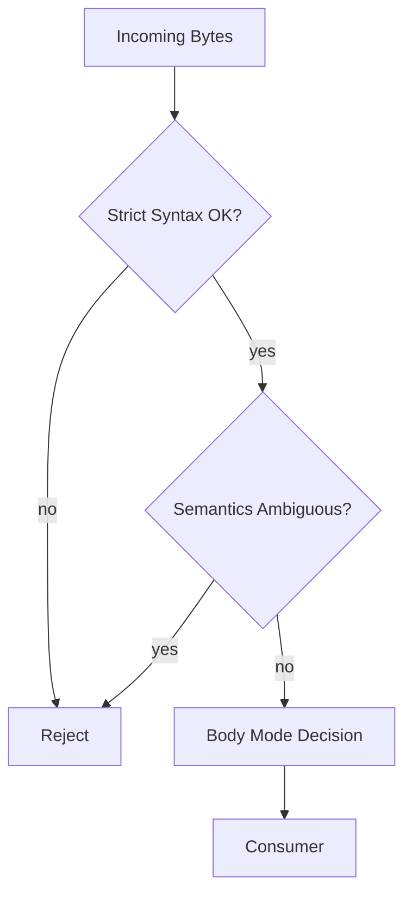
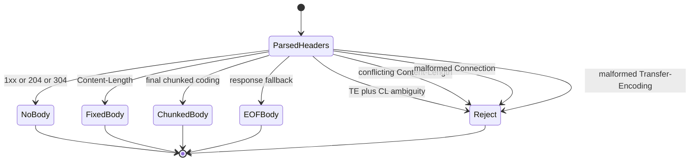
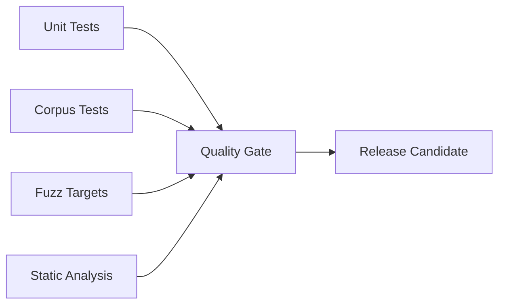

# Production Hardening

`iohttpparser` — не generic text parser. Это security-sensitive HTTP/1.1 wire parser. Поэтому production hardening означает fail-closed обработку malformed, ambiguous и hostile traffic при предсказуемой интеграции для `iohttp` и `ringwall`.

---

## Содержание

1. [Strict Policy Surface](#1-strict-policy-surface)
2. [Limits and Boundaries](#2-limits-and-boundaries)
3. [Semantics Rejection Rules](#3-semantics-rejection-rules)
4. [State and Buffer Ownership](#4-state-and-buffer-ownership)
5. [Verification Pipeline](#5-verification-pipeline)
6. [Consumer Profiles](#6-consumer-profiles)
7. [Release Gates](#7-release-gates)

---

## 1. Strict Policy Surface

Production baseline — это `IHTP_POLICY_STRICT`.

| Policy | Default | Purpose |
|---|---|---|
| `reject_obs_fold` | `true` | Запрет obsolete folded header syntax |
| `reject_bare_lf` | `true` | Запрет line endings без `CRLF` |
| `reject_te_cl` | `true` | Запрет ambiguity `Transfer-Encoding` + `Content-Length` |
| `allow_spaces_in_uri` | `false` | Fail-closed разбор request-target |

Цель — маленький policy surface. Если правило влияет на request smuggling или framing ambiguity, strict mode должен отвергать это по умолчанию.

---

## 2. Limits and Boundaries

Жёсткие parser limits — это часть production contract.

| Limit | Macro | Default |
|---|---|---|
| Max headers | `IHTP_MAX_HEADERS` | 64 |
| Max request line | `IHTP_MAX_REQUEST_LINE` | 8192 |
| Max header line | `IHTP_MAX_HEADER_LINE` | 8192 |

Эти лимиты должны оставаться:
- явными
- покрытыми тестами
- build-time configurable для consumer

Для `ringwall` ожидается более жёсткий профиль, чем для general-purpose `iohttp`.

---

## 3. Semantics Rejection Rules

Production hardening живёт в основном в semantics layer.

Сейчас уже реализованы классы reject:
- conflicting duplicate `Content-Length`
- malformed `Transfer-Encoding`
- duplicate `chunked`
- request `Transfer-Encoding`, который не заканчивается `chunked`
- malformed `Connection` token lists
- missing или duplicate `Host` в strict HTTP/1.1 request handling
- no-body response precedence для `1xx`, `204` и `304`

---

## 4. State and Buffer Ownership

Production embedding зависит от простых ownership rules:
- caller владеет всеми input buffers
- parsed spans валидны только пока жив caller buffer
- parser state хранит progress, а не private storage
- body decoders хранят только framing state

Это критично для:
- `io_uring` provided-buffer pipelines
- proxy/security use cases, где копии должны быть явными
- запрета hidden heap allocation в hot path

---

## 5. Verification Pipeline

Production hardening обеспечивается несколькими слоями проверки:

| Layer | Current Tooling |
|---|---|
| Unit tests | Unity |
| Corpus tests | Scanner, semantics, body corpora |
| Fuzzing | `fuzz_parser`, `fuzz_chunked`, `fuzz_scanner` |
| Formatting | `clang-format` |
| Static analysis | `cppcheck`, `PVS-Studio`, `CodeChecker` |
| Benchmark checks | scanner benchmark scripts |

---

## 6. Consumer Profiles

### iohttp

Профиль `iohttp` должен оставаться interoperable, но strict by default. Leniency допустима только как явный compatibility choice.

### ringwall

Профиль `ringwall` должен оставаться более жёстким:
- меньшие limits
- никакой legacy tolerance по умолчанию
- fail closed при ambiguity

---

## 7. Release Gates

Перед production-tagged release проект должен требовать:

1. Green `./scripts/quality.sh`
2. Green sanitizer matrix там, где она поддерживается
3. Green fuzz smoke runs
4. Differential checks против `picohttpparser` и `llhttp`
5. Документированный consumer contract для `iohttp` и `ringwall`

Правило простое: performance improvements опциональны; strict correctness и явные failure modes обязательны.
