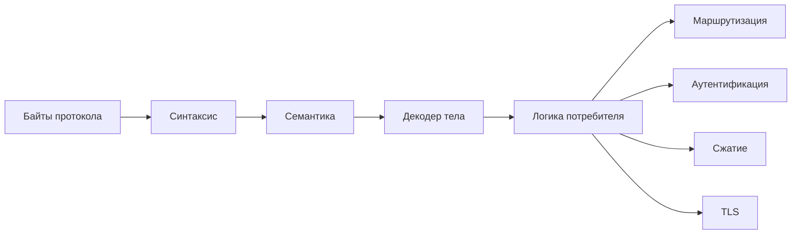

# Сравнение Экосистемы Парсеров

## Назначение

Этот документ определяет, какие задачи должны оставаться внутри
`iohttpparser`, а какие задачи должны решаться в потребителе или в соседней
библиотеке.

## Разделение Ответственности

| Задача | iohttpparser | Потребитель | Соседняя библиотека |
|---|---|---|---|
| разбор строки запроса и строки статуса | да | нет | нет |
| разбор полей заголовков | да | нет | нет |
| семантика фрейминга | да | нет | нет |
| декодирование `chunked` | да | нет | нет |
| решение по `keep-alive` | да | потребитель использует результат | нет |
| маршрутизация | нет | да | нет |
| нормализация `URI` | нет | да | нет |
| `TLS` | нет | да | да |
| декодирование сжатия | нет | да | да |
| cookies | нет | да | да |
| кадры WebSocket | нет | да | да |

## Сравнение С Семействами Парсеров

| Семейство | Типичная граница |
|---|---|
| минимальный парсер (`picohttpparser`) | в основном только синтаксис; семантика вынесена наружу |
| сгенерированный автомат состояний (`llhttp`) | синтаксис и многие решения по протоколу находятся внутри обратных вызовов |
| многослойное ядро парсера (`iohttpparser`) | синтаксис, семантика и фрейминг тела разделены по стадиям |

## Почему `iohttpparser` Включает Семантику И Фрейминг Тела

Библиотека включает:
- решения по фреймингу
- отклонение неоднозначностей
- правила `keep-alive` и отсутствия тела
- декодирование `chunked`

Причины:
- `iohttp` и `ioguard` нуждаются в этих решениях до прикладной логики
- эти решения зависят от семантики HTTP на уровне байтов
- перенос этой логики наружу увеличивает дублирование кода рядом с парсером

## Почему `iohttpparser` Исключает Верхние Слои

Библиотека исключает:
- маршрутизацию
- аутентификацию
- авторизацию
- нормализацию `URI`
- декодирование содержимого
- владение транспортом

Причины:
- эти задачи зависят от прикладной политики, а не только от синтаксиса HTTP
- разным потребителям нужна разная логика
- добавление этих задач в парсер расширит контракт без выигрыша в корректности разбора

## Диаграмма Границы

## Совместимость С `picohttpparser` И `llhttp`

`iohttpparser` совместим с экосистемой в следующем смысле:
- его можно сравнивать с `picohttpparser` и `llhttp` по синтаксическому поведению
- он не копирует их модель интеграции

`iohttpparser` отличается в следующем:
- он не предоставляет интерфейс через обратные вызовы как `llhttp`
- он не ограничивается только синтаксическим результатом как `picohttpparser`
