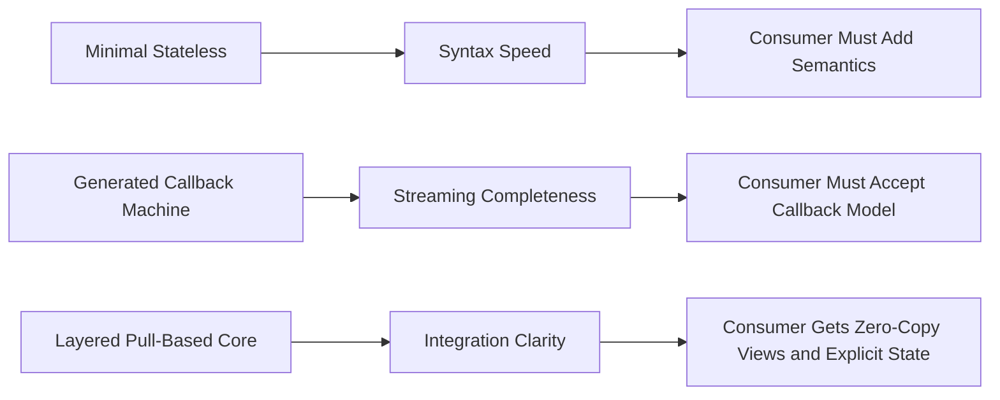
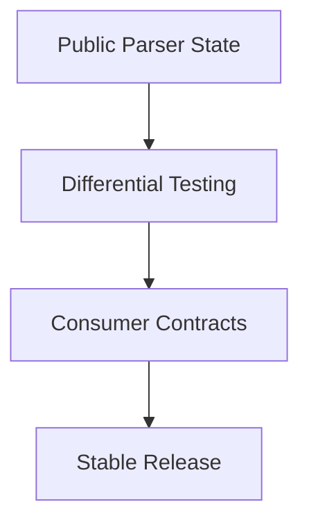

# Сравнение экосистемы парсеров

## Executive Summary

Экосистема embedded HTTP/1.1 parsers делится на три больших implementation style:

1. Minimal stateless parsers
2. Generated callback-driven state machines
3. Layered pull-based parser cores

`iohttpparser` намеренно строится как третья категория. В этом документе сравниваются эти стили и объясняется, почему это важно для `iohttp`, `ringwall` и generic embedders.

---

## Семейства реализаций

| Family | Representative | Strength | Weakness |
|---|---|---|---|
| Minimal stateless | `picohttpparser` | Маленький API, простая интеграция, быстрый syntax path | Consumer сам владеет semantics и частью edge cases |
| Generated callback state machine | `llhttp` | Богатый streaming behavior, зрелое покрытие state machine | Callback-first API, более сильное смешение semantics и parser logic |
| Layered pull-based core | `iohttpparser` | Явное ownership, отдельные semantics/body layers, удобный consumer state | Более молодая кодовая база и ещё формирующаяся ecosystem/docs |

---

## Подходящесть для целевых consumers

### iohttp

`iohttp` нужен parser core, который:
- не владеет transport
- может жить под `io_uring` server
- держит body framing отдельно от routing и application logic

Это лучше совпадает с `iohttpparser`, чем с callback-driven machine.

### ringwall

`ringwall` нужен parser core, который:
- работает как строгая security boundary
- явно показывает semantics decisions
- не скрывает lenient behavior

И это тоже в пользу layered pull-based parser.

### Generic Embedders

Отдельные event loops обычно хотят:
- zero-copy structs
- явный progress через parser state
- отсутствие обязательной зависимости от framework runtime

Именно под это и сделан новый public stateful API.

---

## Comparison Matrix

| Criterion | iohttpparser | picohttpparser | llhttp |
|---|---|---|---|
| Caller-owned buffers | Да | Да | Да, но вывод идёт через callbacks |
| Public parser state | Да | Нет | Да |
| Pull-based result structs | Да | Да | Нет, вместо этого callback events |
| Separate semantics phase | Да | Нет | В основном нет |
| Separate body decoder | Да | Частично | В основном встроен |
| Differential testing value | Высокая | Высокая | Высокая |
| Direct fit for `iohttp` and `ringwall` | Наилучший | Средний | Средний |

---

## Выводы для roadmap

Сравнение parser ecosystem означает такой roadmap:

1. Держать public parser-state API маленьким и стабильным.
2. Расширять differential testing вместо widening leniency.
3. Документировать consumer integration patterns как first-class docs.
4. Сохранять semantics layer явным, а не сворачивать его в syntax parser.

---

## Рекомендация

`iohttpparser` не должен превращаться в копию `picohttpparser` или `llhttp`.

Ему стоит оставаться:
- строже, чем `picohttpparser`
- проще для embedding, чем `llhttp`
- более явным по ownership и semantics, чем оба
