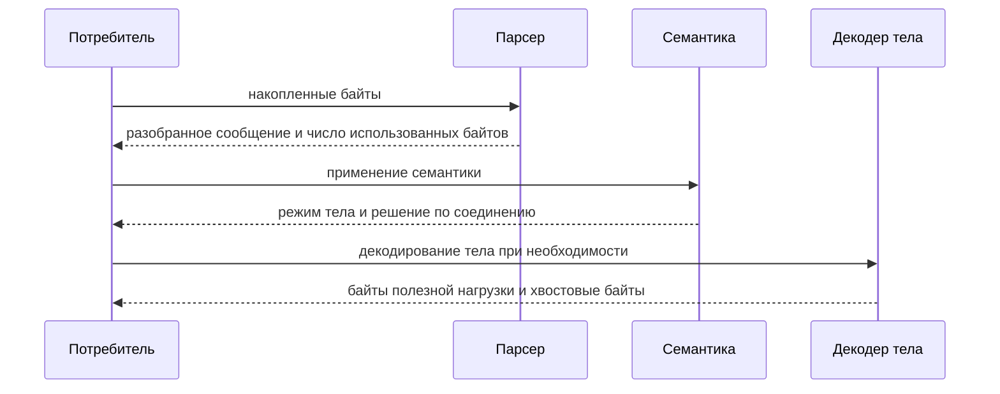

# Контракты Потребителей

## Общий Контракт

Оба поддерживаемых потребителя используют одно и то же ядро парсера.

Общие инварианты:
- входные буферы принадлежат потребителю
- разобранные диапазоны не копируются
- после синтаксического разбора всегда вызывается этап семантики
- после семантики выполняется явная передача в декодер тела
- библиотека не владеет транспортом

Предпочтительный интерфейс для обоих потребителей:
- `ihtp_parser_state_t`
- `ihtp_parse_request_stateful()`
- `ihtp_parse_response_stateful()`
- `ihtp_parse_headers_stateful()`

Публичная поверхность семантики:
- `ihtp_request_apply_semantics()`
- `ihtp_response_apply_semantics()`
- `protocol_upgrade`
- `expects_continue`
- `has_trailer_fields`

## Именованные Профили

| Профиль | Текущее поведение |
|---|---|
| `IHTP_POLICY_IOHTTP` | строгий профиль RFC |
| `IHTP_POLICY_IOGUARD` | строгий профиль RFC |

Оба профиля сейчас являются точными псевдонимами строгого профиля.

## Контракт Для `iohttp`

`iohttp` использует `iohttpparser` как кодек HTTP/1.1 на уровне байтового протокола.

Требуемое поведение:
- разбор по накопленному буферу потребителя
- переиспользование состояния парсера между частичными чтениями
- немедленное применение семантики после завершения разбора заголовков
- передача режима тела на уровень соединения или запроса

Требуемые результаты:
- `bytes_consumed`
- `body_mode`
- `keep_alive`
- диапазоны байтов для заголовков запроса и ответа

## Контракт Для `ioguard`

`ioguard` использует `iohttpparser` как строгий граничный парсер.

Требуемое поведение:
- отказ по умолчанию на неоднозначности
- строгая политика по умолчанию
- отклонение ошибочного фрейминга до передачи в прикладной код

Требуемые результаты:
- метод и цель запроса
- решение по фреймингу
- решение по соединению
- строгое отклонение неоднозначного синтаксиса и семантики

## Правила Владения

| Область | Правило |
|---|---|
| входные данные парсера | принадлежат потребителю |
| разобранные диапазоны | указывают в буфер потребителя |
| состояние парсера | хранит только прогресс |
| результат семантики | копируемая структура потребителя |
| полезная нагрузка `chunked` | переписывается в буфере потребителя |
| хвостовые байты | остаются в буфере потребителя |

## Специальные Случаи

### `CONNECT`

- определяется через `req.method == IHTP_METHOD_CONNECT`
- целевой адрес в форме authority возвращается в `req.path`
- настройка туннеля относится к уровню потребителя

### `101 Switching Protocols`

- `protocol_upgrade` выставляется только при явном повышении протокола
- владение парсером заканчивается на блоке заголовков ответа
- байты после блока заголовков принадлежат потребителю

### `Expect: 100-continue`

- `expects_continue` относится только к запросу
- парсер не формирует промежуточные ответы
- решение о `100 Continue` принимает потребитель

### Хвостовые Поля

- `has_trailer_fields` сообщает о наличии объявленных хвостовых полей
- `ihtp_chunked_decoder_t.consume_trailer` определяет владение хвостовым блоком
- `consume_trailer = false` возвращает хвостовые байты потребителю

## Последовательность Интеграции

