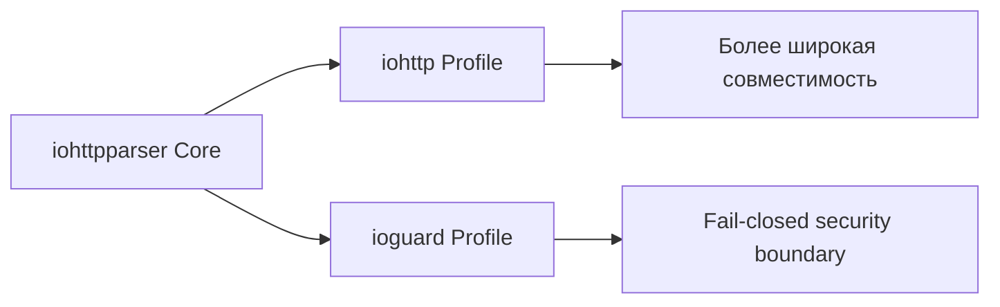
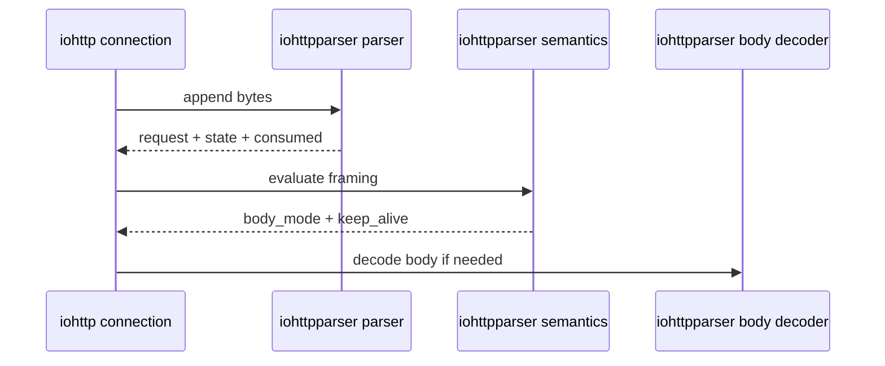

# Контракты Потребителей

## Краткий Вывод

`iohttpparser` уже имеет достаточную базу по parser, semantics, body decoder и differential testing, чтобы зафиксировать явные consumer contracts.

Два основных потребителя:
- `iohttp`
- `ioguard` (бывший `ringwall`)

Им не нужно идентичное поведение на уровне policy. Им нужен один parser core с разными policy envelopes.

---

## Общий Базовый Контракт

Оба потребителя зависят от одинаковых инвариантов:
- caller-owned input buffers
- zero-copy spans в parsed outputs
- отсутствие transport state внутри parser
- явный semantics step после syntax parsing
- явный body-framing handoff через `ihtp_semantics_*` и `ihtp_body_decoder_*`

Предпочтительный путь интеграции для обоих:
- `ihtp_parser_state_t`
- `ihtp_parse_request_stateful()`
- `ihtp_parse_response_stateful()`
- `ihtp_parse_headers_stateful()`

Semantics handoff теперь тоже часть публичного surface:
- `ihtp_request_apply_semantics()`
- `ihtp_response_apply_semantics()`
- header: `include/iohttpparser/ihtp_semantics.h`
- consumer-facing flags:
  - `protocol_upgrade`
  - `expects_continue`
  - `has_trailer_fields`

---

## Контракт Для iohttp

`iohttp` это HTTP server library. Его parser contract должен оптимизироваться под понятный body framing и повторно используемое connection-level state, но при этом по умолчанию оставаться strict по RFC.

### Ожидаемая модель интеграции

- накапливать байты на соединение
- переиспользовать один `ihtp_parser_state_t` на текущее сообщение
- запускать semantics сразу после успешного разбора headers
- передавать body mode дальше в request-processing code, не смешивая parser layer с routing и app logic

### Обязательные гарантии

- strict-by-default request parsing
- leniency только через явную policy configuration
- стабильные `bytes_consumed` и parser-phase reporting на partial reads
- separation по body mode:
  - `IHTP_BODY_NONE`
  - `IHTP_BODY_FIXED`
  - `IHTP_BODY_CHUNKED`
  - `IHTP_BODY_EOF`

---

## Контракт Для ioguard

`ioguard` использует `iohttpparser` как более строгий boundary component. Его parser contract должен оптимизироваться под fail-closed behavior и rejection любой неоднозначности.

### Ожидаемая модель интеграции

- один parser state на каждый control-plane message flow
- strict profile по умолчанию
- reject ambiguity до того, как сообщение увидит proxy или security logic

### Обязательные гарантии

- reject-by-default для:
  - conflicting `Content-Length`
  - `Transfer-Encoding + Content-Length`
  - malformed `Connection`
  - malformed line endings
  - invalid request-target control bytes
- маленькая и явная limit surface
- отсутствие скрытого fallback от strict решения к lenient accept

`ioguard` должен трактовать semantics output из `iohttpparser` как security decision point, а не просто как удобный parser result.

---

## Разделение Policy

| Область | iohttp | ioguard |
|---|---|---|
| Default mode | Strict | Strict |
| Lenient toggles | Допустимы при явной настройке | Нежелательны; только как migration opt-in |
| Header limits | Умеренные server defaults | Меньшие fail-closed defaults |
| Ambiguous framing | Reject | Reject |
| Bare `LF` support | Только через явную lenient policy | Off |
| `obs-fold` support | Только через явную lenient policy | Off |

В публичном API теперь есть именованные presets:
- `IHTP_POLICY_IOHTTP`
- `IHTP_POLICY_IOGUARD`

Оба пока отображаются в строгий RFC-профиль. Раздельные имена нужны, чтобы
consumer code опирался на явный intent и мог пережить будущую дивергенцию без
смены call site.

---

## Ближайшие Шаги

Sprint 7 теперь должен зафиксировать:

1. consumer-facing docs для body-mode handoff
2. ownership для `Upgrade`, `CONNECT` и `Expect: 100-continue`
3. presets по limits/profile для `iohttp` и `ioguard`
4. integration examples со stateful parsing поверх accumulated buffers

### Детали ownership в semantics

- `protocol_upgrade` выставляется только когда само сообщение явно фиксирует
  переключение протокола:
  - request: `Connection: upgrade` и непустой `Upgrade`
  - response: `101 Switching Protocols` вместе с `Connection: upgrade` и `Upgrade`
- `expects_continue` есть только у request и выставляется для точного
  `Expect: 100-continue`
- `has_trailer_fields` означает, что сообщение объявляет trailer fields и
  consumer должен передать завершение chunked body в trailer-aware path
- `CONNECT` по-прежнему определяется главным образом через
  `req.method == IHTP_METHOD_CONNECT`; Sprint 7 не добавляет для него отдельный
  дублирующий флаг

### Базовый integration example

`examples/basic_parse.c` теперь показывает рекомендуемый consumer flow:

1. накапливать байты в одном caller-owned буфере
2. переиспользовать `ihtp_parser_state_t`
3. разбирать сообщение с `IHTP_POLICY_IOHTTP`
4. вызывать `ihtp_request_apply_semantics()`
5. передавать оставшиеся байты в `ihtp_decode_chunked()`, если framing chunked

## Рекомендация

Нужно рассматривать `iohttp` и `ioguard` как policy consumers одного parser core, а не как повод разводить поведение на разные parser implementations.
