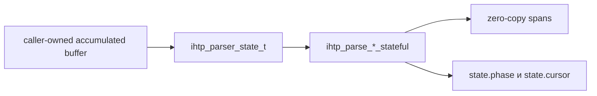

# Stateful Parser API

В `iohttpparser` теперь есть явный stateful API для инкрементального разбора:
- request
- response
- отдельного header block

Новый API сохраняет базовую модель библиотеки: pull-based parsing, zero-copy spans, без callback-ов, без скрытых аллокаций и без внутренних буферов парсера.



## Доступный API

- `ihtp_parser_state_t`
- `ihtp_parser_state_init()`
- `ihtp_parser_state_reset()`
- `ihtp_parse_request_stateful()`
- `ihtp_parse_response_stateful()`
- `ihtp_parse_headers_stateful()`

## Контракт

- входной буфер по-прежнему принадлежит вызывающему коду
- разобранные поля по-прежнему ссылаются на caller-owned buffer
- один и тот же `ihtp_parser_state_t` надо переиспользовать, пока accumulated buffer растёт
- `state.cursor` показывает общий прогресс внутри накопленного буфера
- `state.phase` показывает, где сейчас парсер: start line, headers, done или error
- `ihtp_parser_state_reset()` сохраняет `state.mode`, но сбрасывает progress для нового сообщения

## Пример

```c
#include <iohttpparser/ihtp_parser.h>
#include <string.h>

int main(void)
{
    const char *wire =
        "GET /health HTTP/1.1\r\n"
        "Host: example.com\r\n"
        "\r\n";

    ihtp_request_t req = {0};
    ihtp_parser_state_t st;
    size_t consumed = 0;

    ihtp_parser_state_init(&st, IHTP_PARSER_MODE_REQUEST);

    if (ihtp_parse_request_stateful(&st, wire, 20, &req, nullptr, &consumed) == IHTP_INCOMPLETE) {
        /* дописываем новые байты в тот же accumulated buffer */
    }

    if (ihtp_parse_request_stateful(&st, wire, strlen(wire), &req, nullptr, &consumed) == IHTP_OK) {
        /* req теперь содержит zero-copy spans внутрь wire */
    }
}
```

## Когда использовать

Stateful API нужен там, где consumer уже держит connection state и хочет явно контролировать прогресс parser layer. Stateless API по-прежнему подходит для простого accumulated-buffer сценария, где отдельный state object не даёт выигрыша.
