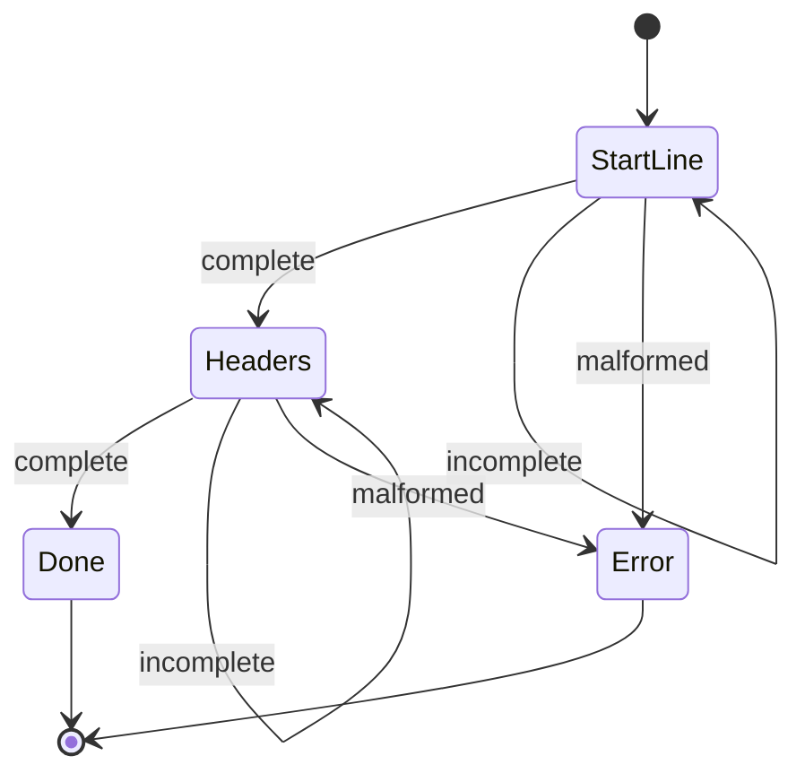

[](https://github.com/ioplane/iohttpparser)
[](https://www.iso.org/standard/82075.html)
[](https://www.doxygen.nl/)
[](https://mermaid.js.org/syntax/stateDiagram.html)

# Состояние Парсера

## Назначение

Интерфейс состояния парсера нужен для инкрементального разбора по накопленному
буферу потребителя.

Поддерживаемые классы сообщений:
- запросы
- ответы
- отдельные блоки заголовков

## Публичный Интерфейс

| API | Назначение |
|---|---|
| `ihtp_parser_state_t` | объект прогресса парсера |
| `ihtp_parser_state_init()` | инициализация состояния |
| `ihtp_parser_state_reset()` | подготовка состояния к следующему сообщению |
| `ihtp_parse_request_stateful()` | инкрементальный разбор запроса |
| `ihtp_parse_response_stateful()` | инкрементальный разбор ответа |
| `ihtp_parse_headers_stateful()` | инкрементальный разбор блока заголовков |

## Инварианты

- накопленный буфер принадлежит потребителю
- разобранные диапазоны указывают в накопленный буфер
- один и тот же буфер должен оставаться валидным между вызовами
- состояние парсера хранит только прогресс
- `ihtp_parser_state_reset()` сбрасывает только прогресс разбора

## Модель Прогресса



Объект состояния нужен, чтобы не пересканировать уже принятые байты.

## Пример

```c
#include <iohttpparser/ihtp_parser.h>
#include <string.h>

int main(void)
{
    const char *wire =
        "GET /health HTTP/1.1\r\n"
        "Host: example.com\r\n"
        "\r\n";

    ihtp_request_t req = {0};
    ihtp_parser_state_t st;
    size_t consumed = 0;

    ihtp_parser_state_init(&st, IHTP_PARSER_MODE_REQUEST);

    if (ihtp_parse_request_stateful(&st, wire, 20, &req, NULL, &consumed) == IHTP_INCOMPLETE) {
        /* добавить байты в тот же накопленный буфер */
    }

    if (ihtp_parse_request_stateful(&st, wire, strlen(wire), &req, NULL, &consumed) == IHTP_OK) {
        /* поля req указывают в wire */
    }

    return 0;
}
```

## Когда Использовать

Использовать интерфейс состояния, когда потребитель:
- читает из соединения в несколько шагов
- хранит накопленный буфер
- хочет явный прогресс парсера без обратных вызовов

Использовать интерфейс без состояния, когда потребитель уже имеет полный
накопленный буфер и не нуждается в отдельном объекте состояния.
