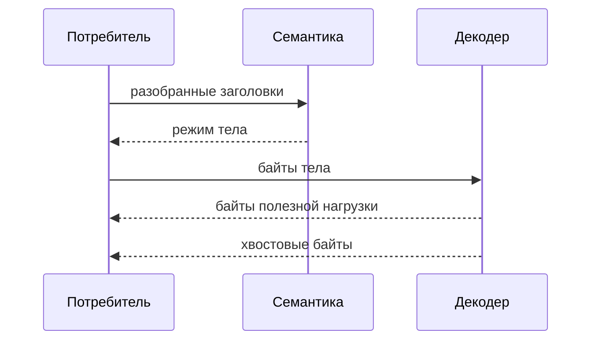

# Декодер Тела

## Область Применения

Декодер тела занимается только фреймингом.

Внутри области применения:
- учёт тела фиксированной длины
- декодирование `chunked`
- управление потреблением хвостового блока

Вне области применения:
- чтение из транспорта
- скрытая буферизация
- декодирование содержимого
- интерпретация полезной нагрузки

## Публичная Поверхность

| API | Назначение |
|---|---|
| `ihtp_fixed_decoder_init()` | инициализация учёта тела фиксированной длины |
| `ihtp_decode_fixed()` | продвижение состояния декодера фиксированной длины |
| `ihtp_chunked_decoder_t` | состояние декодера `chunked` |
| `ihtp_decode_chunked()` | декодирование `chunked` в исходном буфере |

## Контракт Декодера `chunked`

- Один `ihtp_chunked_decoder_t` переиспользуется между вызовами.
- Декодер переписывает буфер потребителя без промежуточного буфера.
- `*bufsz` становится размером сохранённой полезной нагрузки в текущем срезе.
- `total_decoded` считает только байты полезной нагрузки.
- Неотрицательное возвращаемое значение означает завершение и равно числу
  хвостовых байтов после обработки завершающего пути `chunked`.

### Владение Хвостовым Блоком

| `consume_trailer` | Эффект |
|---|---|
| `true` | декодер потребляет хвостовые поля до завершающей пустой строки |
| `false` | декодер оставляет хвостовые байты потребителю |

Хвостовые байты остаются в буфере потребителя сразу после префикса
декодированной полезной нагрузки.

## Контракт Декодера Фиксированной Длины

- `ihtp_fixed_decoder_init()` задаёт ожидаемую длину полезной нагрузки.
- `ihtp_decode_fixed()` выполняет только учёт.
- `remaining` уменьшается монотонно.
- `total_decoded` увеличивается монотонно.
- Передача большего числа байтов, чем `remaining`, является ошибкой.

## Правила Владения

- Входные байты принадлежат потребителю.
- Декодированные байты полезной нагрузки остаются в памяти потребителя.
- Состояние декодера хранит только счётчики и фазу.

## Последовательность Декодирования

