[](https://github.com/ioplane/iohttpparser)
[](https://www.rfc-editor.org/rfc/rfc9110.html)
[](https://www.rfc-editor.org/rfc/rfc9112.html)
[](https://valgrind.org/)
[](https://github.com/namhyung/uftrace)
[](https://mermaid.js.org/syntax/gantt.html)

# Программа И Методика Испытаний

## Связанные Документы

| Документ | Назначение |
|---|---|
| [02-comparison.md](./02-comparison.md) | цели сравнения и сравниваемые возможности |
| [09-test-results.md](./09-test-results.md) | результаты функциональных и производительных испытаний |
| [10-extended-contract-methodology.md](./10-extended-contract-methodology.md) | методика для возможностей вне общей матрицы |
| [11-extended-contract-results.md](./11-extended-contract-results.md) | состояние результатов по расширенному контракту |
| [../plans/2026-03-11-sprint-11-comparison-report.md](../plans/2026-03-11-sprint-11-comparison-report.md) | подробная история сравнения и профилирования |

## Назначение

Этот документ задаёт программу и методику испытаний на уровне репозитория.

Документ покрывает:
- функциональные испытания
- производительные испытания
- сравнение с `picohttpparser` и `llhttp`
- публикацию воспроизводимых артефактов в репозитории

Документ охватывает общий слой сравнения.

Возможности, которым нужен расширенный взгляд на контракт, вынесены в:
- [10-extended-contract-methodology.md](./10-extended-contract-methodology.md)
- [11-extended-contract-results.md](./11-extended-contract-results.md)

## Объект Испытаний

Объект испытаний:
- парсер
- состояние парсера
- этап семантики
- декодер тела
- реализации сканера

Вне объекта испытаний:
- транспортный ввод-вывод
- `TLS`
- маршрутизация
- прикладные обработчики

## Цели Испытаний

| Цель | Вопрос |
|---|---|
| корректность синтаксиса | принимает ли парсер допустимый синтаксис и отклоняет ли ошибочный синтаксис? |
| корректность семантики | соответствуют ли правила фрейминга и соединения документированному контракту? |
| совместимость с потребителями | могут ли `iohttp` и `ioguard` использовать библиотеку без скрытого вспомогательного слоя? |
| эквивалентность реализаций | дают ли скалярные и SIMD-пути одинаковый результат? |
| сравнительное поведение | где поведение совпадает или намеренно расходится с `picohttpparser` и `llhttp`? |
| пропускная способность | какой объём работы парсер выполняет за единицу времени? |
| локализация узкого места | какой внутренний этап даёт основную стоимость? |

## Входные Данные

| Класс входных данных | Источник |
|---|---|
| модульные случаи | `tests/unit/` |
| корпусные случаи | `tests/corpus/` |
| дифференциальные случаи | `tests/corpus/differential/`, `tests/corpus/semantics-differential/` |
| интеграционные случаи | `tests/unit/test_iohttp_integration.c` |
| сценарии пропускной способности | `bench/bench_throughput_compare.c` |
| цели профилирования | `bench/bench_throughput_compare.c`, бенчмарки сканера |

## Среда

Требуемая среда:
- контейнер разработки из `deploy/podman/Containerfile`
- preset `clang-debug` для функциональных прогонов
- preset `clang-release` для прогонов пропускной способности

Дополнительные средства профилирования внутри контейнера:
- `valgrind`
- `uftrace`
- `gdb`
- `ftracer`

## Структура Программы Испытаний

```mermaid
gantt
    title Порядок выполнения ПМИ и ПСИ
    dateFormat  X
    axisFormat %s
    section Функциональный Контур
    Настройка и сборка            :a1, 0, 1
    Полный прогон ctest           :a2, after a1, 1
    section Производительный Контур
    Одиночная матрица пропускной способности :b1, after a2, 1
    Медианная матрица пропускной способности :b2, after b1, 1
    section Публикация
    Запись артефактов в репозиторий :c1, after b2, 1
    Обновление документа 09         :c2, after c1, 1
```



## Функциональные Испытания

Функциональные испытания используют:
- `cmake --preset clang-debug`
- `cmake --build --preset clang-debug`
- `ctest --preset clang-debug --output-on-failure`

Функциональный прогон включает:
- модульные тесты
- корпусные тесты
- дифференциальные тесты
- интеграционные тесты потребителей
- тесты реализаций сканера

Правило приёмки:
- полный прогон `ctest` должен завершиться без ошибок в выбранном preset

## Производительные Испытания

Производительные испытания используют:
- `bench/bench_throughput_compare.c`
- `scripts/run-throughput-compare.sh`
- `scripts/run-throughput-median.sh`

Производительный прогон обязан включать все три парсера:
- `iohttpparser`
- `picohttpparser`
- `llhttp`

Производительный прогон обязан включать:
- общую матрицу
- матрицу для `CONNECT`
- медианную агрегацию повторных прогонов

Измеряемые значения:
- `req/s`
- `MiB/s`
- `ns/req`

## Правила Сравнения

Правила сравнения:
1. для всех трёх парсеров используется один и тот же набор байтов
2. область сравнения ограничивается работой парсера; логика потребителя не включается
3. строгий и мягкий режимы `iohttpparser` фиксируются отдельно
4. расхождения классифицируются как:
   - совпадающее поведение
   - намеренное расхождение
   - необъяснённое расхождение

## Публикация Артефактов

Артефакты, публикуемые в репозитории, записываются в каталог:

`tests/artifacts/pmi-psi/<date>/`

Точки входа на уровне репозитория:
- [`tests/artifacts/pmi-psi/README.md`](../../tests/artifacts/pmi-psi/README.md)
- [`tests/artifacts/pmi-psi/index.tsv`](../../tests/artifacts/pmi-psi/index.tsv)
- [`tests/artifacts/pmi-psi/latest.txt`](../../tests/artifacts/pmi-psi/latest.txt)

Обязательные файлы:
- `README.md`
- `run.txt`
- `host.txt`
- `toolchain.txt`
- `ctest.txt`
- `throughput.tsv`
- `throughput-connect.tsv`
- `throughput-median.tsv`
- `throughput-connect-median.tsv`

## Основной Исполнительный Скрипт

Основной воспроизводимый исполнительный скрипт:

```bash
bash scripts/run-pmi-psi.sh
```

Скрипт:
1. настраивает и собирает проект
2. выполняет полный функциональный прогон
3. выполняет измерения пропускной способности только для парсера
4. сохраняет все результаты в репозитории

## Критерии Приёмки

Партия ПМИ/ПСИ принимается только при выполнении всех условий:
1. полный функциональный прогон завершился успешно
2. артефакты записаны в репозиторий
3. документ `09-test-results.md` обновлён по сгенерированным артефактам
4. сохранено трёхстороннее сравнение с `picohttpparser` и `llhttp`
