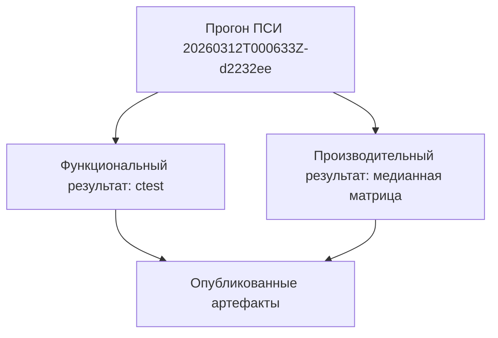
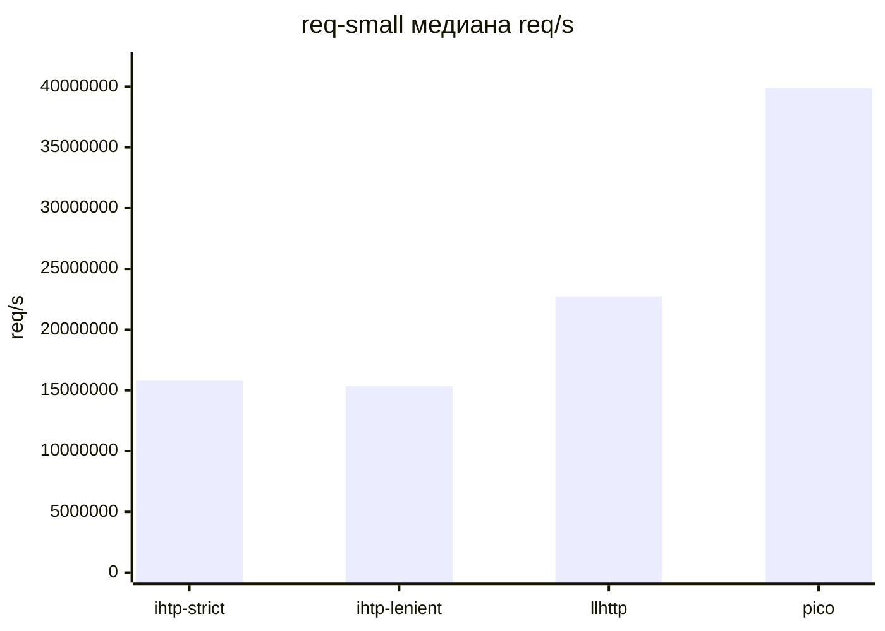
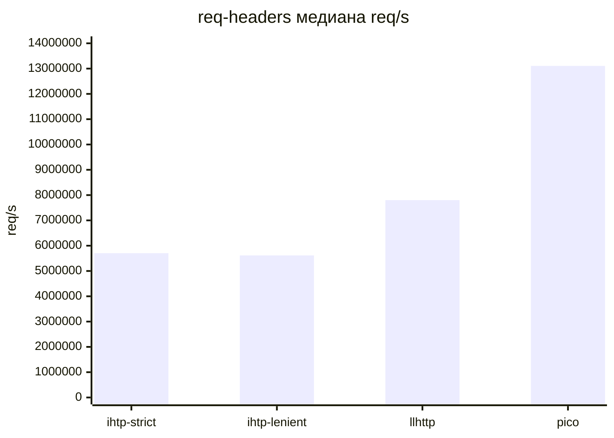
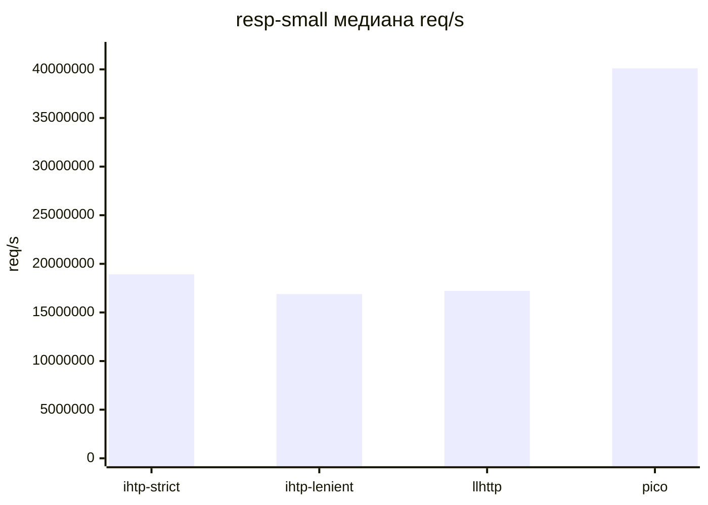
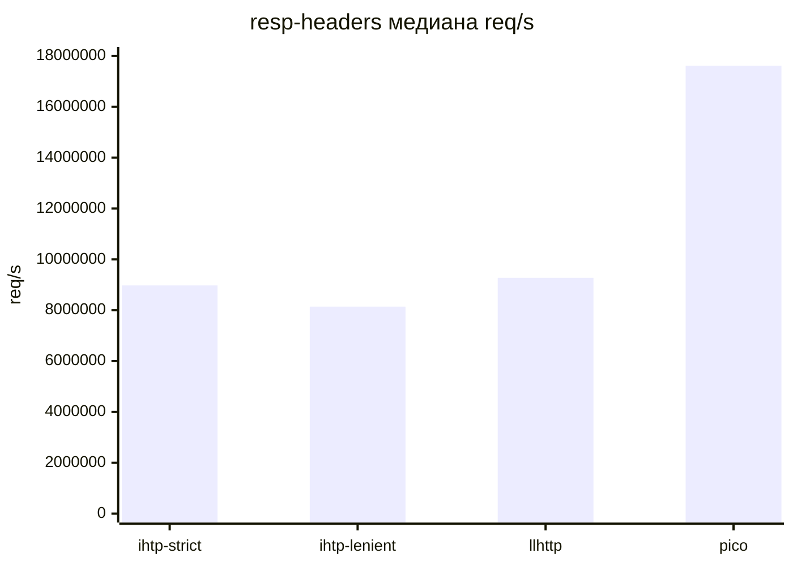
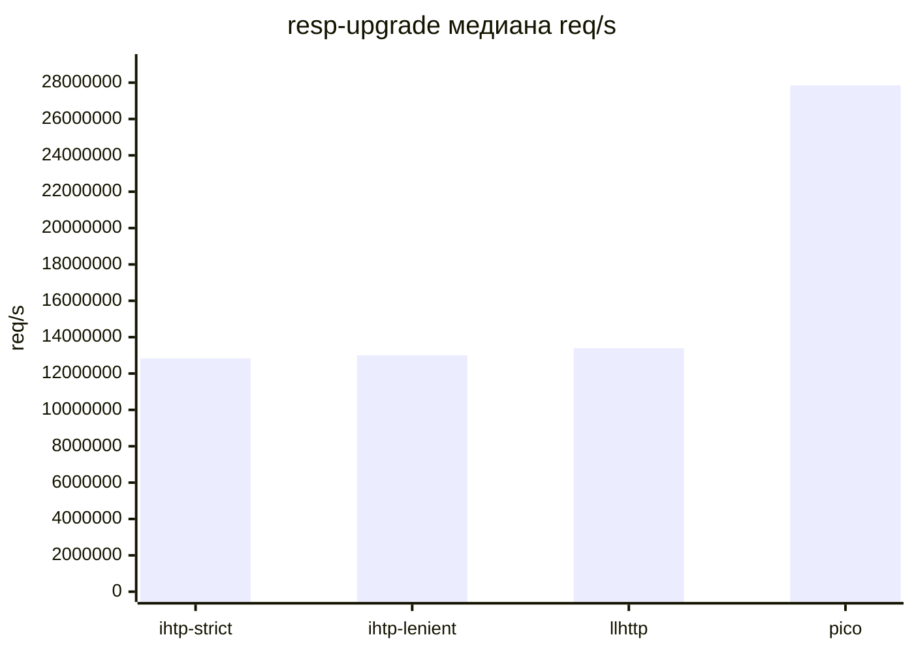
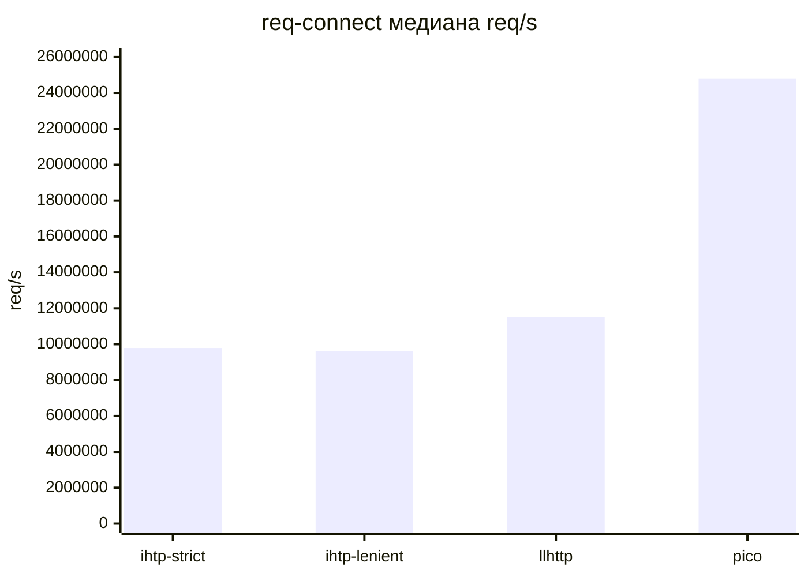

# Результаты Испытаний

## Связанные Документы

| Документ | Назначение |
|---|---|
| [02-comparison.md](./02-comparison.md) | сравниваемые возможности и сценарии |
| [08-testing-methodology.md](./08-testing-methodology.md) | программа и методика испытаний |
| [../plans/2026-03-11-sprint-11-comparison-report.md](../plans/2026-03-11-sprint-11-comparison-report.md) | подробные заметки по сравнению и профилированию |

## Область

Этот документ хранит публикуемые в репозитории результаты функциональных и
производительных испытаний.

## Набор Артефактов

Текущий каталог артефактов:

`tests/artifacts/pmi-psi/runs/20260312T000633Z-d2232ee/`

Точки входа на уровне репозитория:
- [`tests/artifacts/pmi-psi/README.md`](../../tests/artifacts/pmi-psi/README.md)
- [`tests/artifacts/pmi-psi/index.tsv`](../../tests/artifacts/pmi-psi/index.tsv)
- [`tests/artifacts/pmi-psi/latest.txt`](../../tests/artifacts/pmi-psi/latest.txt)
- [`tests/artifacts/pmi-psi/runs/20260312T000633Z-d2232ee/summary.md`](../../tests/artifacts/pmi-psi/runs/20260312T000633Z-d2232ee/summary.md)

## Сводка Выполнения

| Поле | Значение |
|---|---|
| идентификатор прогона | `20260312T000633Z-d2232ee` |
| ревизия git | `d2232ee` |
| preset функционального прогона | `clang-debug` |
| число итераций в стенде пропускной способности | `200000` |
| число прогонов для медианы | `5` |
| статус | `PASS` |

## Функциональные Результаты

Результат `ctest --preset clang-debug --output-on-failure`:

| Показатель | Значение |
|---|---|
| всего тестов | `12` |
| ошибок | `0` |
| доля успешных тестов | `100%` |
| общее время | `0.02 sec` |

Проверенный набор исполняемых файлов:
- `test_scanner`
- `test_scanner_backends`
- `test_scanner_corpus`
- `test_parser`
- `test_parser_state`
- `test_differential_corpus`
- `test_semantics_differential`
- `test_semantics`
- `test_semantics_corpus`
- `test_iohttp_integration`
- `test_body_decoder`
- `test_body_decoder_corpus`

## Производительные Результаты

### Почему эти числа не совпадают с более поздним тюнингом

Этот прогон ПСИ выполнен на ревизии `d2232ee` из `main`.

Более поздняя работа по локализации производительности ещё не влита в `main`:
- ветка: `feature/sprint-13-perf-localization`
- PR: `#25`

Поэтому данный ПСИ отражает стабильную слитую базу, а не самый новый
непроведённый через merge пакет оптимизаций. По этой причине результат ПСИ
может отставать от более нового profiler-driven батча.

### Расшифровка Сценариев

| Сценарий | Значение |
|---|---|
| `req-small` | короткий запрос с минимальным блоком заголовков |
| `req-headers` | запрос с более крупным и реалистичным набором заголовков |
| `resp-small` | короткий ответ без большого блока заголовков |
| `resp-headers` | ответ с более крупным блоком заголовков |
| `resp-upgrade` | путь ответа `101 Switching Protocols` |
| `req-connect` | запрос `CONNECT` в форме authority |

### Результаты По Сценариям

#### req-small

Короткий запрос с минимальным блоком заголовков.

| Парсер | медиана req/s | медиана MiB/s | медиана ns/req |
|---|---:|---:|---:|
| `iohttpparser-strict` | `15,802,711.37` | `738.46` | `63.28` |
| `iohttpparser-lenient` | `15,347,760.69` | `717.20` | `65.16` |
| `llhttp` | `22,734,335.87` | `1,062.38` | `43.99` |
| `picohttpparser` | `39,873,576.84` | `1,863.29` | `25.08` |

#### req-headers

Запрос с более крупным и реалистичным набором заголовков.

| Парсер | медиана req/s | медиана MiB/s | медиана ns/req |
|---|---:|---:|---:|
| `iohttpparser-strict` | `5,703,031.35` | `1,011.62` | `175.35` |
| `iohttpparser-lenient` | `5,615,055.18` | `996.02` | `178.09` |
| `llhttp` | `7,799,817.98` | `1,383.56` | `128.21` |
| `picohttpparser` | `13,106,707.01` | `2,324.91` | `76.30` |

#### resp-small

Короткий ответ без большого блока заголовков.

| Парсер | медиана req/s | медиана MiB/s | медиана ns/req |
|---|---:|---:|---:|
| `iohttpparser-strict` | `18,919,582.13` | `920.20` | `52.86` |
| `iohttpparser-lenient` | `16,892,389.82` | `821.60` | `59.20` |
| `llhttp` | `17,222,275.95` | `837.65` | `58.06` |
| `picohttpparser` | `40,101,939.13` | `1,950.45` | `24.94` |

#### resp-headers

Ответ с более крупным блоком заголовков.

| Парсер | медиана req/s | медиана MiB/s | медиана ns/req |
|---|---:|---:|---:|
| `iohttpparser-strict` | `8,975,082.39` | `992.88` | `111.42` |
| `iohttpparser-lenient` | `8,141,790.25` | `900.70` | `122.82` |
| `llhttp` | `9,275,587.30` | `1,026.12` | `107.81` |
| `picohttpparser` | `17,615,896.30` | `1,948.78` | `56.77` |

#### resp-upgrade

Путь ответа `101 Switching Protocols`.

| Парсер | медиана req/s | медиана MiB/s | медиана ns/req |
|---|---:|---:|---:|
| `iohttpparser-strict` | `12,829,842.42` | `942.13` | `77.94` |
| `iohttpparser-lenient` | `13,000,813.27` | `954.69` | `76.92` |
| `llhttp` | `13,391,228.97` | `983.36` | `74.68` |
| `picohttpparser` | `27,851,809.43` | `2,045.24` | `35.90` |

#### req-connect

Запрос `CONNECT` в форме authority.

| Парсер | медиана req/s | медиана MiB/s | медиана ns/req |
|---|---:|---:|---:|
| `iohttpparser-strict` | `9,788,064.90` | `924.13` | `102.17` |
| `iohttpparser-lenient` | `9,600,916.77` | `906.46` | `104.16` |
| `llhttp` | `11,501,856.00` | `1,085.93` | `86.94` |
| `picohttpparser` | `24,784,351.36` | `2,339.98` | `40.35` |

## Интерпретация

- Функциональные ПСИ завершились без ошибок.
- Трёхстороннее сравнение выполнено для `iohttpparser`, `llhttp` и `picohttpparser`.
- `picohttpparser` остаётся лидером по чистой пропускной способности во всех опубликованных сценариях ПСИ.
- `llhttp` быстрее текущей базовой ветки `main` на коротких сценариях стороны запроса.
- `iohttpparser-strict` в этом прогоне быстрее `iohttpparser-lenient` на опубликованных сценариях.
- Этот ПСИ не опровергает более позднюю profiler-driven работу из PR `#25`; он предшествует этой ветке и измеряет только слитую базу.
