# Результаты Испытаний

## Связанные Документы

| Документ | Назначение |
|---|---|
| [02-comparison.md](./02-comparison.md) | сравниваемые возможности и область применения |
| [08-testing-methodology.md](./08-testing-methodology.md) | программа и методика испытаний |
| [10-extended-contract-methodology.md](./10-extended-contract-methodology.md) | методика для возможностей расширенного контракта |
| [11-extended-contract-results.md](./11-extended-contract-results.md) | состояние результатов по возможностям вне общей матрицы |
| [../plans/2026-03-11-sprint-11-comparison-report.md](../plans/2026-03-11-sprint-11-comparison-report.md) | подробные заметки по сравнению и профилированию |

## Область

Документ хранит публикуемые в репозитории результаты ПСИ по:
- функциональной проверке
- сравнению пропускной способности парсеров
- прикладным сценариям потребителей

Документ публикует общую сравнительную матрицу.

Возможности, которым нужен расширенный взгляд на контракт, описаны в:
- [10-extended-contract-methodology.md](./10-extended-contract-methodology.md)
- [11-extended-contract-results.md](./11-extended-contract-results.md)

## Набор Артефактов

Текущий каталог артефактов:

`tests/artifacts/pmi-psi/runs/20260312T014756Z-4998946/`

Точки входа на уровне репозитория:
- [`tests/artifacts/pmi-psi/README.md`](../../tests/artifacts/pmi-psi/README.md)
- [`tests/artifacts/pmi-psi/index.tsv`](../../tests/artifacts/pmi-psi/index.tsv)
- [`tests/artifacts/pmi-psi/latest.txt`](../../tests/artifacts/pmi-psi/latest.txt)
- [`tests/artifacts/pmi-psi/runs/20260312T014756Z-4998946/summary.md`](../../tests/artifacts/pmi-psi/runs/20260312T014756Z-4998946/summary.md)
- [`tests/artifacts/pmi-psi/runs/20260312T014756Z-4998946/throughput-median.tsv`](../../tests/artifacts/pmi-psi/runs/20260312T014756Z-4998946/throughput-median.tsv)
- [`tests/artifacts/pmi-psi/runs/20260312T014756Z-4998946/throughput-connect-median.tsv`](../../tests/artifacts/pmi-psi/runs/20260312T014756Z-4998946/throughput-connect-median.tsv)

## Сводка Выполнения

| Поле | Значение |
|---|---|
| идентификатор прогона | `20260312T014756Z-4998946` |
| ревизия git | `4998946` |
| функциональный preset | `clang-debug` |
| число итераций в стенде пропускной способности | `200000` |
| число прогонов для медианы | `5` |
| статус | `PASS` |

## Функциональные Результаты

Результат `ctest --preset clang-debug --output-on-failure`:

| Показатель | Значение |
|---|---|
| всего тестов | `12` |
| ошибок | `0` |
| доля успешных тестов | `100%` |
| общее время | `0.02 sec` |

Проверенный набор исполняемых файлов:
- `test_scanner`
- `test_scanner_backends`
- `test_scanner_corpus`
- `test_parser`
- `test_parser_state`
- `test_differential_corpus`
- `test_semantics_differential`
- `test_semantics`
- `test_semantics_corpus`
- `test_iohttp_integration`
- `test_body_decoder`
- `test_body_decoder_corpus`

## Профили Сравнения

| Профиль | Значение |
|---|---|
| `picohttpparser` | минимальный нулевой разбор без расширенного контракта |
| `llhttp` | эталонное сгенерированное ядро разбора |
| `iohttpparser-stateful-strict` | предпочтительный производительный путь для потребителей |
| `iohttpparser-strict` | строгая оболочка без отдельного состояния |
| `iohttpparser-stateful-lenient` | интерфейс состояния в режиме совместимости |
| `iohttpparser-lenient` | оболочка без состояния в режиме совместимости |

## Прикладные Сценарии

### Расшифровка Сценариев

| Сценарий | Назначение |
|---|---|
| `req-small` | короткий запрос с минимальным блоком заголовков |
| `req-headers` | запрос с более крупным и реалистичным набором заголовков |
| `resp-small` | короткий ответ без большого блока заголовков |
| `resp-headers` | ответ с более крупным блоком заголовков |
| `resp-upgrade` | передача ответа `101 Switching Protocols` потребителю |
| `req-connect` | запрос `CONNECT` в форме authority |

### Легенда Цветов Для Сравнительных Графиков

| Цвет | Библиотека |
|---|---|
| синий | `picohttpparser` |
| красный | `llhttp` |
| зелёный | `iohttpparser-stateful-strict` |

### Общая Трёхсторонняя Матрица

```mermaid
---
config:
  theme: base
  themeVariables:
    xyChart:
      plotColorPalette: "#2563eb, #dc2626, #059669"
      titleColor: "#475569"
      xAxisLabelColor: "#475569"
      xAxisTitleColor: "#475569"
      xAxisTickColor: "#94a3b8"
      xAxisLineColor: "#94a3b8"
      yAxisLabelColor: "#475569"
      yAxisTitleColor: "#475569"
      yAxisTickColor: "#94a3b8"
      yAxisLineColor: "#94a3b8"
---
xychart-beta
    title "Прикладные сценарии, медиана req/s"
    x-axis ["req-small", "req-headers", "resp-small", "resp-headers", "resp-upgrade"]
    y-axis "req/s" 0 --> 40000000
    bar [38695677.07, 13525043.61, 37669387.46, 16830116.55, 23766424.53]
    bar [23759749.96, 7702701.60, 17006629.18, 9694390.17, 11994313.02]
    bar [19635405.86, 9334685.68, 22148835.75, 11824577.19, 15261886.34]
```

### Трёхсторонний Фокус На CONNECT

```mermaid
---
config:
  theme: base
  themeVariables:
    xyChart:
      plotColorPalette: "#2563eb, #dc2626, #059669"
      titleColor: "#475569"
      xAxisLabelColor: "#475569"
      xAxisTitleColor: "#475569"
      xAxisTickColor: "#94a3b8"
      xAxisLineColor: "#94a3b8"
      yAxisLabelColor: "#475569"
      yAxisTitleColor: "#475569"
      yAxisTickColor: "#94a3b8"
      yAxisLineColor: "#94a3b8"
---
xychart-beta
    title "CONNECT, медиана req/s"
    x-axis ["req-connect"]
    y-axis "req/s" 0 --> 25000000
    bar [23793069.77]
    bar [11256663.52]
    bar [14397430.12]
```

### req-small

Короткий запрос с минимальным блоком заголовков.

| Парсер | медиана req/s | медиана MiB/s | медиана ns/req |
|---|---:|---:|---:|
| `picohttpparser` | `38,695,677.07` | `1,808.25` | `25.84` |
| `llhttp` | `23,759,749.96` | `1,110.29` | `42.09` |
| `iohttpparser-stateful-strict` | `19,635,405.86` | `917.56` | `50.93` |
| `iohttpparser-strict` | `17,987,319.66` | `840.55` | `55.59` |
| `iohttpparser-stateful-lenient` | `18,004,235.86` | `841.34` | `55.54` |
| `iohttpparser-lenient` | `17,164,781.47` | `802.11` | `58.26` |

### req-headers

Запрос с более крупным и реалистичным набором заголовков.

| Парсер | медиана req/s | медиана MiB/s | медиана ns/req |
|---|---:|---:|---:|
| `picohttpparser` | `13,525,043.61` | `2,399.12` | `73.94` |
| `iohttpparser-stateful-strict` | `9,334,685.68` | `1,655.82` | `107.13` |
| `iohttpparser-stateful-lenient` | `8,126,390.07` | `1,441.49` | `123.06` |
| `iohttpparser-strict` | `8,108,611.61` | `1,438.33` | `123.33` |
| `iohttpparser-lenient` | `7,829,076.23` | `1,388.75` | `127.73` |
| `llhttp` | `7,702,701.60` | `1,366.33` | `129.82` |

### resp-small

Короткий ответ без большого блока заголовков.

| Парсер | медиана req/s | медиана MiB/s | медиана ns/req |
|---|---:|---:|---:|
| `picohttpparser` | `37,669,387.46` | `1,832.14` | `26.55` |
| `iohttpparser-stateful-strict` | `22,148,835.75` | `1,077.26` | `45.15` |
| `iohttpparser-lenient` | `20,422,035.66` | `993.27` | `48.97` |
| `iohttpparser-strict` | `19,865,508.52` | `966.21` | `50.34` |
| `iohttpparser-stateful-lenient` | `19,663,459.88` | `956.38` | `50.86` |
| `llhttp` | `17,006,629.18` | `827.16` | `58.80` |

### resp-headers

Ответ с более крупным блоком заголовков.

| Парсер | медиана req/s | медиана MiB/s | медиана ns/req |
|---|---:|---:|---:|
| `picohttpparser` | `16,830,116.55` | `1,861.85` | `59.42` |
| `iohttpparser-stateful-lenient` | `11,925,962.43` | `1,319.32` | `83.85` |
| `iohttpparser-stateful-strict` | `11,824,577.19` | `1,308.11` | `84.57` |
| `iohttpparser-strict` | `11,730,949.04` | `1,297.75` | `85.24` |
| `iohttpparser-lenient` | `11,631,476.22` | `1,286.75` | `85.97` |
| `llhttp` | `9,694,390.17` | `1,072.45` | `103.15` |

### resp-upgrade

Передача ответа `101 Switching Protocols` потребителю.

| Парсер | медиана req/s | медиана MiB/s | медиана ns/req |
|---|---:|---:|---:|
| `picohttpparser` | `23,766,424.53` | `1,745.24` | `42.08` |
| `iohttpparser-stateful-lenient` | `16,180,843.58` | `1,188.21` | `61.80` |
| `iohttpparser-lenient` | `15,416,374.30` | `1,132.07` | `64.87` |
| `iohttpparser-strict` | `15,362,211.37` | `1,128.09` | `65.09` |
| `iohttpparser-stateful-strict` | `15,261,886.34` | `1,120.72` | `65.52` |
| `llhttp` | `11,994,313.02` | `880.78` | `83.37` |

### req-connect

Запрос `CONNECT` в форме authority.

| Парсер | медиана req/s | медиана MiB/s | медиана ns/req |
|---|---:|---:|---:|
| `picohttpparser` | `23,793,069.77` | `2,246.39` | `42.03` |
| `iohttpparser-stateful-strict` | `14,397,430.12` | `1,359.32` | `69.46` |
| `iohttpparser-strict` | `13,286,381.92` | `1,254.42` | `75.27` |
| `iohttpparser-stateful-lenient` | `12,044,569.24` | `1,137.17` | `83.02` |
| `iohttpparser-lenient` | `11,857,549.10` | `1,119.52` | `84.33` |
| `llhttp` | `11,256,663.52` | `1,062.78` | `88.84` |

## Вспомогательные Сценарии Профилирования

Эти сценарии не являются прикладными историями потребителя. Они нужны для
локализации стоимости отдельных участков парсера.

| Сценарий | Назначение |
|---|---|
| `req-line-only` | стоимость разбора стартовой строки без большого блока заголовков |
| `req-line-hot` | типовой короткий путь запроса |
| `req-line-long-target` | стоимость проверки длинного пути запроса |
| `req-line-connect` | путь метода и формы authority для `CONNECT` |
| `req-line-options` | путь метода для `OPTIONS *` |
| `req-pico-bench` | длинный запрос из `picohttpparser/bench.c` |
| `hdr-common-heavy` | набор частых заголовков |
| `hdr-name-heavy` | стоимость классификации имён заголовков |
| `hdr-uncommon-valid` | редкие, но корректные имена заголовков |
| `hdr-value-ascii-clean` | путь значения с чистыми ASCII-байтами |
| `hdr-value-heavy` | длинный реалистичный путь значений |
| `hdr-value-obs-text` | путь значений с байтами `obs-text` |
| `hdr-value-trim-heavy` | путь обрезки внешних пробельных байтов |
| `hdr-count-04-minimal` | постоянная стоимость цикла для четырёх минимальных заголовков |
| `hdr-count-16-minimal` | постоянная стоимость цикла для шестнадцати минимальных заголовков |
| `hdr-count-32-minimal` | постоянная стоимость цикла для тридцати двух минимальных заголовков |

Полная числовая матрица опубликована в:
- [`throughput-median.tsv`](../../tests/artifacts/pmi-psi/runs/20260312T014756Z-4998946/throughput-median.tsv)
- [2026-03-11-sprint-11-comparison-report.md](../plans/2026-03-11-sprint-11-comparison-report.md)

## Интерпретация

- Функциональные ПСИ завершились без ошибок.
- Текущий прогон уже содержит слитые оптимизации горячего пути из PR `#25`.
- `picohttpparser` остаётся лидером по чистой пропускной способности во всех опубликованных сценариях.
- `iohttpparser-stateful-strict` теперь является правильной производительной базой для потребителей.
- `iohttpparser-stateful-strict` быстрее `llhttp` в сценариях:
  - `req-headers`
  - `resp-small`
  - `resp-headers`
  - `resp-upgrade`
  - `req-connect`
- `llhttp` остаётся быстрее на самом коротком пути запроса `req-small`.
- Оболочки без состояния остаются медленнее интерфейса состояния, потому что по контракту очищают выходную структуру перед каждым вызовом.
