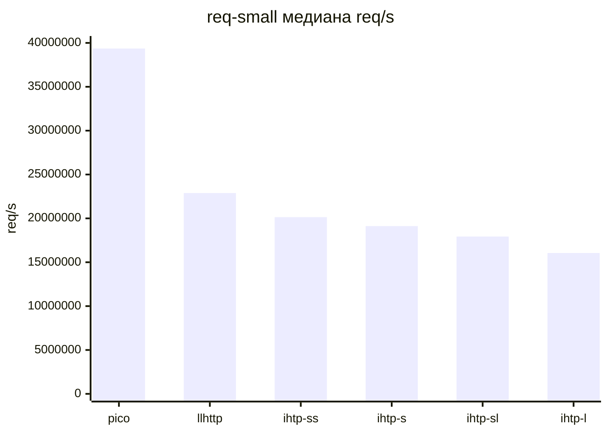
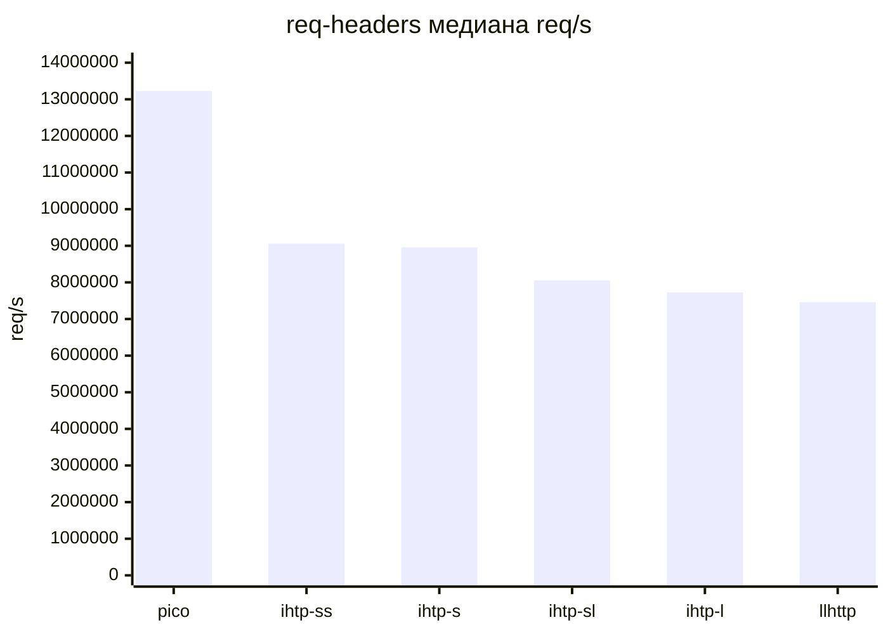
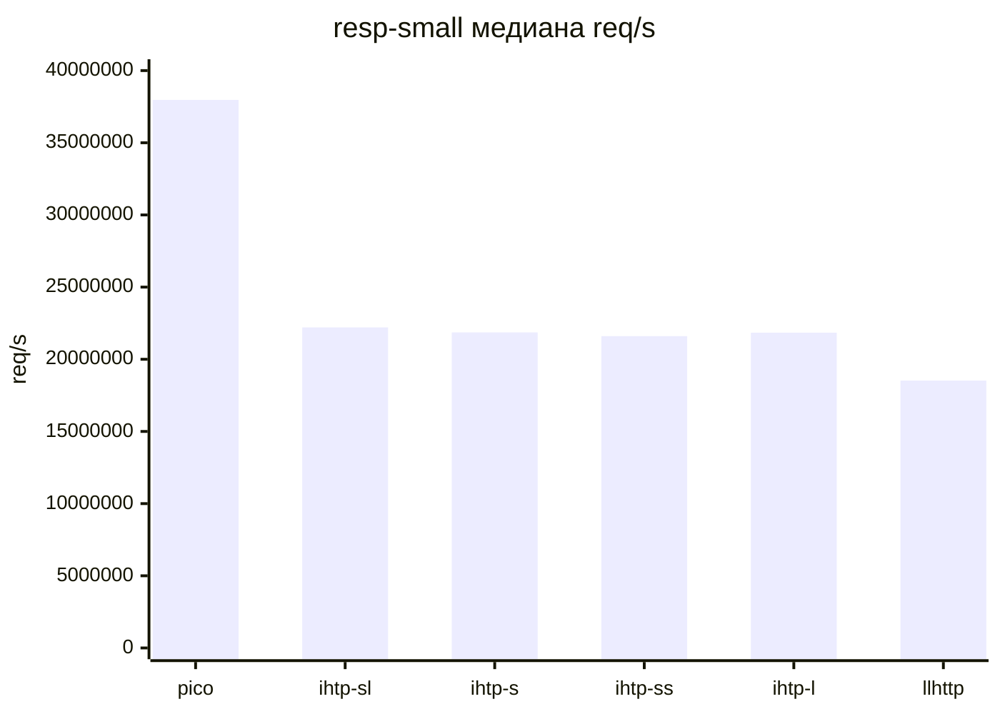
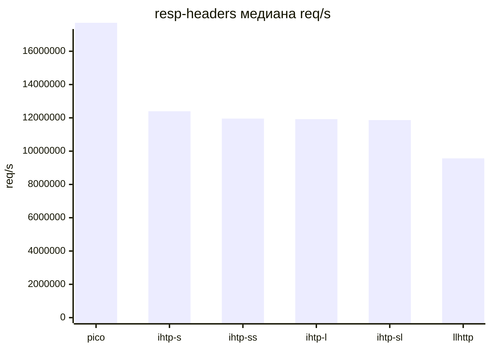
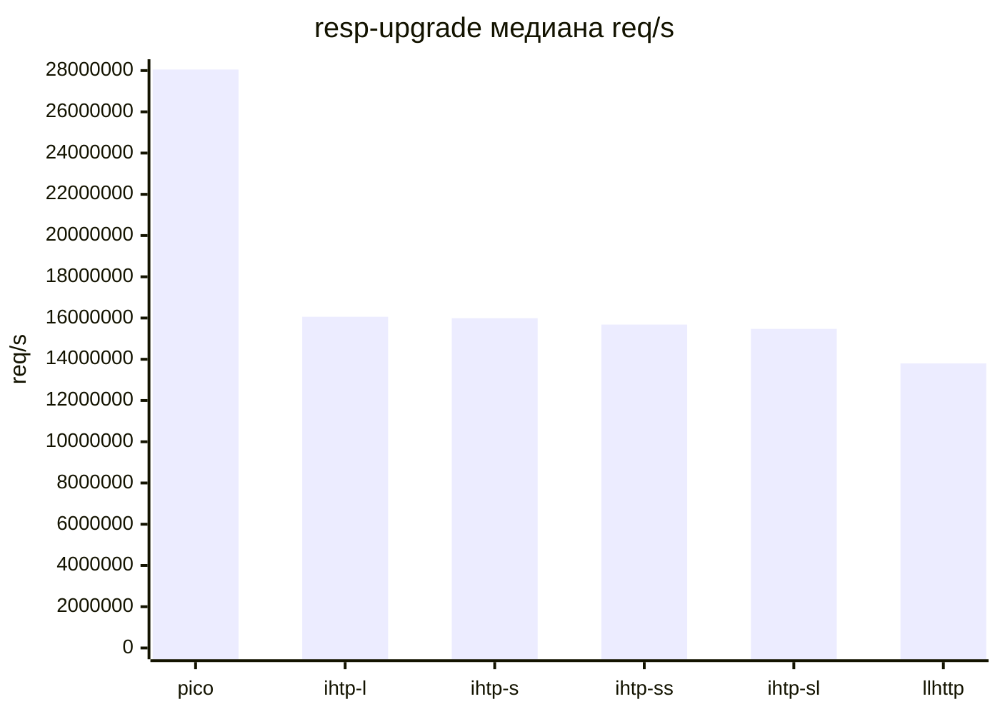
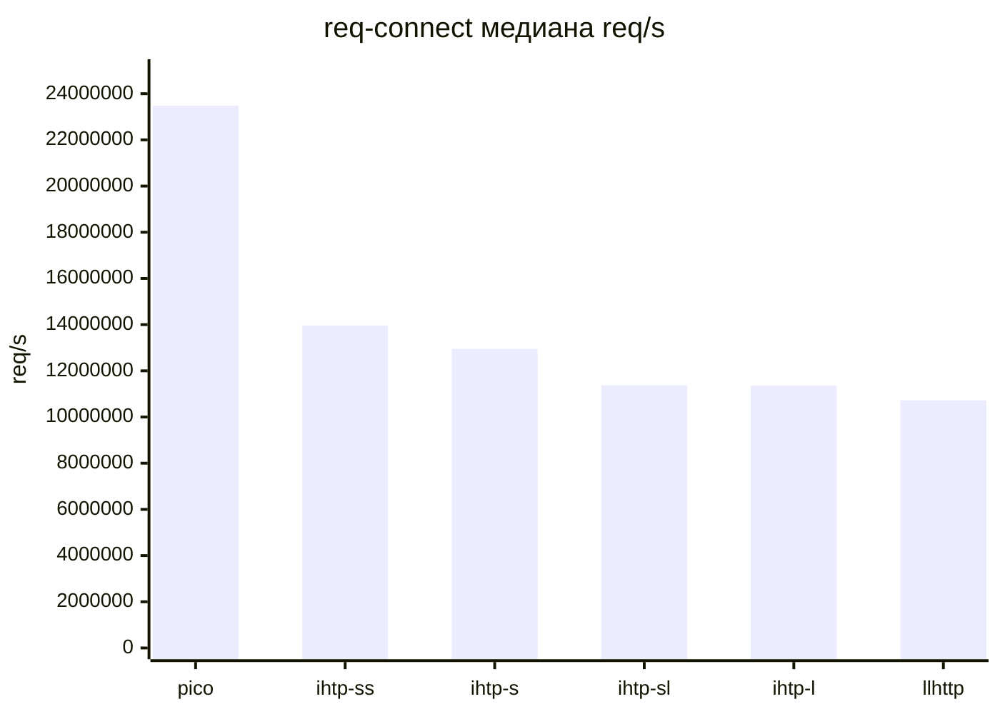

# Результаты Испытаний

## Связанные Документы

| Документ | Назначение |
|---|---|
| [02-comparison.md](./02-comparison.md) | сравниваемые возможности и область применения |
| [08-testing-methodology.md](./08-testing-methodology.md) | программа и методика испытаний |
| [10-extended-contract-methodology.md](./10-extended-contract-methodology.md) | методика для возможностей расширенного контракта |
| [11-extended-contract-results.md](./11-extended-contract-results.md) | состояние результатов по возможностям вне общей матрицы |
| [../plans/2026-03-11-sprint-11-comparison-report.md](../plans/2026-03-11-sprint-11-comparison-report.md) | подробные заметки по сравнению и профилированию |

## Область

Документ хранит публикуемые в репозитории результаты ПСИ по:
- функциональной проверке
- сравнению пропускной способности парсеров
- прикладным сценариям потребителей

Документ публикует общую сравнительную матрицу.

Возможности, которым нужен расширенный взгляд на контракт, описаны в:
- [10-extended-contract-methodology.md](./10-extended-contract-methodology.md)
- [11-extended-contract-results.md](./11-extended-contract-results.md)

## Набор Артефактов

Текущий каталог артефактов:

`tests/artifacts/pmi-psi/runs/20260312T002621Z-34c2e79/`

Точки входа на уровне репозитория:
- [`tests/artifacts/pmi-psi/README.md`](../../tests/artifacts/pmi-psi/README.md)
- [`tests/artifacts/pmi-psi/index.tsv`](../../tests/artifacts/pmi-psi/index.tsv)
- [`tests/artifacts/pmi-psi/latest.txt`](../../tests/artifacts/pmi-psi/latest.txt)
- [`tests/artifacts/pmi-psi/runs/20260312T002621Z-34c2e79/summary.md`](../../tests/artifacts/pmi-psi/runs/20260312T002621Z-34c2e79/summary.md)
- [`tests/artifacts/pmi-psi/runs/20260312T002621Z-34c2e79/throughput-median.tsv`](../../tests/artifacts/pmi-psi/runs/20260312T002621Z-34c2e79/throughput-median.tsv)
- [`tests/artifacts/pmi-psi/runs/20260312T002621Z-34c2e79/throughput-connect-median.tsv`](../../tests/artifacts/pmi-psi/runs/20260312T002621Z-34c2e79/throughput-connect-median.tsv)

## Сводка Выполнения

| Поле | Значение |
|---|---|
| идентификатор прогона | `20260312T002621Z-34c2e79` |
| ревизия git | `34c2e79` |
| функциональный preset | `clang-debug` |
| число итераций в стенде пропускной способности | `200000` |
| число прогонов для медианы | `5` |
| статус | `PASS` |

## Функциональные Результаты

Результат `ctest --preset clang-debug --output-on-failure`:

| Показатель | Значение |
|---|---|
| всего тестов | `12` |
| ошибок | `0` |
| доля успешных тестов | `100%` |
| общее время | `0.02 sec` |

Проверенный набор исполняемых файлов:
- `test_scanner`
- `test_scanner_backends`
- `test_scanner_corpus`
- `test_parser`
- `test_parser_state`
- `test_differential_corpus`
- `test_semantics_differential`
- `test_semantics`
- `test_semantics_corpus`
- `test_iohttp_integration`
- `test_body_decoder`
- `test_body_decoder_corpus`

## Профили Сравнения

| Профиль | Значение |
|---|---|
| `picohttpparser` | минимальный нулевой разбор без расширенного контракта |
| `llhttp` | эталонное сгенерированное ядро разбора |
| `iohttpparser-stateful-strict` | предпочтительный производительный путь для потребителей |
| `iohttpparser-strict` | строгая оболочка без отдельного состояния |
| `iohttpparser-stateful-lenient` | интерфейс состояния в режиме совместимости |
| `iohttpparser-lenient` | оболочка без состояния в режиме совместимости |

## Прикладные Сценарии

### Расшифровка Сценариев

| Сценарий | Назначение |
|---|---|
| `req-small` | короткий запрос с минимальным блоком заголовков |
| `req-headers` | запрос с более крупным и реалистичным набором заголовков |
| `resp-small` | короткий ответ без большого блока заголовков |
| `resp-headers` | ответ с более крупным блоком заголовков |
| `resp-upgrade` | передача ответа `101 Switching Protocols` потребителю |
| `req-connect` | запрос `CONNECT` в форме authority |

### req-small

Короткий запрос с минимальным блоком заголовков.

| Парсер | медиана req/s | медиана MiB/s | медиана ns/req |
|---|---:|---:|---:|
| `picohttpparser` | `39,358,038.90` | `1,840.54` | `25.41` |
| `llhttp` | `22,889,567.56` | `1,069.85` | `43.69` |
| `iohttpparser-stateful-strict` | `20,141,999.08` | `941.23` | `49.65` |
| `iohttpparser-strict` | `19,123,076.89` | `893.65` | `52.29` |
| `iohttpparser-stateful-lenient` | `17,933,819.54` | `838.64` | `55.76` |
| `iohttpparser-lenient` | `16,054,814.99` | `750.77` | `62.29` |

### req-headers

Запрос с более крупным и реалистичным набором заголовков.

| Парсер | медиана req/s | медиана MiB/s | медиана ns/req |
|---|---:|---:|---:|
| `picohttpparser` | `13,228,205.26` | `2,346.53` | `75.60` |
| `iohttpparser-stateful-strict` | `9,060,302.98` | `1,607.34` | `110.37` |
| `iohttpparser-strict` | `8,956,119.89` | `1,588.86` | `111.66` |
| `iohttpparser-stateful-lenient` | `8,055,212.03` | `1,429.02` | `124.14` |
| `iohttpparser-lenient` | `7,724,660.95` | `1,370.38` | `129.46` |
| `llhttp` | `7,460,704.47` | `1,323.45` | `134.04` |

### resp-small

Короткий ответ без большого блока заголовков.

| Парсер | медиана req/s | медиана MiB/s | медиана ns/req |
|---|---:|---:|---:|
| `picohttpparser` | `37,967,472.13` | `1,846.36` | `26.34` |
| `iohttpparser-stateful-lenient` | `22,206,618.37` | `1,080.07` | `45.03` |
| `iohttpparser-strict` | `21,862,006.79` | `1,063.35` | `45.74` |
| `iohttpparser-stateful-strict` | `21,599,111.84` | `1,050.57` | `46.30` |
| `iohttpparser-lenient` | `21,841,803.53` | `1,062.37` | `45.78` |
| `llhttp` | `18,525,103.51` | `900.10` | `53.98` |

### resp-headers

Ответ с более крупным блоком заголовков.

| Парсер | медиана req/s | медиана MiB/s | медиана ns/req |
|---|---:|---:|---:|
| `picohttpparser` | `17,709,099.53` | `1,959.11` | `56.47` |
| `iohttpparser-strict` | `12,397,916.33` | `1,371.91` | `80.66` |
| `iohttpparser-stateful-strict` | `11,956,838.92` | `1,323.10` | `83.63` |
| `iohttpparser-lenient` | `11,921,626.75` | `1,319.21` | `83.88` |
| `iohttpparser-stateful-lenient` | `11,864,417.24` | `1,312.88` | `84.29` |
| `llhttp` | `9,566,233.95` | `1,058.30` | `104.53` |

### resp-upgrade

Передача ответа `101 Switching Protocols` потребителю.

| Парсер | медиана req/s | медиана MiB/s | медиана ns/req |
|---|---:|---:|---:|
| `picohttpparser` | `28,050,353.19` | `2,059.34` | `35.65` |
| `iohttpparser-lenient` | `16,060,830.72` | `1,179.11` | `62.26` |
| `iohttpparser-strict` | `15,993,263.64` | `1,174.15` | `62.53` |
| `iohttpparser-stateful-strict` | `15,683,676.55` | `1,151.41` | `63.76` |
| `iohttpparser-stateful-lenient` | `15,472,213.10` | `1,135.88` | `64.63` |
| `llhttp` | `13,800,504.33` | `1,015.59` | `72.46` |

### req-connect

Запрос `CONNECT` в форме authority.

| Парсер | медиана req/s | медиана MiB/s | медиана ns/req |
|---|---:|---:|---:|
| `picohttpparser` | `23,477,372.10` | `2,216.63` | `42.59` |
| `iohttpparser-stateful-strict` | `13,961,958.41` | `1,318.19` | `71.62` |
| `iohttpparser-strict` | `12,950,026.37` | `1,222.64` | `77.22` |
| `iohttpparser-stateful-lenient` | `11,375,010.08` | `1,073.29` | `87.91` |
| `iohttpparser-lenient` | `11,370,703.00` | `1,072.88` | `87.94` |
| `llhttp` | `10,724,707.64` | `1,012.44` | `93.24` |

## Вспомогательные Сценарии Профилирования

Эти сценарии не являются прикладными историями потребителя. Они нужны для
локализации стоимости отдельных участков парсера.

| Сценарий | Назначение |
|---|---|
| `req-line-only` | стоимость разбора стартовой строки без большого блока заголовков |
| `req-line-hot` | типовой короткий путь запроса |
| `req-line-long-target` | стоимость проверки длинного пути запроса |
| `req-line-connect` | путь метода и формы authority для `CONNECT` |
| `req-line-options` | путь метода для `OPTIONS *` |
| `req-pico-bench` | длинный запрос из `picohttpparser/bench.c` |
| `hdr-common-heavy` | набор частых заголовков |
| `hdr-name-heavy` | стоимость классификации имён заголовков |
| `hdr-uncommon-valid` | редкие, но корректные имена заголовков |
| `hdr-value-ascii-clean` | путь значения с чистыми ASCII-байтами |
| `hdr-value-heavy` | длинный реалистичный путь значений |
| `hdr-value-obs-text` | путь значений с байтами `obs-text` |
| `hdr-value-trim-heavy` | путь обрезки внешних пробельных байтов |
| `hdr-count-04-minimal` | постоянная стоимость цикла для четырёх минимальных заголовков |
| `hdr-count-16-minimal` | постоянная стоимость цикла для шестнадцати минимальных заголовков |
| `hdr-count-32-minimal` | постоянная стоимость цикла для тридцати двух минимальных заголовков |

Полная числовая матрица опубликована в:
- [`throughput-median.tsv`](../../tests/artifacts/pmi-psi/runs/20260312T002621Z-34c2e79/throughput-median.tsv)
- [2026-03-11-sprint-11-comparison-report.md](../plans/2026-03-11-sprint-11-comparison-report.md)

## Интерпретация

- Функциональные ПСИ завершились без ошибок.
- Текущий прогон уже содержит слитые оптимизации горячего пути из PR `#25`.
- `picohttpparser` остаётся лидером по чистой пропускной способности во всех опубликованных сценариях.
- `iohttpparser-stateful-strict` теперь является правильной производительной базой для потребителей.
- `iohttpparser-stateful-strict` быстрее `llhttp` в сценариях:
  - `req-headers`
  - `resp-small`
  - `resp-headers`
  - `resp-upgrade`
  - `req-connect`
- `llhttp` остаётся быстрее на самом коротком пути запроса `req-small`.
- Оболочки без состояния остаются медленнее интерфейса состояния, потому что по контракту очищают выходную структуру перед каждым вызовом.
