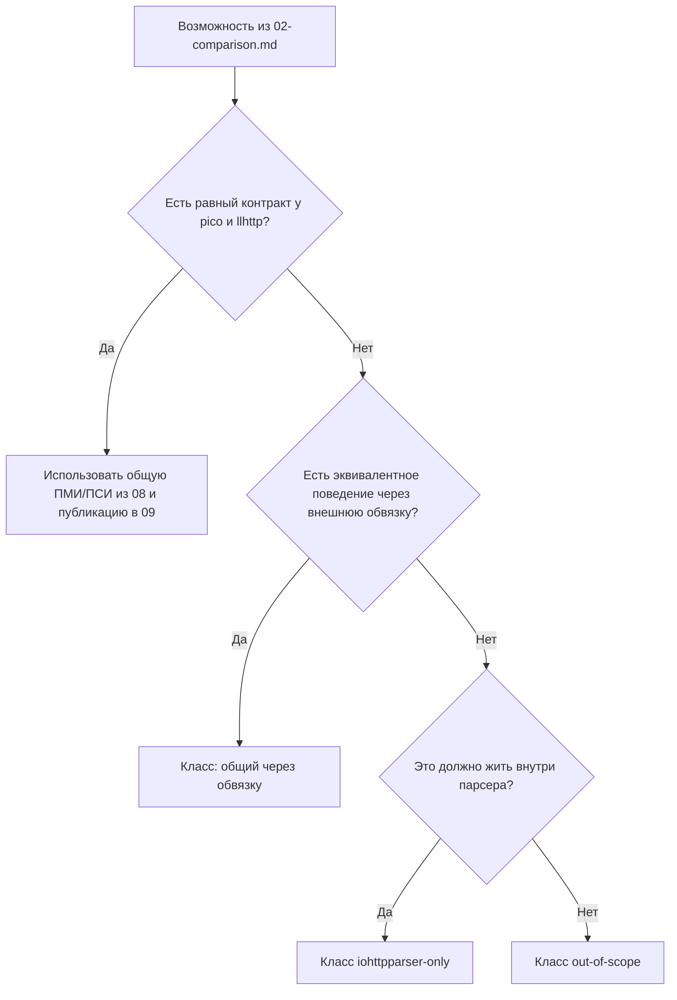

# Методика Испытаний Расширенного Контракта

## Связанные Документы

| Документ | Назначение |
|---|---|
| [02-comparison.md](./02-comparison.md) | перечень возможностей и цели сравнения |
| [08-testing-methodology.md](./08-testing-methodology.md) | общая ПМИ/ПСИ и сравнение общего слоя |
| [09-test-results.md](./09-test-results.md) | опубликованные результаты общей ПСИ |
| [11-extended-contract-results.md](./11-extended-contract-results.md) | опубликованные результаты по расширенному контракту |

## Область

Документ задаёт методику испытаний для возможностей, которые есть в
`iohttpparser`, но не сравниваются с `picohttpparser` и `llhttp` по полностью
равному контракту.

Документ охватывает:
- расширенные функциональные проверки;
- внутренние измерения производительности дополнительных слоёв контракта;
- правила честного прямого и косвенного сравнения;
- требования к публикуемым артефактам.

## Модель Классификации

| Класс | Смысл | Правило сравнения |
|---|---|---|
| прямой общий | прямое свойство ядра разбора с одинаковым внешним результатом | прямое сравнение всех трёх библиотек |
| общий через обвязку | возможность есть у всех, но хотя бы одной библиотеке нужна внешняя обвязка | сначала сравнение ядра разбора, затем отдельная оценка цены обвязки |
| только `iohttpparser` | возможность есть только у `iohttpparser` | измерение абсолютной стоимости и накладных расходов относительно ближайшего базиса ядра разбора |
| вне области | возможность не относится к библиотеке парсинга уровня байтов | не включать в сравнение производительности парсера |

## Группы Возможностей Из 02

### Общий Прямой Слой

- разбор начальной строки запроса
- разбор строки статуса

### Общий Слой Через Обвязку

- разбор блока заголовков отдельно
- публичное состояние парсера
- разбор без отдельного состояния
- представления без копирования
- семантика фрейминга
- отклонение неоднозначностей
- декодирование `chunked`
- учёт фиксированной длины
- признаки владения хвостовыми полями
- признаки передачи повышения протокола
- признак `Expect: 100-continue`

### Только В `iohttpparser`

- именованные строгие профили
- SIMD-слой сканера
- поддерживаемый корпус дифференциальных тестов
- интеграционные тесты для потребителей

### Вне Области Библиотеки

- нормализация `URI`
- маршрутизация
- разбор cookies
- политика аутентификации
- декодирование сжатия
- разбор кадров WebSocket
- прикладной протокол после повышения соединения

## Объекты Испытаний

| Объект | Источник функциональной проверки | Источник измерений |
|---|---|---|
| общий слой разбора | `tests/unit/test_differential_corpus.c` | `bench/bench_throughput_compare.c` |
| слой семантики | `tests/unit/test_semantics.c`, `tests/unit/test_semantics_corpus.c`, `tests/unit/test_semantics_differential.c` | ближайший сценарий ядра разбора и отдельный сценарий контракта после публикации |
| слой декодера тела | `tests/unit/test_body_decoder.c`, `tests/unit/test_body_decoder_corpus.c` | ближайший сценарий ядра разбора и сценарий передачи тела после публикации |
| слой контрактов потребителей | `tests/unit/test_iohttp_integration.c` | сценарий пропускной способности уровня потребителя после публикации |
| слой сканера | `tests/unit/test_scanner_backends.c`, `tests/unit/test_scanner_corpus.c` | `bench/bench_parser.c`, `scripts/check-scanner-bench.sh` |

## Функциональная Методика

Для каждой возможности из `02-comparison.md` применяется такой порядок:

1. проверить наличие через модульный, корпусный или интеграционный тест;
2. привязать возможность к публикуемому артефакту или стенду;
3. определить класс сравнения;
4. зафиксировать прямой результат, косвенный результат или явную неприменимость.

Функциональное подтверждение должно содержать:
- исходный файл;
- тип сценария;
- владельца контракта;
- ожидаемый результат или класс отклонения.

## Методика Измерения Производительности

### Общий Прямой Слой

Используется общая трёхсторонняя ПСИ из:
- `scripts/run-pmi-psi.sh`
- `scripts/run-throughput-median.sh`
- `tests/artifacts/pmi-psi/runs/<run_id>/throughput-median.tsv`

Ответ по производительности:
- прямой `req/s`;
- прямой `MiB/s`;
- прямой `ns/req`.

### Общий Слой Через Обвязку

Используются два измерения:

1. общий базис ядра разбора из общей матрицы ПСИ;
2. ближайший интеграционный или послойный сценарий для дополнительного контракта.

Ответ по производительности:
- базис ядра разбора;
- ближайший расширенный сценарий;
- относительная цена дополнительного контракта.

### Только В `iohttpparser`

Используется внутреннее измерение.

Цель сравнения:
- ближайший базис ядра разбора `iohttpparser`;
- цена `stateful` против `stateless`;
- цена `parser-only` против `parser+semantics`;
- цена `parser+semantics` против `parser+semantics+body`.

Ответ по производительности:
- абсолютный `req/s`;
- абсолютный `MiB/s`;
- абсолютный `ns/req`;
- относительная цена по отношению к ближайшему базису.

### Вне Области Библиотеки

Сравнение производительности парсера не выполняется.

## Обязательные Поля Для Каждой Возможности

| Поле | Требование |
|---|---|
| возможность | точное имя из `02-comparison.md` |
| класс | один из четырёх классов |
| функциональное подтверждение | тест или артефакт |
| подтверждение производительности | общая матрица, расширенная матрица, стенд сканера или `не применяется` |
| режим сравнения | прямой, косвенный, внутренний или вне области |
| интерпретация | одно фактическое предложение |

## Цели Для Расширенного Измерительного Контура

Следующие группы требуют отдельного внутреннего измерения даже при отсутствии
прямого внешнего аналога.

| Группа | Обязательная семья сценариев | Цель |
|---|---|---|
| публичное состояние парсера | `stateful-reuse-*` | измерить стоимость и пользу повторного использования состояния |
| применение семантики | `semantics-*` | измерить стоимость решений по фреймингу и владению |
| передача в декодер тела | `body-handoff-*` | измерить стоимость перехода к обработке тела |
| интеграция потребителя | `consumer-iohttp-*`, `consumer-ioguard-*` | измерить цену контракта в реальных потоках встраивания |
| именованные профили | выбор профиля в одном и том же пути разбора | подтвердить отсутствие лишней цены выбора профиля |

## Контракт Артефактов

Расширенные результаты должны публиковаться в репозитории с:

- описанием сценария;
- профилем парсера;
- медианой `req/s`;
- медианой `MiB/s`;
- медианой `ns/req`;
- указанием базиса сравнения;
- метаданными прогона.

Обязательные файлы для расширенного слоя:

- `throughput-extended.tsv`
- `throughput-extended-median.tsv`
- `summary-extended.md`
- `manifest.json`

Если у возможности ещё нет отдельного артефакта, в результате должно быть
прямо указано:
- `ещё не опубликовано`;
- ближайшее доступное подтверждение;
- причина отсутствия прямого сравнения.

## Правила Приёмки

Результат по расширенному контракту считается корректным только если:

- функциональный тест проходит;
- сценарий воспроизводится скриптом из репозитория;
- базис сравнения указан явно;
- пропускная способность ядра разбора не смешивается с внешним кодом приложения.

## Не Измеряется

Документ не охватывает:
- пропускную способность сокета;
- стоимость TLS;
- цену планировщика;
- поведение внешнего прокси;
- цену маршрутизации приложения.

Это относится к потребителям библиотеки, а не к самой библиотеке парсинга.
