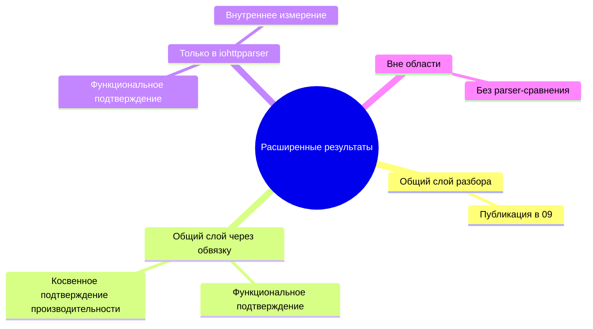

# Результаты По Расширенному Контракту

## Связанные Документы

| Документ | Назначение |
|---|---|
| [02-comparison.md](./02-comparison.md) | перечень возможностей |
| [08-testing-methodology.md](./08-testing-methodology.md) | общая ПМИ/ПСИ |
| [09-test-results.md](./09-test-results.md) | опубликованные результаты общей ПСИ |
| [10-extended-contract-methodology.md](./10-extended-contract-methodology.md) | методика для расширенного слоя |

## Область

Документ фиксирует состояние результатов для возможностей из
`02-comparison.md`, которые не представлены полностью в общей матрице ПСИ из
`09-test-results.md`.

Документ отвечает на вопросы:
- какая возможность уже подтверждена функционально;
- для какой возможности уже есть опубликованное подтверждение производительности;
- какая возможность пока подтверждается только косвенно;
- для какой возможности сравнение на уровне парсерной библиотеки не требуется.

## Классы Результатов

| Статус | Смысл |
|---|---|
| опубликовано напрямую | есть прямое функциональное и производительное подтверждение |
| опубликовано косвенно | есть функциональное подтверждение, а производительность выводится через ближайший базис |
| только функционально | есть функциональное подтверждение, но нет отдельного опубликованного измерения |
| не применяется | сравнение производительности не относится к уровню парсерной библиотеки |

## Матрица Результатов По Возможностям

| Возможность | Класс | Функциональное подтверждение | Подтверждение производительности | Статус | Интерпретация |
|---|---|---|---|---|---|
| разбор начальной строки запроса | прямой общий | `test_parser.c`, `test_differential_corpus.c` | сценарии `req-small`, `req-line-*`, `req-pico-bench` из `09` | опубликовано напрямую | есть прямое трёхстороннее сравнение |
| разбор строки статуса | прямой общий | `test_parser.c`, `test_differential_corpus.c` | сценарии `resp-small`, `resp-headers`, `resp-upgrade` из `09` | опубликовано напрямую | есть прямое трёхстороннее сравнение |
| разбор блока заголовков отдельно | общий через обвязку | `test_parser.c`, `test_differential_corpus.c` | сценарии `req-headers`, `resp-headers`, `hdr-*` из `09` | опубликовано косвенно | прямое подтверждение ядра разбора есть, но цена внешней обвязки по конкурентам не отделена |
| публичное состояние парсера | общий через обвязку | `test_parser_state.c` | сравнение `iohttpparser-stateful-*` и `iohttpparser-*` в `09` | опубликовано косвенно | цена состояния видна только внутри профилей `iohttpparser` |
| разбор без отдельного состояния | общий через обвязку | `test_parser.c` | сравнение `iohttpparser-*` и `iohttpparser-stateful-*` в `09` | опубликовано косвенно | цена оболочки измеряется только для `iohttpparser` |
| представления без копирования | общий через обвязку | `test_parser.c`, `test_iohttp_integration.c` | ближайшие сценарии ядра разбора из `09` | опубликовано косвенно | владение данными входит в общий путь разбора, но не выделено в отдельный стенд |
| семантика фрейминга | общий через обвязку | `test_semantics.c`, `test_semantics_corpus.c`, `test_semantics_differential.c` | ближайшие сценарии ядра разбора из `09`; отдельной опубликованной матрицы для семантики пока нет | только функционально | поведение подтверждено, отдельная публикация цены ещё не выполнена |
| отклонение неоднозначностей | общий через обвязку | `test_semantics.c`, `test_semantics_differential.c`, `test_iohttp_integration.c` | строгие сценарии ядра разбора из `09` | опубликовано косвенно | цена строгого режима видна, но логика отклонения не выделена в отдельную матрицу |
| декодирование `chunked` | общий через обвязку | `test_body_decoder.c`, `test_body_decoder_corpus.c` | отдельного опубликованного стенда для тела пока нет | только функционально | функциональное покрытие полное, публикации отдельной пропускной способности пока нет |
| учёт фиксированной длины | общий через обвязку | `test_body_decoder.c`, `test_iohttp_integration.c` | отдельного опубликованного стенда для тела пока нет | только функционально | стоимость учёта подтверждена только косвенно |
| признаки владения хвостовыми полями | общий через обвязку | `test_semantics.c`, `test_body_decoder.c`, `test_iohttp_integration.c` | отдельного опубликованного стенда для хвостовых полей пока нет | только функционально | контракт подтверждён, цена не выделена |
| признаки передачи повышения протокола | общий через обвязку | `test_semantics.c`, `test_iohttp_integration.c` | сценарий `resp-upgrade` из `09` | опубликовано косвенно | цена реалистичной передачи повышения протокола уже видна |
| признак `Expect: 100-continue` | общий через обвязку | `test_semantics.c`, `test_iohttp_integration.c` | отдельного опубликованного стенда для `expect` пока нет | только функционально | поведение подтверждено, отдельного измерения пока нет |
| именованные строгие профили | только `iohttpparser` | `test_semantics.c`, публичные заголовки | строгие и совместимые профили в `09`; отдельного стенда для выбора профиля пока нет | опубликовано косвенно | выбор профиля виден через профили, но не выделен как отдельная нулевая цена |
| SIMD-слой сканера | только `iohttpparser` | `test_scanner_backends.c`, `test_scanner_corpus.c` | `bench/bench_parser.c`, `scripts/check-scanner-bench.sh`, заметки профилирования | опубликовано косвенно | подтверждение производительности есть в стендах репозитория, но не внутри пакета ПСИ |
| поддерживаемый корпус дифференциальных тестов | только `iohttpparser` | `test_differential_corpus.c`, `test_semantics_differential.c` | не относится к пропускной способности | не применяется | это средство проверки корректности, а не функция времени выполнения |
| интеграционные тесты для потребителей | только `iohttpparser` | `test_iohttp_integration.c` | ближайшие сценарии ядра разбора из `09`; отдельного опубликованного consumer-throughput пока нет | только функционально | контракт подтверждён, прямой публикации пропускной способности потребителя пока нет |
| нормализация `URI` | вне области | исключено проектным контрактом | не применяется | не применяется | задача относится не к ядру разбора |
| маршрутизация | вне области | исключено проектным контрактом | не применяется | не применяется | задача относится к прикладному уровню |
| разбор cookies | вне области | исключено проектным контрактом | не применяется | не применяется | задача относится к верхнему уровню протокола |
| политика аутентификации | вне области | исключено проектным контрактом | не применяется | не применяется | задача относится к потребителю |
| декодирование сжатия | вне области | исключено проектным контрактом | не применяется | не применяется | задача возникает после передачи тела |
| разбор кадров WebSocket | вне области | исключено проектным контрактом | не применяется | не применяется | задача возникает после повышения протокола |
| прикладной протокол после повышения соединения | вне области | исключено проектным контрактом | не применяется | не применяется | задача относится к обработчику нового протокола |

## Интерпретация Производительности Расширенного Слоя

### Что уже измеряется

- пропускная способность ядра разбора для прямого сравнения;
- цена `stateful` и `stateless` путей внутри `iohttpparser`;
- сценарии запроса, ответа, повышения протокола и `CONNECT`;
- производительность сканера через отдельный стенд сканера.

### Что ещё не опубликовано отдельной матрицей

- пропускная способность `parser + semantics`;
- пропускная способность `parser + body-decoder`;
- цена хвостовых полей;
- цена `Expect: 100-continue`;
- сквозная пропускная способность потоков `iohttp` и `ioguard`.

## Текущее Заключение

Репозиторий уже подтверждает следующие факты:

- общий слой разбора измеряется напрямую в `09`;
- расширенный контракт `iohttpparser` покрыт функционально;
- часть цены расширенного контракта видна косвенно через профили `stateful/stateless` и `strict/lenient`;
- основной недостающий элемент — не отсутствие проверки, а отсутствие отдельной опубликованной матрицы для расширенной пропускной способности.

## Следующие Цели Публикации

Следующий пакет артефактов для этого документа должен добавить:

- `throughput-extended.tsv`
- `throughput-extended-median.tsv`
- `summary-extended.md`

Эти файлы должны покрывать:
- повторное использование состояния парсера;
- применение семантики;
- передачу в декодер тела;
- поток потребителя `iohttp`;
- поток потребителя `ioguard`.
