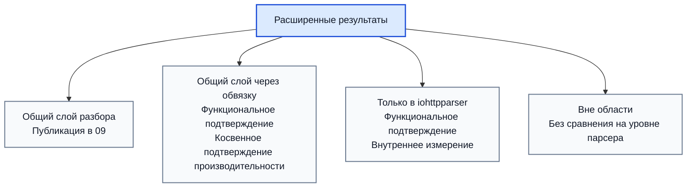

# Результаты По Расширенному Контракту

## Связанные Документы

| Документ | Назначение |
|---|---|
| [02-comparison.md](./02-comparison.md) | перечень возможностей |
| [08-testing-methodology.md](./08-testing-methodology.md) | общая ПМИ/ПСИ |
| [09-test-results.md](./09-test-results.md) | опубликованные результаты общей ПСИ |
| [10-extended-contract-methodology.md](./10-extended-contract-methodology.md) | методика для расширенного слоя |

## Область

Документ фиксирует состояние результатов для возможностей из
`02-comparison.md`, которые не представлены полностью в общей матрице ПСИ из
`09-test-results.md`.

Документ отвечает на вопросы:
- какая возможность уже подтверждена функционально;
- для какой возможности уже есть опубликованное подтверждение производительности;
- какая возможность пока подтверждается только косвенно;
- для какой возможности сравнение на уровне парсерной библиотеки не требуется.

Опубликованный расширенный прогон, на который ссылается документ:

- `tests/artifacts/pmi-psi/runs/20260312T014756Z-4998946/summary-extended.md`
- `tests/artifacts/pmi-psi/runs/20260312T014756Z-4998946/throughput-extended-median.tsv`

## Классы Результатов

| Статус | Смысл |
|---|---|
| опубликовано напрямую | есть прямое функциональное и производительное подтверждение |
| опубликовано косвенно | есть функциональное подтверждение, а производительность выводится через ближайший базис |
| только функционально | есть функциональное подтверждение, но нет отдельного опубликованного измерения |
| не применяется | сравнение производительности не относится к уровню парсерной библиотеки |

## Матрица Результатов По Возможностям

| Возможность | Класс | Функциональное подтверждение | Подтверждение производительности | Статус | Интерпретация |
|---|---|---|---|---|---|
| разбор начальной строки запроса | прямой общий | `test_parser.c`, `test_differential_corpus.c` | сценарии `req-small`, `req-line-*`, `req-pico-bench` из `09` | опубликовано напрямую | есть прямое трёхстороннее сравнение |
| разбор строки статуса | прямой общий | `test_parser.c`, `test_differential_corpus.c` | сценарии `resp-small`, `resp-headers`, `resp-upgrade` из `09` | опубликовано напрямую | есть прямое трёхстороннее сравнение |
| разбор блока заголовков отдельно | общий через обвязку | `test_parser.c`, `test_differential_corpus.c` | сценарии `req-headers`, `resp-headers`, `hdr-*` из `09` | опубликовано косвенно | прямое подтверждение ядра разбора есть, но цена внешней обвязки по конкурентам не отделена |
| публичное состояние парсера | общий через обвязку | `test_parser_state.c` | `stateful-reuse-request` в `throughput-extended-median.tsv` | опубликовано напрямую | опубликован отдельный сценарий цены повторного использования состояния |
| разбор без отдельного состояния | общий через обвязку | `test_parser.c` | сравнение `iohttpparser-*` и `iohttpparser-stateful-*` в `09` | опубликовано косвенно | цена оболочки измеряется только для `iohttpparser` |
| представления без копирования | общий через обвязку | `test_parser.c`, `test_iohttp_integration.c` | ближайшие сценарии ядра разбора из `09` | опубликовано косвенно | владение данными входит в общий путь разбора, но не выделено в отдельный стенд |
| семантика фрейминга | общий через обвязку | `test_semantics.c`, `test_semantics_corpus.c`, `test_semantics_differential.c` | `request-chunked-parse-semantics`, `response-upgrade-parse-semantics`, `consumer-ioguard-reject-te-cl` в `throughput-extended-median.tsv` | опубликовано напрямую | опубликованы отдельные сценарии стадии семантики |
| отклонение неоднозначностей | общий через обвязку | `test_semantics.c`, `test_semantics_differential.c`, `test_iohttp_integration.c` | `consumer-ioguard-reject-te-cl` в `throughput-extended-median.tsv` | опубликовано напрямую | путь отклонения измеряется напрямую |
| декодирование `chunked` | общий через обвязку | `test_body_decoder.c`, `test_body_decoder_corpus.c` | `request-chunked-parse-semantics-body` в `throughput-extended-median.tsv` | опубликовано напрямую | цена передачи и декодирования `chunked` опубликована |
| учёт фиксированной длины | общий через обвязку | `test_body_decoder.c`, `test_iohttp_integration.c` | `response-fixed-parse-semantics-body` и `consumer-iohttp-fixed-response` в `throughput-extended-median.tsv` | опубликовано напрямую | цена учёта фиксированной длины и передачи тела измеряется напрямую |
| признаки владения хвостовыми полями | общий через обвязку | `test_semantics.c`, `test_body_decoder.c`, `test_iohttp_integration.c` | `consumer-iohttp-expect-trailers` в `throughput-extended-median.tsv` | опубликовано напрямую | цена передачи хвостовых полей опубликована |
| признаки передачи повышения протокола | общий через обвязку | `test_semantics.c`, `test_iohttp_integration.c` | `response-upgrade-parse-semantics` в `throughput-extended-median.tsv` | опубликовано напрямую | цена передачи повышения протокола измеряется напрямую |
| признак `Expect: 100-continue` | общий через обвязку | `test_semantics.c`, `test_iohttp_integration.c` | `consumer-iohttp-expect-trailers` в `throughput-extended-median.tsv` | опубликовано напрямую | поток `Expect` измеряется напрямую |
| именованные строгие профили | только `iohttpparser` | `test_semantics.c`, публичные заголовки | строгие и совместимые профили в `09`; отдельного стенда для выбора профиля пока нет | опубликовано косвенно | выбор профиля виден через профили, но не выделен как отдельная нулевая цена |
| SIMD-слой сканера | только `iohttpparser` | `test_scanner_backends.c`, `test_scanner_corpus.c` | `bench/bench_parser.c`, `scripts/check-scanner-bench.sh`, заметки профилирования | опубликовано косвенно | подтверждение производительности есть в стендах репозитория, но не внутри пакета ПСИ |
| поддерживаемый корпус дифференциальных тестов | только `iohttpparser` | `test_differential_corpus.c`, `test_semantics_differential.c` | не относится к пропускной способности | не применяется | это средство проверки корректности, а не функция времени выполнения |
| интеграционные тесты для потребителей | только `iohttpparser` | `test_iohttp_integration.c` | `consumer-iohttp-*` и `consumer-ioguard-*` в `throughput-extended-median.tsv` | опубликовано напрямую | опубликована прямая пропускная способность потоков потребителей |
| нормализация `URI` | вне области | исключено проектным контрактом | не применяется | не применяется | задача относится не к ядру разбора |
| маршрутизация | вне области | исключено проектным контрактом | не применяется | не применяется | задача относится к прикладному уровню |
| разбор cookies | вне области | исключено проектным контрактом | не применяется | не применяется | задача относится к верхнему уровню протокола |
| политика аутентификации | вне области | исключено проектным контрактом | не применяется | не применяется | задача относится к потребителю |
| декодирование сжатия | вне области | исключено проектным контрактом | не применяется | не применяется | задача возникает после передачи тела |
| разбор кадров WebSocket | вне области | исключено проектным контрактом | не применяется | не применяется | задача возникает после повышения протокола |
| прикладной протокол после повышения соединения | вне области | исключено проектным контрактом | не применяется | не применяется | задача относится к обработчику нового протокола |

## Опубликованные Результаты По Расширенным Сценариям

Ниже приведены опубликованные измерения для возможностей, которые не входят в
общую трёхстороннюю матрицу `09`.

Опубликованный прогон:

- `tests/artifacts/pmi-psi/runs/20260312T014756Z-4998946/summary-extended.md`
- `tests/artifacts/pmi-psi/runs/20260312T014756Z-4998946/throughput-extended-median.tsv`

### Повторное Использование Состояния

| Сценарий | Возможность | Базис | медиана req/s | медиана MiB/s | медиана ns/op |
|---|---|---|---:|---:|---:|
| `stateful-reuse-request` | публичное состояние парсера | `req-small/iohttpparser-stateful-strict` | `7,981,577.56` | `1,019.98` | `125.29` |

### Семантика И Передача Тела

| Сценарий | Возможность | Базис | медиана req/s | медиана MiB/s | медиана ns/op |
|---|---|---|---:|---:|---:|
| `request-chunked-parse` | разбор запроса с чанковым фреймингом | `req-headers/iohttpparser-stateful-strict` | `7,852,263.74` | `666.48` | `127.35` |
| `request-chunked-parse-semantics` | применение семантики фрейминга | `request-chunked-parse` | `8,154,989.49` | `692.17` | `122.62` |
| `request-chunked-parse-semantics-body` | декодирование чанкового тела | `request-chunked-parse-semantics` | `4,075,425.45` | `380.89` | `245.37` |
| `response-fixed-parse-semantics-body` | учёт фиксированной длины тела | `resp-headers/iohttpparser-stateful-strict` | `16,895,333.75` | `692.84` | `59.19` |

### Потоки Потребителя В Стиле iohttp

| Сценарий | Возможность | Базис | медиана req/s | медиана MiB/s | медиана ns/op |
|---|---|---|---:|---:|---:|
| `consumer-iohttp-expect-trailers` | `Expect: 100-continue` и владение завершающими полями | `request-chunked-parse-semantics-body` | `3,913,056.27` | `966.53` | `255.55` |
| `consumer-iohttp-fixed-response` | передача ответа с фиксированной длиной тела | `response-fixed-parse-semantics-body` | `8,018,723.08` | `1,032.38` | `124.71` |
| `consumer-iohttp-pipeline` | конвейерный поток потребителя с парсером, сохраняющим состояние | `request-chunked-parse-semantics-body` | `3,418,498.73` | `704.19` | `292.53` |

### Повышение Протокола И Потоки В Стиле ioguard

| Сценарий | Возможность | Базис | медиана req/s | медиана MiB/s | медиана ns/op |
|---|---|---|---:|---:|---:|
| `response-upgrade-parse` | передача ответа с повышением протокола | `resp-upgrade/iohttpparser-stateful-strict` | `10,138,496.42` | `744.50` | `98.63` |
| `response-upgrade-parse-semantics` | флаги владения при повышении протокола | `response-upgrade-parse` | `10,942,576.59` | `803.55` | `91.39` |
| `consumer-ioguard-connect` | строгая передача `CONNECT` | `req-connect/iohttpparser-stateful-strict` | `17,046,011.45` | `1,056.66` | `58.66` |
| `consumer-ioguard-reject-te-cl` | строгий отказ на неоднозначном фрейминге | `request-chunked-parse-semantics` | `7,838,169.09` | `680.23` | `127.58` |

## Интерпретация Производительности Расширенного Слоя

### Что уже измеряется

- пропускная способность ядра разбора для прямого сравнения;
- цена `stateful` и `stateless` путей внутри `iohttpparser`;
- сценарии запроса, ответа, повышения протокола и `CONNECT`;
- производительность сканера через отдельный стенд сканера.

### Что ещё не опубликовано отдельной матрицей

- доказательство нулевой цены именованных профилей;
- цена владения представлениями без копирования, выделенная из ядра разбора;
- результаты сканера внутри пакета ПСИ.

## Текущее Заключение

Репозиторий уже подтверждает следующие факты:

- общий слой разбора измеряется напрямую в `09`;
- расширенный контракт `iohttpparser` покрыт функционально;
- часть цены расширенного контракта видна косвенно через профили `stateful/stateless` и `strict/lenient`;
- основной недостающий элемент — не отсутствие проверки, а отсутствие отдельной публикации для профилей, изолированной цены представлений без копирования и результатов сканера внутри пакета ПСИ.

## Оставшиеся Цели Публикации

Следующий пакет артефактов для этого документа должен добавить только
оставшиеся специализированные подтверждения:

- доказательство нулевой накладной стоимости именованных профилей;
- изолированную стоимость владения диапазонами без копирования;
- результаты по вариантам сканера внутри пакета ПМИ/ПСИ.
