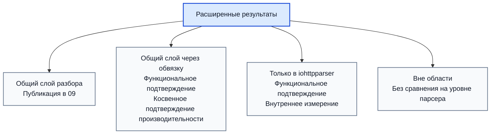
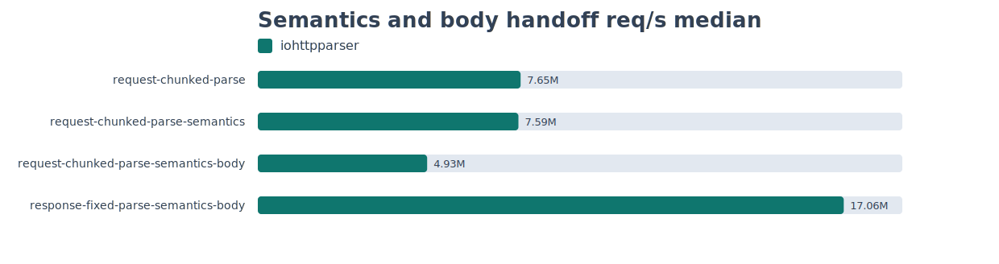
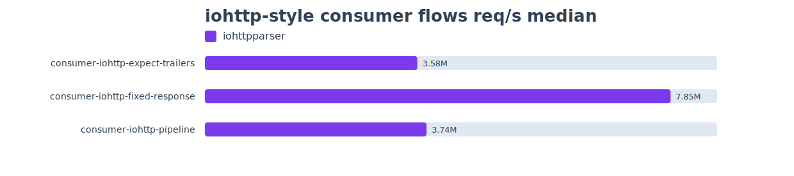
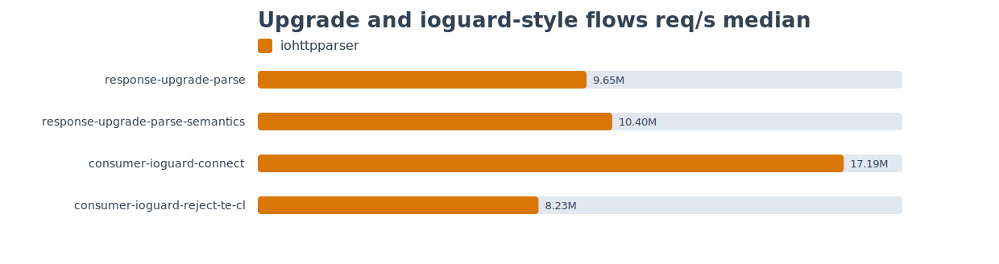
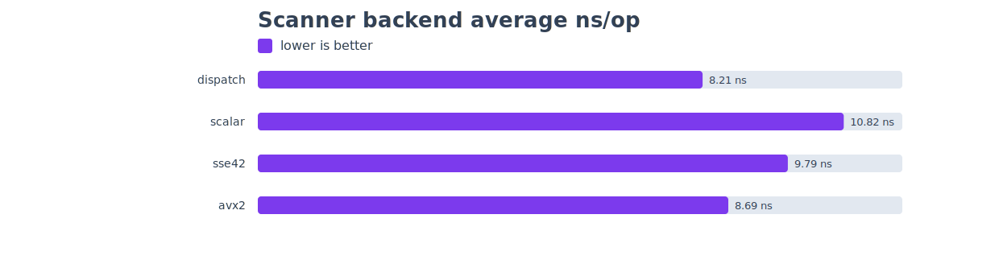

# Результаты По Расширенному Контракту

## Связанные Документы

| Документ | Назначение |
|---|---|
| [02-comparison.md](./02-comparison.md) | перечень возможностей |
| [08-testing-methodology.md](./08-testing-methodology.md) | общая ПМИ/ПСИ |
| [09-test-results.md](./09-test-results.md) | опубликованные результаты общей ПСИ |
| [10-extended-contract-methodology.md](./10-extended-contract-methodology.md) | методика для расширенного слоя |

## Область

Документ фиксирует состояние результатов для возможностей из
`02-comparison.md`, которые не представлены полностью в общей матрице ПСИ из
`09-test-results.md`.

Документ отвечает на вопросы:
- какая возможность уже подтверждена функционально;
- для какой возможности уже есть опубликованное подтверждение производительности;
- какая возможность пока подтверждается только косвенно;
- для какой возможности сравнение на уровне парсерной библиотеки не требуется.

Опубликованный расширенный прогон, на который ссылается документ:

- `tests/artifacts/pmi-psi/runs/20260313T210231Z-3b9c398/summary-extended.md`
- `tests/artifacts/pmi-psi/runs/20260313T210231Z-3b9c398/throughput-extended-median.tsv`
- `tests/artifacts/pmi-psi/runs/20260313T210231Z-3b9c398/scanner-bench.tsv`

## Классы Результатов

| Статус | Смысл |
|---|---|
| опубликовано напрямую | есть прямое функциональное и производительное подтверждение |
| опубликовано косвенно | есть функциональное подтверждение, а производительность выводится через ближайший базис |
| только функционально | есть функциональное подтверждение, но нет отдельного опубликованного измерения |
| не применяется | сравнение производительности не относится к уровню парсерной библиотеки |

## Матрица Результатов По Возможностям

| Возможность | Класс | Функциональное подтверждение | Подтверждение производительности | Статус | Интерпретация |
|---|---|---|---|---|---|
| разбор начальной строки запроса | прямой общий | `test_parser.c`, `test_differential_corpus.c` | сценарии `req-small`, `req-line-*`, `req-pico-bench` из `09` | опубликовано напрямую | есть прямое трёхстороннее сравнение |
| разбор строки статуса | прямой общий | `test_parser.c`, `test_differential_corpus.c` | сценарии `resp-small`, `resp-headers`, `resp-upgrade` из `09` | опубликовано напрямую | есть прямое трёхстороннее сравнение |
| разбор блока заголовков отдельно | общий через обвязку | `test_parser.c`, `test_differential_corpus.c` | сценарии `req-headers`, `resp-headers`, `hdr-*` из `09` | опубликовано косвенно | прямое подтверждение ядра разбора есть, но цена внешней обвязки по конкурентам не отделена |
| публичное состояние парсера | общий через обвязку | `test_parser_state.c` | `stateful-reuse-request` в `throughput-extended-median.tsv` | опубликовано напрямую | опубликован отдельный сценарий цены повторного использования состояния |
| разбор без отдельного состояния | общий через обвязку | `test_parser.c` | сравнение `iohttpparser-*` и `iohttpparser-stateful-*` в `09` | опубликовано косвенно | цена оболочки измеряется только для `iohttpparser` |
| представления без копирования | общий через обвязку | `test_parser.c`, `test_iohttp_integration.c` | `zero-copy-request-parse` и `zero-copy-request-observe` в `throughput-extended-median.tsv` | опубликовано напрямую | цена разбора и цена наблюдения диапазонов опубликованы отдельно |
| семантика фрейминга | общий через обвязку | `test_semantics.c`, `test_semantics_corpus.c`, `test_semantics_differential.c` | `request-chunked-parse-semantics`, `response-upgrade-parse-semantics`, `consumer-ioguard-reject-te-cl` в `throughput-extended-median.tsv` | опубликовано напрямую | опубликованы отдельные сценарии стадии семантики |
| отклонение неоднозначностей | общий через обвязку | `test_semantics.c`, `test_semantics_differential.c`, `test_iohttp_integration.c` | `consumer-ioguard-reject-te-cl` в `throughput-extended-median.tsv` | опубликовано напрямую | путь отклонения измеряется напрямую |
| декодирование `chunked` | общий через обвязку | `test_body_decoder.c`, `test_body_decoder_corpus.c` | `request-chunked-parse-semantics-body` в `throughput-extended-median.tsv` | опубликовано напрямую | цена передачи и декодирования `chunked` опубликована |
| учёт фиксированной длины | общий через обвязку | `test_body_decoder.c`, `test_iohttp_integration.c` | `response-fixed-parse-semantics-body` и `consumer-iohttp-fixed-response` в `throughput-extended-median.tsv` | опубликовано напрямую | цена учёта фиксированной длины и передачи тела измеряется напрямую |
| признаки владения хвостовыми полями | общий через обвязку | `test_semantics.c`, `test_body_decoder.c`, `test_iohttp_integration.c` | `consumer-iohttp-expect-trailers` в `throughput-extended-median.tsv` | опубликовано напрямую | цена передачи хвостовых полей опубликована |
| признаки передачи повышения протокола | общий через обвязку | `test_semantics.c`, `test_iohttp_integration.c` | `response-upgrade-parse-semantics` в `throughput-extended-median.tsv` | опубликовано напрямую | цена передачи повышения протокола измеряется напрямую |
| признак `Expect: 100-continue` | общий через обвязку | `test_semantics.c`, `test_iohttp_integration.c` | `consumer-iohttp-expect-trailers` в `throughput-extended-median.tsv` | опубликовано напрямую | поток `Expect` измеряется напрямую |
| именованные строгие профили | только `iohttpparser` | `test_semantics.c`, публичные заголовки | `policy-strict-request-semantics`, `policy-iohttp-request-semantics`, `policy-ioguard-request-semantics` в `throughput-extended-median.tsv` | опубликовано напрямую | отдельные строки подтверждают отсутствие скрытого медленного пути выбора профиля |
| SIMD-слой сканера | только `iohttpparser` | `test_scanner_backends.c`, `test_scanner_corpus.c` | `scanner-bench.tsv` и `charts/scanner-backends.svg` внутри пакета ПМИ/ПСИ | опубликовано напрямую | подтверждение работы вариантов сканера теперь входит в опубликованный набор артефактов |
| поддерживаемый корпус дифференциальных тестов | только `iohttpparser` | `test_differential_corpus.c`, `test_semantics_differential.c` | не относится к пропускной способности | не применяется | это средство проверки корректности, а не функция времени выполнения |
| интеграционные тесты для потребителей | только `iohttpparser` | `test_iohttp_integration.c` | `consumer-iohttp-*` и `consumer-ioguard-*` в `throughput-extended-median.tsv` | опубликовано напрямую | опубликована прямая пропускная способность потоков потребителей |
| нормализация `URI` | вне области | исключено проектным контрактом | не применяется | не применяется | задача относится не к ядру разбора |
| маршрутизация | вне области | исключено проектным контрактом | не применяется | не применяется | задача относится к прикладному уровню |
| разбор cookies | вне области | исключено проектным контрактом | не применяется | не применяется | задача относится к верхнему уровню протокола |
| политика аутентификации | вне области | исключено проектным контрактом | не применяется | не применяется | задача относится к потребителю |
| декодирование сжатия | вне области | исключено проектным контрактом | не применяется | не применяется | задача возникает после передачи тела |
| разбор кадров WebSocket | вне области | исключено проектным контрактом | не применяется | не применяется | задача возникает после повышения протокола |
| прикладной протокол после повышения соединения | вне области | исключено проектным контрактом | не применяется | не применяется | задача относится к обработчику нового протокола |

## Опубликованные Результаты По Расширенным Сценариям

Ниже приведены опубликованные измерения для возможностей, которые не входят в
общую трёхстороннюю матрицу `09`.

Опубликованный прогон:

- `tests/artifacts/pmi-psi/runs/20260313T210231Z-3b9c398/summary-extended.md`
- `tests/artifacts/pmi-psi/runs/20260313T210231Z-3b9c398/throughput-extended-median.tsv`
- `tests/artifacts/pmi-psi/runs/20260313T210231Z-3b9c398/scanner-bench.tsv`

### Повторное Использование Состояния

| Сценарий | Возможность | Базис | медиана req/s | медиана MiB/s | медиана ns/op |
|---|---|---|---:|---:|---:|
| `stateful-reuse-request` | публичное состояние парсера | `req-small/iohttpparser-stateful-strict` | `7,173,783.07` | `916.75` | `139.40` |

### Именованные Строгие Профили

| Сценарий | Возможность | Базис | медиана req/s | медиана MiB/s | медиана ns/op |
|---|---|---|---:|---:|---:|
| `policy-strict-request-semantics` | базовый строгий профиль | `req-headers/iohttpparser-stateful-strict` | `8,211,956.51` | `806.65` | `121.77` |
| `policy-iohttp-request-semantics` | именованный профиль `IHTP_POLICY_IOHTTP` | `policy-strict-request-semantics` | `8,744,997.15` | `859.01` | `114.35` |
| `policy-ioguard-request-semantics` | именованный профиль `IHTP_POLICY_IOGUARD` | `policy-strict-request-semantics` | `8,796,864.30` | `864.10` | `113.68` |

### Семантика И Передача Тела

| Сценарий | Возможность | Базис | медиана req/s | медиана MiB/s | медиана ns/op |
|---|---|---|---:|---:|---:|
| `request-chunked-parse` | разбор запроса с чанковым фреймингом | `req-headers/iohttpparser-stateful-strict` | `7,653,287.11` | `649.59` | `130.66` |
| `request-chunked-parse-semantics` | применение семантики фрейминга | `request-chunked-parse` | `7,590,657.40` | `644.27` | `131.74` |
| `request-chunked-parse-semantics-body` | декодирование чанкового тела | `request-chunked-parse-semantics` | `4,932,477.34` | `460.99` | `202.74` |
| `response-fixed-parse-semantics-body` | учёт фиксированной длины тела | `resp-headers/iohttpparser-stateful-strict` | `17,064,526.09` | `699.78` | `58.60` |

### Наблюдение За Диапазонами Без Копирования

| Сценарий | Возможность | Базис | медиана req/s | медиана MiB/s | медиана ns/op |
|---|---|---|---:|---:|---:|
| `zero-copy-request-parse` | разбор с формированием диапазонов без копирования | `req-headers/iohttpparser-stateful-strict` | `8,783,805.30` | `1,725.64` | `113.85` |
| `zero-copy-request-observe` | чтение диапазонов на стороне потребителя | `zero-copy-request-parse` | `8,242,407.56` | `1,619.28` | `121.32` |

### Потоки Потребителя В Стиле iohttp

| Сценарий | Возможность | Базис | медиана req/s | медиана MiB/s | медиана ns/op |
|---|---|---|---:|---:|---:|
| `consumer-iohttp-expect-trailers` | `Expect: 100-continue` и владение завершающими полями | `request-chunked-parse-semantics-body` | `3,581,515.46` | `884.64` | `279.21` |
| `consumer-iohttp-fixed-response` | передача ответа с фиксированной длиной тела | `response-fixed-parse-semantics-body` | `7,849,751.05` | `1,010.62` | `127.39` |
| `consumer-iohttp-pipeline` | конвейерный поток потребителя с парсером, сохраняющим состояние | `request-chunked-parse-semantics-body` | `3,736,765.92` | `769.75` | `267.61` |

### Повышение Протокола И Потоки В Стиле ioguard

| Сценарий | Возможность | Базис | медиана req/s | медиана MiB/s | медиана ns/op |
|---|---|---|---:|---:|---:|
| `response-upgrade-parse` | передача ответа с повышением протокола | `resp-upgrade/iohttpparser-stateful-strict` | `9,647,043.15` | `708.41` | `103.66` |
| `response-upgrade-parse-semantics` | флаги владения при повышении протокола | `response-upgrade-parse` | `10,398,724.53` | `763.61` | `96.17` |
| `consumer-ioguard-connect` | строгая передача `CONNECT` | `req-connect/iohttpparser-stateful-strict` | `17,192,341.12` | `1,065.73` | `58.17` |
| `consumer-ioguard-reject-te-cl` | строгий отказ на неоднозначном фрейминге | `request-chunked-parse-semantics` | `8,234,980.90` | `714.67` | `121.43` |

### Результаты По Вариантам Сканера

| Вариант | Смысл | Подтверждение |
|---|---|---|
| `dispatch` | выбор варианта во время выполнения | `scanner-bench.tsv` |
| `scalar` | скалярный резервный путь | `scanner-bench.tsv` |
| `sse42` | путь SSE4.2 на поддерживаемых узлах | `scanner-bench.tsv` |
| `avx2` | путь AVX2 на поддерживаемых узлах | `scanner-bench.tsv` |

## Интерпретация Производительности Расширенного Слоя

### Что уже измеряется

- пропускная способность ядра разбора для прямого сравнения;
- цена `stateful` и `stateless` путей внутри `iohttpparser`;
- сценарии запроса, ответа, повышения протокола и `CONNECT`;
- производительность сканера через отдельный стенд сканера.

### Что теперь опубликовано напрямую

- выбор именованного профиля через отдельные строки `policy-*`;
- цена разбора и цена чтения диапазонов без копирования через строки `zero-copy-*`;
- результаты вариантов сканера внутри пакета ПМИ/ПСИ.

## Текущее Заключение

Репозиторий уже подтверждает следующие факты:

- общий слой разбора измеряется напрямую в `09`;
- расширенный контракт `iohttpparser` покрыт функционально;
- часть цены расширенного контракта видна косвенно через профили `stateful/stateless` и `strict/lenient`;
- ранее отсутствовавшие цели публикации теперь закрыты отдельными строками и артефактами сканера внутри пакета ПМИ/ПСИ.

## Оставшиеся Цели Публикации

Открытых целей публикации для матрицы расширенного контракта не осталось. Следующие прогоны должны только обновлять численные значения в текущем формате артефактов.
