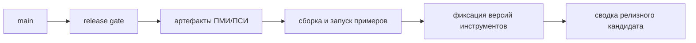

# Контрольный Список Для Релизного Кандидата

## Связанные Документы

| Документ | Назначение |
|---|---|
| [08-testing-methodology.md](./08-testing-methodology.md) | общая методика проверки |
| [09-test-results.md](./09-test-results.md) | опубликованные результаты общей ПСИ |
| [10-extended-contract-methodology.md](./10-extended-contract-methodology.md) | методика проверки расширенного контракта |
| [11-extended-contract-results.md](./11-extended-contract-results.md) | опубликованные результаты расширенного контракта |
| [api-reference.md](./api-reference.md) | точка входа в публичное API |

## Область

Документ задаёт контрольный список репозитория для выпуска релизного кандидата.

## Входные Данные Для Релизного Кандидата

- чистый `main`
- опубликованный пакет ПМИ/ПСИ
- опубликованный пакет расширенного контракта
- сгенерированная документация Doxygen
- собранные и выполненные публичные примеры
- зафиксированные версии инструментов

## Поток Подготовки Релизного Кандидата

## Обязательные Проверки

| Проверка | Команда или источник | Критерий |
|---|---|---|
| release gate | `scripts/run-release-gate.sh` | pass |
| артефакты общей ПМИ/ПСИ | `tests/artifacts/pmi-psi/latest.txt` | присутствуют и актуальны |
| артефакты расширенного контракта | `tests/artifacts/pmi-psi/runs/<run>/summary-extended.md` | присутствуют |
| сборка Doxygen | `cmake --build --preset clang-debug --target docs` | pass |
| проверка документации | `python3 scripts/lint-docs.py` | pass |
| сборка примеров | `cmake --build --preset clang-debug --target example_basic example_connect example_expect_trailers example_response_upgrade` | pass |
| запуск примеров | `build/clang-debug/example_*` | pass |
| фиксация версий инструментов | `tests/artifacts/release-candidate/runs/<run>/toolchain.txt` | присутствует |

## Публикуемые Подтверждения Для Релизного Кандидата

Пакет релизного кандидата должен собираться командой:

- `scripts/run-release-candidate.sh`

Каталог публикации:

- `tests/artifacts/release-candidate/`

## Структура Release Notes

Release notes должны содержать:

1. идентификатор выпуска
2. поддерживаемую область применения
3. состав публичного API
4. сводку проверки
5. ссылки на опубликованные артефакты
6. перечень известных непокрываемых задач

## Критерии Завершения

- каждая обязательная проверка проходит
- артефакты релизного кандидата опубликованы в репозитории
- публичные примеры выполняются без ошибок
- документация Doxygen собирается без предупреждений
- документы `09` и `11` ссылаются на актуальное подтверждение
