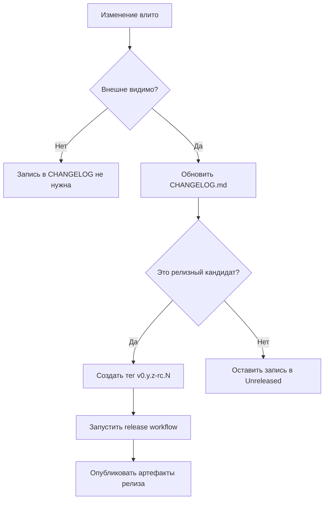

[](https://github.com/ioplane/iohttpparser)
[](https://semver.org/spec/v2.0.0.html)
[](https://keepachangelog.com/en/1.1.0/)
[](https://mermaid.js.org/syntax/flowchart.html)

# 13. Версионирование И Журнал Изменений

## Область

Документ задаёт идентификаторы релизов, правила версионирования до `1.0.0` и
правила ведения `CHANGELOG.md` для `iohttpparser`.

## Формат Версий

`iohttpparser` использует Semantic Versioning 2.0.0 и Git-теги с префиксом `v`.

Примеры:

```text
v0.1.0-rc.1
v0.1.0
v0.2.0
v1.0.0
```

## Политика До 1.0.0

| Шаблон | Значение | Когда использовать |
|---|---|---|
| `v0.y.z-rc.N` | Релизный кандидат | Релизный конвейер готов, а сборка предназначена для внешней проверки |
| `v0.y.z` | Публичный релиз до `1.0.0` | Линия релизных кандидатов принята как текущая базовая версия |
| `v1.0.0` | Первый стабильный релиз | Публичный интерфейс, release gate, публикуемое подтверждение и политика поддержки объявлены стабильными |

## Начальная Линия Релизов

Начальная публичная линия релизов для этого репозитория:

```text
v0.1.0-rc.N
```

Первый тег в этой линии:

```text
v0.1.0-rc.1
```

## Правила Для Журнала Изменений

`CHANGELOG.md` обязателен. Файл ведётся по правилам Keep a Changelog 1.1.0.

Обязательные разделы:

| Раздел | Назначение |
|---|---|
| `Added` | Новые внешне видимые возможности |
| `Changed` | Изменения поведения, контракта, конвейера или публикуемого подтверждения |
| `Deprecated` | Поддерживаемые возможности, запланированные к удалению |
| `Removed` | Удалённое публичное поведение или поддержка |
| `Fixed` | Исправления поведения и дефектов |
| `Security` | Изменения, связанные с безопасностью и усилением защиты |

Правила:

- Вверху всегда оставлять `Unreleased`.
- Обновлять журнал изменений в той же ветке, где сделано изменение.
- Записывать только внешне видимые изменения.
- Писать короткие фактические пункты.
- Перед созданием тега релиза переносить выпущенные изменения из `Unreleased`
  в датированный раздел версии.

## Схема Принятия Решения О Релизе


