# Документация На Русском

Русская версия документации `iohttpparser`.

## Карта Документации

```mermaid
graph TD
    IDX["docs/ru/README.md"]

    A1["01 Архитектура"]
    A2["02 Сравнение"]
    A3["03 Усиление Для Работы В Рабочей Среде"]
    A4["04 Сравнение Экосистемы Парсеров"]
    A5["05 Контракты Потребителей"]
    A6["06 Состояние Парсера"]
    A7["07 Декодер Тела"]
    A8["08 Методология Тестирования"]
    A9["09 Результаты Испытаний"]
    A10["10 Методика Расширенного Контракта"]
    A11["11 Результаты Расширенного Контракта"]
    A12["12 Контрольный Список Релизного Кандидата"]
    API["Справочник API"]

    IDX --> A1
    IDX --> A2
    IDX --> A3
    IDX --> A4
    IDX --> A5
    IDX --> A6
    IDX --> A7
    IDX --> A8
    IDX --> A9
    IDX --> A10
    IDX --> A11
    IDX --> A12
    IDX --> API

    style IDX fill:#1a73e8,color:#fff
```

## Нумерованные Документы

| # | Документ | Область |
|---|---|---|
| 01 | [Архитектура](./01-architecture.md) | Область применения, слои, владение данными, границы интеграции |
| 02 | [Сравнение](./02-comparison.md) | Сравнение возможностей и контрактов с `picohttpparser` и `llhttp` |
| 03 | [Усиление Для Работы В Рабочей Среде](./03-production-hardening.md) | Строгая политика, лимиты, классы отклонения и проверка |
| 04 | [Сравнение Экосистемы Парсеров](./04-parser-ecosystem-comparison.md) | Разделение ответственности между ядром парсера, потребителем и соседними слоями |
| 05 | [Контракты Потребителей](./05-consumer-contracts.md) | Контракт интеграции для `iohttp` и `ioguard` |
| 06 | [Состояние Парсера](./06-parser-state.md) | Интерфейс состояния парсера и правила владения данными |
| 07 | [Декодер Тела](./07-body-decoder.md) | Контракты декодирования `chunked` и тела фиксированной длины |
| 08 | [Методология Тестирования](./08-testing-methodology.md) | ПМИ, ПСИ, правила сравнения и публикация артефактов |
| 09 | [Результаты Испытаний](./09-test-results.md) | Публикуемые результаты ПМИ/ПСИ и индекс артефактов |
| 10 | [Методика Расширенного Контракта](./10-extended-contract-methodology.md) | Методика для возможностей вне общей матрицы ядра разбора |
| 11 | [Результаты Расширенного Контракта](./11-extended-contract-results.md) | Состояние результатов по расширенному контракту `iohttpparser` |
| 12 | [Контрольный Список Релизного Кандидата](./12-release-candidate-checklist.md) | Проверка релизного кандидата, публикуемое подтверждение и структура release notes |

## Справка

| Документ | Назначение |
|---|---|
| [api-reference.md](./api-reference.md) | Точка входа в справочник публичного интерфейса, сформированный Doxygen |
| [../../SUPPORT.md](../../SUPPORT.md) | Каналы поддержки и обязательные сведения для сообщений |
| [../README.md](../README.md) | Верхнеуровневый индекс документации |
| [../plans/README.md](../plans/README.md) | Индекс планов |
| [../rfc/README.md](../rfc/README.md) | Локальное зеркало RFC |
