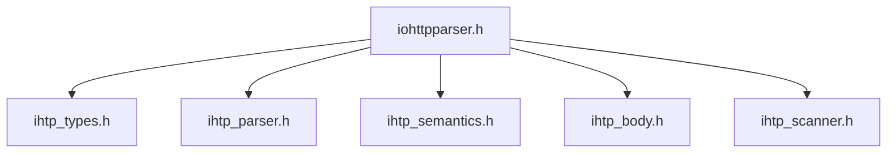

# Справочник API

Точка входа в Doxygen для публичного интерфейса `iohttpparser`.

## Связанные Документы

| Документ | Назначение |
|---|---|
| [05-consumer-contracts.md](./05-consumer-contracts.md) | контракт интеграции для потребителей |
| [06-parser-state.md](./06-parser-state.md) | контракт интерфейса состояния парсера |
| [07-body-decoder.md](./07-body-decoder.md) | контракт декодера тела |

## Публичные Заголовки

- `include/iohttpparser/iohttpparser.h`
- `include/iohttpparser/ihtp_types.h`
- `include/iohttpparser/ihtp_parser.h`
- `include/iohttpparser/ihtp_semantics.h`
- `include/iohttpparser/ihtp_body.h`
- `include/iohttpparser/ihtp_scanner.h`

## Карта Модулей

| Модуль | Область |
|---|---|
| Публичный интерфейс | общий заголовок и вспомогательные функции версии |
| Типы и политики | перечисления, структуры, лимиты, именованные профили |
| Интерфейс парсера | функции разбора без состояния и с состоянием |
| Интерфейс семантики | фрейминг, `keep-alive`, `upgrade`, `Expect`, признаки хвостовых полей |
| Интерфейс декодера тела | контракты `chunked` и `fixed-length` |
| Интерфейс сканера | низкоуровневый поиск разделителей и проверка токенов |

## Сводка Контракта

- строгий HTTP/1.1 разбор по умолчанию
- представления без копирования в буфере потребителя
- раздельные стадии парсера, семантики и декодера тела
- точки входа с состоянием и без состояния
- передача `upgrade`, `Expect: 100-continue` и хвостовых полей находится на стороне потребителя

## Чеклист Для Потребителя

1. Сохранять входные байты, пока используются представления без копирования.
2. Вызывать этап семантики после синтаксического разбора.
3. Запускать декодер тела только после выбора режима тела на этапе семантики.
4. Использовать именованные профили вместо анонимной ручной настройки политики.
